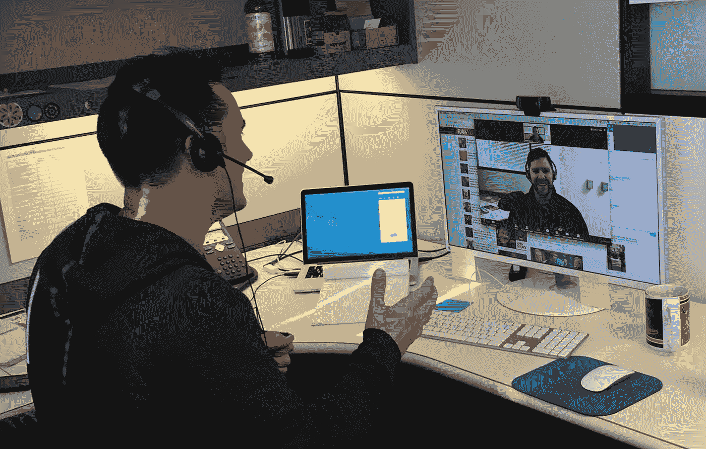

# 使用深度学习的噪声抑制

> 原文：<https://medium.com/analytics-vidhya/noise-suppression-using-deep-learning-6ead8c8a1839?source=collection_archive---------2----------------------->

学分:缩放

在在线视频会议和虚拟交流蓬勃发展的时候，平台抑制背景噪声的能力对其领先优势起着至关重要的作用。像 Google Meet 这样的平台不断使用机器学习来执行噪声抑制，以尽可能提供最佳的音频质量。今天，我将向您展示如何制作自己的深度学习模型来执行噪声抑制