# 非二值图像分类 CNN 教程(5 个类别)

> 原文：<https://medium.com/analytics-vidhya/non-binary-image-classifying-cnn-tutorial-5-categories-df431449c7d5?source=collection_archive---------4----------------------->

有大量的数据集和教程可以用来构建二元(两类)CNN 图像分类器。然而，我看不到有那么多的资源可以用 3 个或更多的类别对 CNN 进行图像分类。与二进制 CNN 相比，在设计非二进制图像分类 CNN 时有一些重要的区别。本教程将带你了解如何为一个包含 3 个或更多类别的数据集构建 CNN。

首先，让我们得到我们的数据集。令人惊讶的是，很难找到一个原始图像数据集(相当大的样本量)有超过 2 个类别。然而，我最终在 Kaggle 上找到了一个由[亚历山大·马马耶夫](https://www.kaggle.com/alxmamaev)创建的可靠的[花朵识别数据集](https://www.kaggle.com/alxmamaev/flowers-recognition)。该数据集包含属于 5 个不同类别的花的图像——蒲公英、雏菊、郁金香、玫瑰和向日葵。每个类别有 700 到 1100 张图片。

虽然该数据集的图像已经根据类别拆分到文件夹中，但它们没有拆分到测试/训练集中。我使用了一个快速的 Python 脚本来完成这个任务。你可以在这里的[查看剧本。](https://gist.github.com/colleenDunlap/69b5cfe04a64339ef7d2191b9a9f6d6f)

现在来发展我们的 CNN。我的模型的轮廓看起来像这样

```
1\. Input Convolution Layer, take in 32x32 size images, generate 32 3x3 feature maps
2\. Dropout Layer (to prevent Overfitting)
3\. Max Pooling Layer (Picks strongest features in feature map)
4\. Full Connection/ANN Layers (one with 1,024 units, another with 512 units, both with relu activation function)
5\. Output Layer (softmax function)
```

这是一个直观的展示。我们得到我们的图像数据矩阵，生成多个特征图，并从这些特征图中汇集。然后，我们将该数据“展平”成一个向量，以馈入我们的人工神经网络/全连接层。然后，我们有一个输出层，包含图像属于我们的 5 个类别的概率。

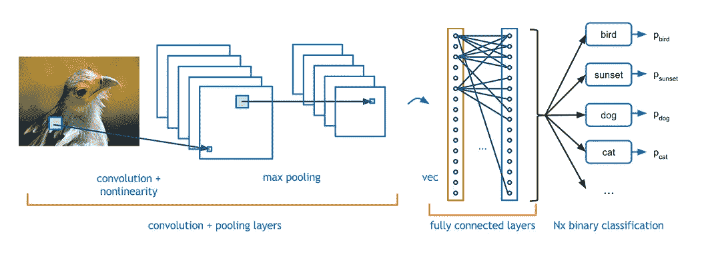

[图片来源此处](https://adeshpande3.github.io/A-Beginner%27s-Guide-To-Understanding-Convolutional-Neural-Networks/)

现在来看代码。首先，让我们导入我们的依赖关系，并设置我们的卷积层。

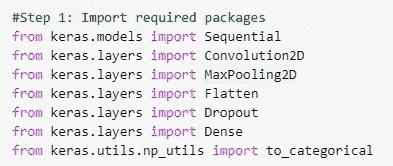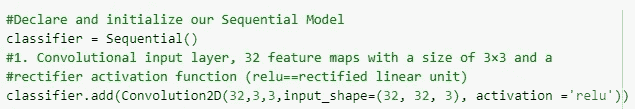

现在我们的辍学层。我将它设置为 10%，以防止过度拟合我们的模型。

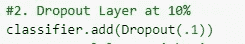

最后，我们使用 Max Pooling 和 flatten 进行池化，以准备要传递给 ANN 层的数据

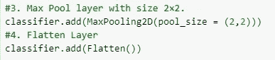

现在我们创建我们的“完全连接”我为我们的人工神经网络使用了两层——一层取 1024 个单位，第二层取 512 个单位。然后，是我们的输出层，一个“softmax”函数，其中节点的数量等于类别的数量(在我们的例子中是 5)。

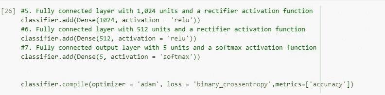

接下来，我们设置图像数据生成器。这来自我们的测试和训练数据所在的目录，并为我们创建图像数据以用作模型的输入。在原始数据集中，图像大约为 200x200 像素。为了速度和防止过度拟合，我们将减少这个值。

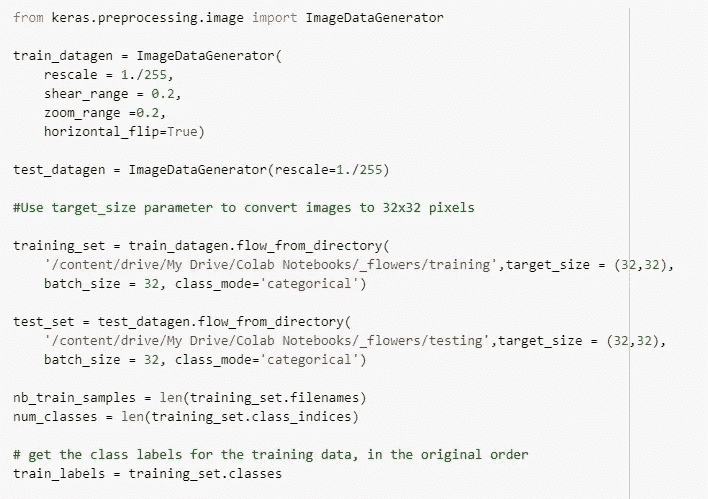

现在我们训练我们的模型。我选定了 10 个时期，每个时期 50 步。你可以摆弄这些数字，看看这对你的准确度有什么影响。

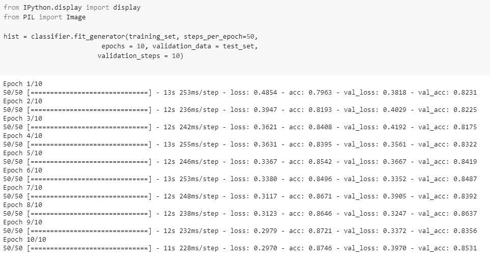

从这里，我们可以验证我们的模型的准确性，并绘制模型的准确性和训练时间的损失。

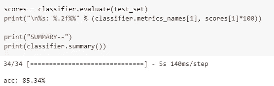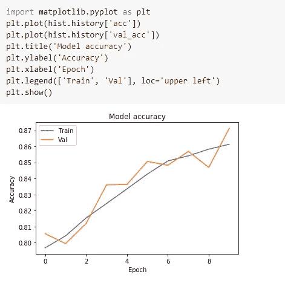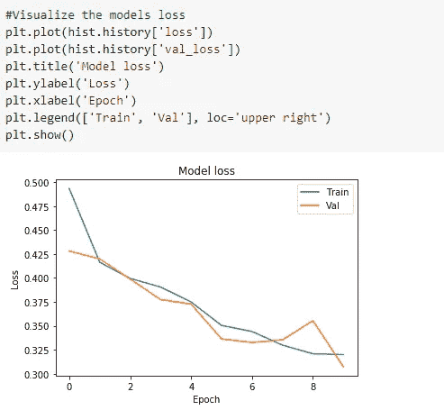

然后我们可以在单个图像上运行该模型，并查看结果！

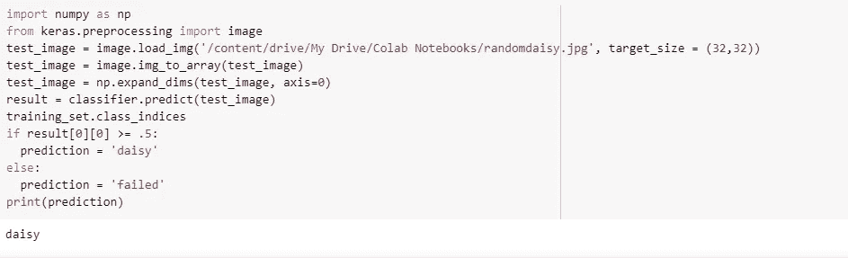

成功了！结果[0][0]是图像是雏菊的概率(索引为 0，因为雏菊是我们列出的第一个类别)

现在你知道了！没那么糟吧。现在你可以扩展这个方法来拥有你想要的任意多的类别！如果你有足够的数据质量和数量，它甚至会是准确的:D

有什么问题吗？评论？赞美的话？让我在下面的评论中知道❤