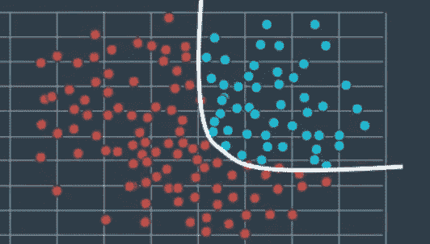
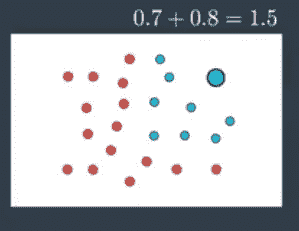
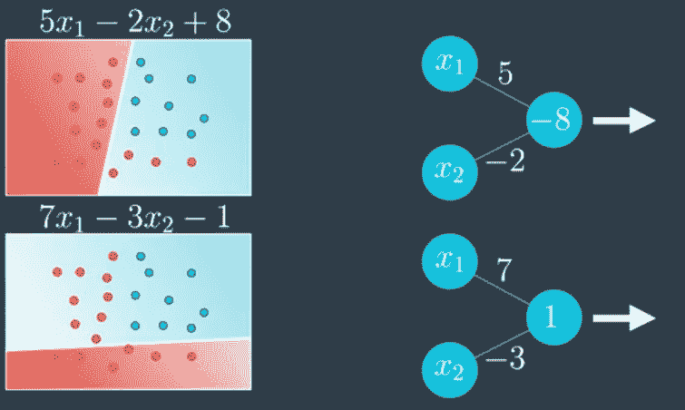
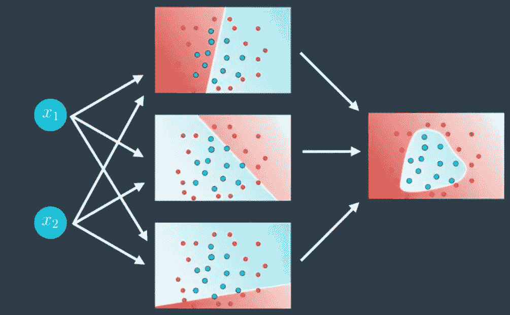
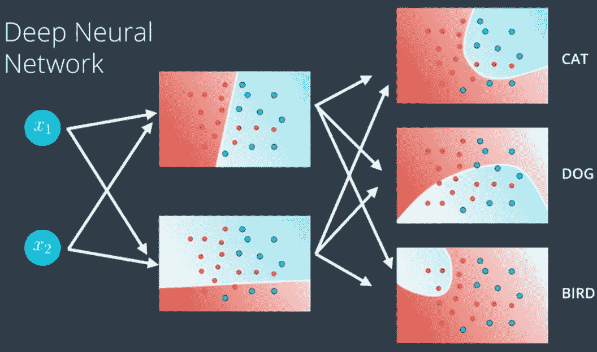

# 非线性模型-使用线性模型的组合求解

> 原文：<https://medium.com/analytics-vidhya/non-linear-model-1a9067d79dd3?source=collection_archive---------15----------------------->

在本文中，我们将看到模型如何学习复杂数据集的非线性边界。

非线性数据分离的例子。资料来源:Udacity

**背景**

真实世界的数据集通常有一个问题，即数据不能仅由一条线分开。那么一行之后的下一个是什么呢？可能是一个圆，可能是两条线，也可能是一些曲线。这是神经网络可以展示其全部潜力的地方。

**我们开始吧..**

简而言之，对于无法用直线分离的数据，我们将创建一个概率函数，其中蓝色区域中的点更可能是蓝色的，而红色区域中的点更可能是红色的。将它们分开的曲线是一组同样可能是蓝色或红色的点。

> **组合**

我们将使用一个非常简单的技巧，即将两个线性模型合并成一个非线性模型，如下图所示。

结合两个线性模型。资料来源:Udacity

在结合线性模型之前，让我们先来看看数学。我们所知的线性模型是一个完整的概率空间。这意味着对于每一个点，它给出了这个点是蓝色的概率。让我们选择任意一个点，并检查它在线性模型中为蓝色的概率。如下图所示，来自第一线性模型的点的概率是 0.7，来自第二线性模型的点的概率是 0.8。

点的概率，两个线性模型。资料来源:Udacity

现在的问题是，我们如何将这两者结合起来？嗯，组合两个数最简单的方法就是把它们相加，对吧？

两个线性模型合并后(概率总和)。资料来源:Udacity

> **乙状结肠**

但是现在，这看起来不再像是一个概率，因为它大于 1(1.5 > 1)。概率需要介于 0 和 1 之间。那么我们能做什么呢？我们如何把这个大于 1 的数变成介于 0 和 1 之间的数呢？我们有一个很好的工具，可以将每个数字转换成 0 到 1 之间的数字。这只是一个 sigmoid 函数。我们将 sigmoid 函数应用于 1.5，得到 0.82，这就是这个点在结果概率空间中为蓝色的概率。

> **组合加权**

现在，如果我们想对这个总数进行加权呢？比如说，我们希望左边的模型比右边的模型更能表达结果概率？我们可以增加重量。例如，我们可以说“左一的七倍加上右一的五倍。”当我们组合模型时，我们取第一个概率，乘以 7，然后取第二个概率，乘以 5，如果需要，我们甚至可以添加偏差。假设偏差是负 6，然后我们把它加到整个方程中。

7 * 0.7+5 * 0.8–6 = 2.9，2.9 以上的乙状结肠会给出 0.95。

> **通过神经网络获得权重**

现在，让我们学习如何通过神经网络获得这些权重。比方说，左边的线性模型的线性方程是 5x1-2x2+8。右边是 7x1–3 x2–1。下图显示了两种线性模型的感知器表示。

两种线性模型的感知器。资料来源:Udacity。

现在，让我们使用另一个感知器，通过线性方程将这两个模型结合起来，第一个模型的七倍加上第二个模型的五倍减去六倍。

用于组合线性模型的感知器。资料来源:Udacity

现在把所有这些连接在一起，我们得到了一个神经网络。

最终神经网络表示

此外，我们在上面绘制的内容将偏差放在节点内部(左侧或中间一个)以及单独的节点上(最右侧)。为了避免混淆，中间的是最左边的清晰表示。

因此，这里神经网络将学习两种类型的权重。一个用于每个线性模型(包括偏差),另一个用于组合线性模型。

**不同的神经网络架构**

> **案例 1——较大的隐藏层**

现在，我们正在合并三个线性模型，即在隐藏层中再添加一个节点，以获得输出层中的三角形边界。看看 [*通用逼近定理*](https://en.wikipedia.org/wiki/Universal_approximation_theorem) 说一层神经网络可以解决几乎任何问题或者单个隐层神经网络可以以任何精度逼近 x 的任何连续函数。

更多隐藏层。资料来源:Udacity

***情况 2 —节点较多的输出层***

这只是意味着我们有更多的产出。在这种情况下，我们只有一个多类分类模型。因此，如果我们的模型告诉我们图像是猫、狗还是鸟，那么我们只需让输出层中的每个节点输出每个类别(狗、猫、鸟)的分数。

输出层中的更多节点。资料来源:Udacity

***案例 3 —多层***

这仅仅意味着我们有深度神经网络。在这里，我们的线性模型结合起来创建非线性模型，然后这些模型结合起来创建更多的非线性模型。一般来说，我们可以这样做很多次，并获得具有许多隐藏层的高度复杂的模型。

更多隐藏层。资料来源:Udacity

现在，每当你看到一个神经网络，想想它定义的非线性边界是什么。

学分:Udacity 课程。

如果这篇文章对你有帮助，请给出反馈，并与你的朋友分享。

谢谢！！