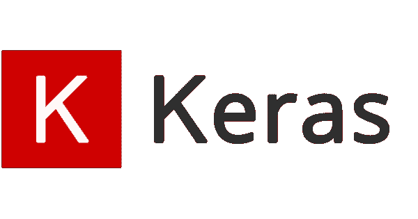
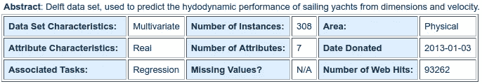
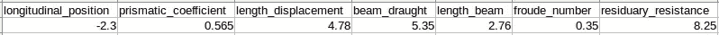
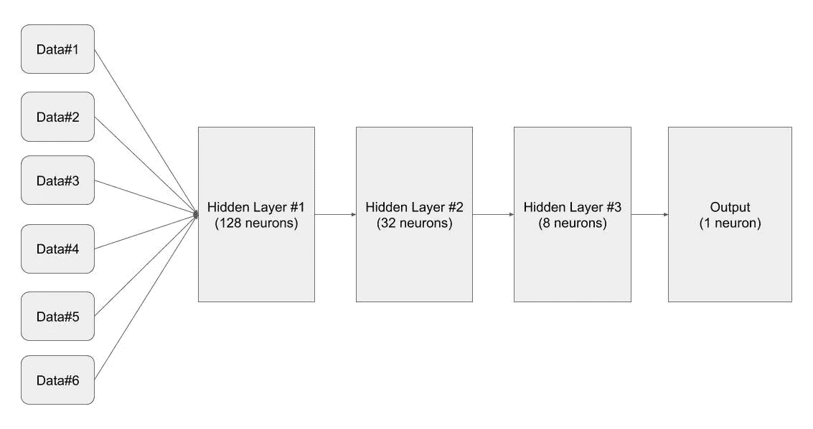
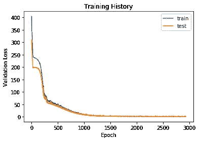
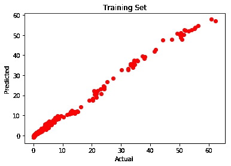
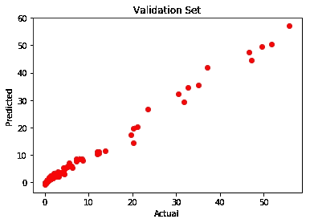

# 具有深度学习的非线性回归

> 原文：<https://medium.com/analytics-vidhya/non-linear-regression-with-deep-learning-221584ccc8c2?source=collection_archive---------2----------------------->

在这篇文章中，我们将学习使用" [Keras](https://keras.io/) "训练神经网络进行回归预测，以及所有的理论和实践细节！本教程中分享的方法和代码可以用于任何其他回归任务，因此在本教程之后，您将能够通过训练有素的神经网络解决任何回归问题！

# 克拉斯

Keras 是 [Kaggle 上前 5 名获胜团队中使用最多的深度学习框架！](https://www.kaggle.com/)

[Keras](https://keras.io/) 是为人类设计的 API，不是为机器设计的。Keras 遵循减少认知负荷的最佳实践:它提供一致的&简单 API，最大限度地减少常见用例所需的用户操作数量，并提供清晰的&可操作错误消息。它有大量的文档和开发人员指南。

在本教程中，我们将使用 Keras 和 [TensorFlow](https://www.tensorflow.org/) 后端在 [python](https://www.python.org/) 上实现一个用于回归预测的神经网络！

# 回归

回归是一种机器学习(ML)算法，可以被训练来预测实数输出；比如温度，股价，等等。

**例如:以下哪一项是回归任务？**

*   预测人的年龄
*   预测某人的国籍
*   预测一家公司的股票价格明天是否会上涨
*   预测一份文件是否与目击不明飞行物有关？

**解法:**预测一个人的年龄(因为是实值，预测国籍是分类的，股票价格会不会涨是离散的——是/否答案，预测一个文档是否与 UFO 有关又是离散的——是/否答案)。

## 分类与回归

回归算法和分类算法的主要区别在于，回归算法是用来预测价格、工资、年龄等连续值的。并且使用分类算法来预测/分类离散值，例如男性或女性、真或假、垃圾邮件或非垃圾邮件等。其实也就这些了！

下面给出的数字会让你对回归有更清晰的认识！没错，这个身材太牛了！:)

分类与回归

在本教程中，我们将训练一个 Keras 神经网络来预测“[游艇流体动力学数据集](https://archive.ics.uci.edu/ml/datasets/Yacht+Hydrodynamics)的回归情况！案例包含 6 个输入值和一个输出值！我们将尝试预测回归，以便能够使用 6 个输入值来预测输出！

# 游艇流体动力学数据集

关于数据集的所有细节都可以在 [UCI 机器学习库](https://archive.ics.uci.edu/ml/datasets/Yacht+Hydrodynamics)获得！

游艇流体力学数据集的快速总结

在初始设计阶段预报帆船的剩余阻力，对于评估船舶性能和估算所需推进功率具有重要价值。基本输入包括基本船体尺寸和船速。

**属性信息
*输入:*** 变化涉及船体几何系数和弗劳德数；
***1。*** 浮力中心的纵向位置，无量纲。
***2。*** 棱形系数，无量纲。
***3。*** 长度-位移比，无量纲。
***4。*** 束流比，无量纲。
***5。*** 长宽比，无量纲。
***6。*** 弗劳德数，无量纲。
***输出:*** 被测变量为单位重量排量的剩余阻力；
***7。*** 单位重量排水量的剩余阻力，无量纲。

带有数据集标题的样本行。

# 设计和开发用于回归预测的 Keras 神经网络

## 网络架构设计

要实现用于回归的神经网络，必须定义架构本身。它使用一个简单的多层感知器(MLP)来定义架构，如下图所示。

简单的多层感知器(MLP)来定义架构。

## 履行

既然我们已经设计好了我们的 Keras 神经网络，现在就来实现我们的设计吧！

**1。首先，我们应该进口必要的包装:**

**2。)**然后，我们需要读取我们的训练和验证数据:

**3。)**我们得到了训练和验证数据，现在让我们训练我们的 Keras 神经网络来预测回归。换句话说，让我们在*【网络架构设计】* 部分实现我们刚刚设计的神经网络架构，并执行模型训练！

以下是模型实现的说明:

*   由于执行了回归，包含具有线性激活函数的单个神经元的密集层。通常使用基于 ReLu 的激活，但是因为它是执行回归的，所以需要线性激活(第 8 行)。
*   用于回归预测的模型用 Adam 优化器初始化，然后被编译(第 11 行)。
*   平均绝对百分比误差被用作损失函数，这意味着试图最小化预测和实际“每单位驱替重量的剩余阻力”值之间的平均百分比差(第 11 行)。
*   对于训练神经网络来说，选择训练时段的数量是一个重要的问题。使用太多的时段会导致训练数据集的[过拟合](https://en.wikipedia.org/wiki/Overfitting)，使用太少的时段也会导致[欠拟合](https://en.wikipedia.org/wiki/Overfitting)模型。因此，使用了[早期停止方法](https://keras.io/api/callbacks/early_stopping/)，该方法允许您指定任意大量的训练时期，并且一旦模型性能在维持验证数据集上停止改善，就停止训练(行#14)。

实际上，请注意，回归案例有两种主要的典型设计方法:

*   使用 linear(默认的)作为输出层的激活函数(和之前层的 ReLu)。
*   使用“均方误差”作为损失度量。

**4。)**我们可以绘制训练历史，看看“我们的模型训练进行得如何？”：

培训历史图

**5。)**现在，让我们看看“我们的模型在训练数据上的预测有多成功？”：

训练集的实际与预测图

我们的模型对训练数据的预测达到了 0.995 R 平方！这太棒了。

> **R 平方(R2)** 是一种统计度量，表示回归模型中由自变量或变量解释的因变量方差的比例。

**6。)**我们研究中最激动人心的部分是检查“我们的模型在验证数据(我们的模型从未见过的数据)上的预测有多成功！)?"：

验证集的实际与预测图

我们的模型对验证数据的预测达到了 0.992 R 平方！这太神奇了！请不要认为在训练数据上达到 0.99 R 平方比在验证数据上达到 0.99 R 平方更容易！

# 结论

在本教程中，我们学习了回归算法的理论背景。我们还设计并实现了一个使用“ [Keras](https://keras.io/) 进行非线性回归预测的神经网络。我们使用“[游艇流体力学数据集](https://archive.ics.uci.edu/ml/datasets/Yacht+Hydrodynamics)作为案例研究，我们在训练和验证数据上都达到了 0.99 的 R 平方，这太棒了！本教程中分享的方法和代码可以用于任何其他回归任务，如“[计算机硬件](http://archive.ics.uci.edu/ml/datasets/Computer+Hardware)”、“[能效](http://archive.ics.uci.edu/ml/datasets/Energy+efficiency)”等等！因此，在本教程之后，你能够解决任何回归问题！

关于实现部分的源代码和更多细节可以在 [**这个 GitHub 库**](https://github.com/ahmetozlu/nonlinear-regression-keras) 中找到！