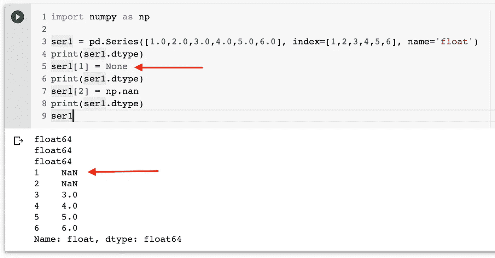

# Python/Numpy | NaN 中无 v/s NaN 探索

> 原文：<https://medium.com/analytics-vidhya/none-v-s-nan-in-python-numpy-nan-explored-318f4cb6df66?source=collection_archive---------7----------------------->


[法比安·格罗斯](https://unsplash.com/@grohsfabian?utm_source=medium&utm_medium=referral)在 [Unsplash](https://unsplash.com?utm_source=medium&utm_medium=referral) 上拍摄的照片

我正在使用 python 工作，并开始学习数据分析，作为开始使用 Python 进行数据分析的第一步，我先浏览了 Numpy，然后转向 Pandas。我遇到了术语`**NaN in Numpy**`,并且经常在熊猫中使用，因为 Numpy 是熊猫数据框架的组成部分。我知道`**None in Python**`，但我想到了以下问题:

→什么是实际的`**difference between None and NaN**`对于初学者来说，这是一个普遍的困惑。

L让我们先探讨一下这两者的类型。

```
import numpy as np
type(np.nan)
type(None)float
NoneType
```

`**np.nan is a float**`和`**None is an Object of NoneType**`

`np.nan`是`**Not a Number (NaN)**`的 IEEE 754 浮点表示，属于`**python built-in numeric type float**`

还有，`**None indicates an Object which has no value**`。有趣的是，任何不显式返回任何东西的函数都隐式返回 None。尝试以下方法:

```
print(print("This is cool"))
```


nump.nan 对 None

从 NaN 是一个浮点数而 None 是一个宾语，我们可以解释什么？我想到的一件事是算术运算:

我们`may apply operations with NaN but not with None`，检查以下内容:

```
np.nan + np.nan  or np.nan + 5
np.nan - np.nan  or np.nan - 5
np.nan * np.nan  or np.nan * 5
np.nan / np.nan  or np.nan / 5
np.nan % np.nan  or np.nan % 5Output:
nan**None+None****Output:
Type Error : unsupported operand type(s)**
```

> Y **你可能会把** `**NaN**` **想成一种数据病毒——它会感染它接触到的任何其他对象。不考虑运算，用** `**NaN**` **运算的结果总会是另一个** `**NaN**` **。**

让我们一起来探索南的另一个有趣的地方！！

```
**np.nan == np.nan
False****np.nan is np.nan
True**
```

> **注意:——Python 生成 id 并给每个变量赋值，我们可以用 id(var)和** `**id is what gets compared when we use "is" operator in python**`得到
> 
> **我们所说的相等是指在比较中两个变量的内容是相同的，而** `**content is what get compared when we use “==’ operator in python**`

现在，如果我们检查 id(np.nan ),它将是相同的:


两个名词不相等，但它们是相同的

**但如果没有则不同:**


没有什么是相同和相等的

> **关于 NaN 值得注意的另一点是:-** `**NaN**` **特指浮点值；对于整数、字符串或其他类型，没有等效的 NaN 值。**

熊猫中的 N **one 和 NaN:-`**NaN**`和`**None**`都有他们的位置，熊猫是建造到`**handle the two of them nearly interchangeably**`的，在他们之间进行适当的转换，我们来看同样的例子。**

让我们有一个包含整数数组的序列，然后用“None”替换序列中的一个元素，注意 dtype 的变化

```
s1 = pd.Series([1,2,3,4], name="integer_series")
print(s1.dtype) --> **int64**
s1[0] = None
print(s1.dtype) --> **float64**
```

因此，通过在一个整数数组中引入一个 None，None 会自动转换为 NaN，导致`**dtype changed to ‘float64’ from ‘int64’**`，如果你看到这个序列，你会在索引 0 处看到‘NaN’。


无转换为具有整数系列的 NaN

现在，让我们看一系列字符串对象，并通过在系列中引入 None 来看结果:

```
import numpy as npser1 = pd.Series(["one","two","three","four","five","six"], index=[1,2,3,4,5,6], name='Object_Series')print(ser1.dtype) --> **Object**ser1[1] = Noneprint(ser1.dtype) -->  **Object**ser1[2] = np.nanprint(ser1.dtype) --> **Object**ser1Output:
**1     None** 
**2      NaN** 
3    three 
4     four 
5     five 
6      six 
Name: Object_Series, dtype: object
```

由于字符串是作为对象存储，所以没有从 None 到 NaN 或 NaN 到 None 的转换。

在一系列 floats 中，没有一个像预期的那样被转换为 Nan:



有多种方法可以在 pandas 中引入、检测、删除和使用 NaN/None 值，你可以在另一篇文章中查看..

[](/@milankmr/learning-pandas-series-part-7-handling-nan-missing-data-in-series-57f5d888c2f) [## 学习熊猫。系列(第 7 部分)(处理系列中的 NaN/缺失数据)

### 连续处理 NaN 是学习从处理数据分析领域的缺失数据开始的必修课…

medium.com](/@milankmr/learning-pandas-series-part-7-handling-nan-missing-data-in-series-57f5d888c2f) 

在这篇文章中，我试着总结了 None 和 NaN 之间的区别，欢迎您对它们的想法/反馈，以提高对它们的理解。

您可能想了解为什么我们在 Pandas 中需要单独的索引器(loc/iloc ):

[](/@milankmr/learning-pandas-part-4-series-why-we-need-separate-indexers-loc-iloc-c081047f3a79) [## 学习熊猫。系列(第 4 部分)(为什么我们需要单独的索引器(loc，iloc..)?)

### 为什么 iloc 和 loc 是熊猫索引和切片的首选？一开始可能会很困惑，但是相信我，你…

medium.com](/@milankmr/learning-pandas-part-4-series-why-we-need-separate-indexers-loc-iloc-c081047f3a79) 

快乐学习！！！