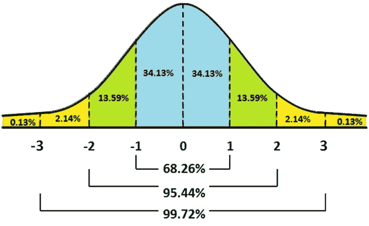
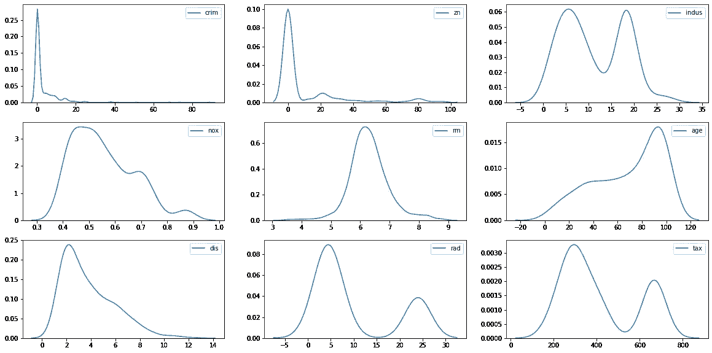

# 正态分布和机器学习

> 原文：<https://medium.com/analytics-vidhya/normal-distribution-and-machine-learning-ec9d3ca05070?source=collection_archive---------1----------------------->

正态分布是统计学中的一个重要概念，也是机器学习的基础。数据科学家在处理线性模型(如果数据呈正态分布，则表现良好)、中心极限定理和探索性数据分析时，需要了解正态分布。

正如**卡尔·弗里德里希·高斯**所发现的，**正态分布/高斯分布**是一种连续的概率分布。它有一个钟形曲线，从中点到曲线的两半是对称的。

来源:谷歌

## 数学定义:

一个连续的随机变量“x”被称为遵循一个参数为μ(均值)和σ(标准差)的正态分布，如果它的概率密度函数由下式给出，

来源:谷歌

这也被称为**正态变量。**

## 标准正态变量:

如果“x”是具有平均值(μ)和标准差(σ)的正态变量，

来源:谷歌

其中 z =标准正态变量

## 标准正态分布:

正态分布的最简单情况称为标准正态分布，其预期值为μ(均值)0 和σ(标准差)1，由以下概率密度函数描述:

来源:谷歌

## 分布曲线特征:

1.  **法向曲线**下的总**面积等于 1。**
2.  这是一个连续的分布。
3.  它是关于平均值对称的。分布的每一半都是另一半的镜像。
4.  它对水平轴是渐近的。
5.  它是单峰的。

## 区域属性:

正态分布带有假设，可以完全由两个参数确定:平均值和标准差。如果均值和标准差已知，您可以访问曲线上的每个数据点。

经验法则是在给定服从正态分布的数据集的平均值和标准偏差的情况下，对数据分布的一种简便快速的估计。它指出:

*   68.26%的数据将落在平均值(μ 1σ)的±1 SD 范围内
*   95.44%的数据将落在平均值(μ 2σ)的±2sd 范围内
*   99.7%的数据将落在平均值(μ 3σ)的±3 SD 范围内
*   95% — (μ±1.96σ)
*   99% — (μ±2.75σ)

来源:谷歌

因此，几乎所有数据都在 **3 个标准偏差**内。该规则使我们能够检查异常值**和**，并且在确定任何分布的正态性时非常有用。

# **在机器学习中的应用:**

在机器学习中，满足正态分布的数据有利于建模。它让数学变得更容易。像 LDA、高斯朴素贝叶斯、逻辑回归、线性回归等模型。，是根据分布是二元或多元正态分布的假设显式计算的。此外， *Sigmoid 函数*最自然地处理正态分布数据。

世界上很多自然现象都遵循对数正态分布，比如*金融数据*和*预测数据*。通过应用转换技术，我们可以将数据转换成正态分布。此外，许多过程遵循正态分布，例如实验中的许多*测量误差、经历扩散的粒子的位置等。*

因此，在拟合模型之前，最好仔细研究数据并检查每个变量的基本分布。

> 注:正态性是 ML 模型的一个假设。数据不一定总是遵循正态分布。ML 模型在非正态分布数据的情况下也能很好地工作。像*决策树、XgBoost* 这样的模型不假设任何正态性，并且也处理原始数据。此外，如果只有*模型误差*是高斯的，而不是整个数据集，那么*线性回归*在统计上是有效的。

***这里我分析了波士顿房价数据集。我已经解释了可视化技术和转换技术，以及可以验证分布正态性的图。***

## 可视化技术:

存在 13 个数字和 1 个分类(chas)特征

> **直方图:**它是一种条形图，是对一个连续变量的概率分布的估计。它定义了数字数据，并将其划分为统一的区间，这些区间是变量的连续、非重叠区间。

所有数字特征的直方图

> **kdeplot:** 这是一个内核分布估计图，描述了连续或非参数数据变量的概率密度函数，即我们可以同时绘制单变量或多变量。

所有数字特征的 kdeplot

## **特征分析:**

让我们以非常类似正态分布的特征 ***rm(每个住所的平均房间数)*** 为例。

尽管它的右尾有些扭曲，但我们需要检查它有多接近正态分布。为此，我们需要查看 [***Q-Q 图***](https://www.statisticshowto.com/q-q-plots/) 。

> 当两个变量的[分位数](https://en.wikipedia.org/wiki/Quantile)相互作图时，所得的图称为分位数图或 QQ 图。该图提供了两个变量的分布相对于位置是否相似的总结。

注意:“rm”功能在绘制 qqplot 之前已经标准化

这里我们可以清楚地看到，特征并不是正态分布的。但是有点像。我们可以得出结论，在将这个特性提供给模型之前对其进行标准化(StandardScaler)可以产生一个好的结果。

# 中心极限定理和正态分布；

CLT 指出，当我们向数据集添加大量独立的随机变量时，不管这些变量的原始分布如何，它们的归一化总和都趋向于高斯分布。

机器学习模型通常将训练数据视为由*确定性*和*随机性*部分组成的混合体。设*因变量(Y)* 由这些部分组成。模型总是想把***【Y】**【X】*的因变量表达为几个函数。如果函数是 sum(或者表示为某个其他函数的和)并且 ***X*** 的个数确实很高，那么 ***Y*** 应该是正态分布。****

****这里 ml 模型试图将*确定性部分表示为确定性自变量(X)之和:*****

*******确定性+随机性= func(确定性(1)) +…+ func(确定性(n)) + model_error*******

****如果用**来解释 ***Y*** 的整个确定性部分，那么***model _ erro****r*只描绘了*的随机部分，应该是正态分布。*******

*******所以如果误差分布是正态的，那么我们可以认为这个模型是成功的。否则一些其他特征在模型中不存在但对***【Y】***有足够大的影响或者模型不正确。*******

*********注:请在这里*** ***找到中心极限定理*** [***的博客链接。***](https://abhishek-barai.medium.com/central-limit-theorem-and-machine-learning-part-1-af3b65dc9d32)******

******请在这里找到代码[。](https://github.com/MaverickMonk/Machine-Learning-Methods/blob/main/normal_distribution_and_machine_learning.ipynb)******

## ******参考资料:******

****** [## 有人能告诉我为什么我们在机器学习中总是使用高斯分布吗？

### 开始组$我也有同样的问题“对预测值或目标值进行高斯变换有什么好处？”…

stats.stackexchange.com](https://stats.stackexchange.com/questions/38237/can-anyone-tell-me-why-we-always-use-the-gaussian-distribution-in-machine-learni)******