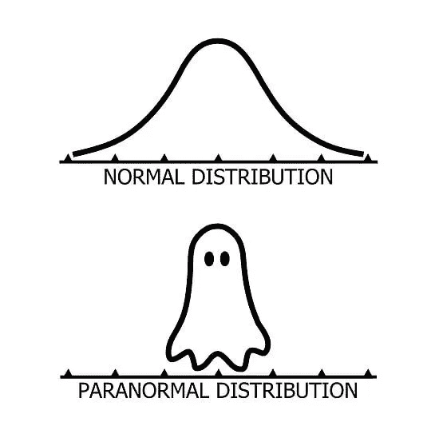
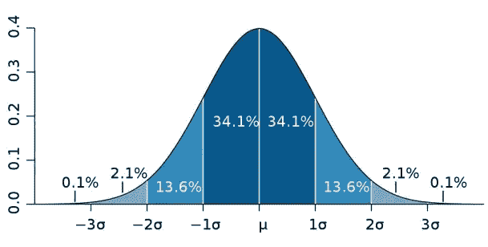
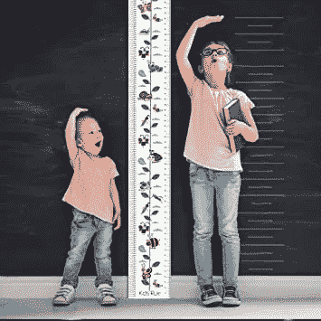

# 正态分布-钟形曲线

> 原文：<https://medium.com/analytics-vidhya/normal-distribution-the-bell-curve-4f4a5fc2caaa?source=collection_archive---------24----------------------->

在我从事工程工作的日子里，我听说过许多关于正态分布的事情，但从来没有真正理解过它的实际应用。只有在我开始从事数据科学领域的工作后，我才知道钟形曲线有多么有用。正态分布，也称为高斯分布，是一种关于平均值对称的连续概率分布，因此中心的左侧是右侧的镜像。因为它的形状，也被称为钟形曲线。

钟形曲线下的面积代表概率，曲线下的总面积等于 1。

# 钟形曲线的性质

正态曲线(钟形曲线)

*   钟形曲线下的总面积是 1。
*   钟形曲线关于它的平均值是对称的。即中心右侧的面积与钟形曲线左侧的面积完全相同。
*   平均值、中值和众数都相等。
*   它遵循*经验*法则。经验法则告诉我们有多少百分比的数据会落在平均值的一定数量的标准偏差内。
*   大约 68.2%的数据位于 1 个标准偏差内。
    约 95.5%的数据位于 2 个标准差以内。
    大约 99.7%的数据位于 3 个标准差以内。

# 为什么这么重要？

正态分布是统计学中最重要的概率分布，因为它适合我们日常生活中的大多数活动。比如考试成绩，身高，体重，社会收入分配等等。，遵循正态分布。

## 人口的身高和体重

人口的身高是正态分布的一个例子。大多数人都是中等身高。从平均身高来看，太矮或太高的人很少。同样，即使人口的重量也遵循正态分布。

## 考试分数

在 CAT、GATE 等各种竞争性考试中获得的分数。遵循正态分布。大多数学生成绩一般。然而，分数过高或过低的学生人数都很少。

## 社会收入分配

这是正态分布的经典例子之一。社会上的大多数人属于中产阶级。极富或极贫的人更少。

## 股票市场

每天我们都会听到股市上涨或下跌的消息。股票价格的上涨或下跌取决于市场的各种因素。这些变化的对数值的收益率、股票价格&的股票收益率往往形成一条钟形曲线。如果回报是正态分布的，那么大约 99.7%的回报将落在平均值的三个偏差范围内。钟形曲线的这些特征允许金融分析师和投资者对投资的预期收益和风险进行统计推断。

## 鞋码

世界上大多数人的脚都是普通尺寸。脚长太小或太大的人很少见。因此，世界上大多数鞋子都是均码的，也遵循正态分布。所以在灰姑娘的故事中，除非她属于那种罕见的人，否则她的鞋子会适合任何其他普通女人！

# 结论

正态分布如此重要的一个主要原因是它对统计学家的工作非常有用。几乎所有的统计检验都假设正态分布。在科学和经济学中，大量的随机变量可以近似地或精确地用正态分布来解释。它被用于几乎所有的领域，因此名副其实- ***正态*分布。**

*如果你喜欢这篇文章，请鼓掌分享！快乐阅读！*