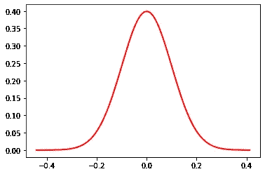
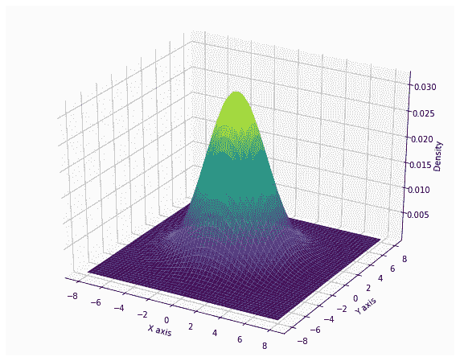
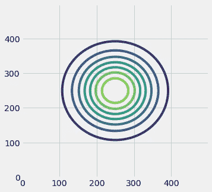
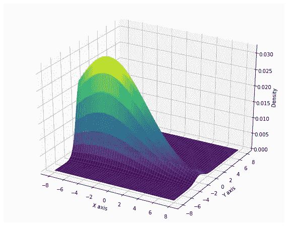
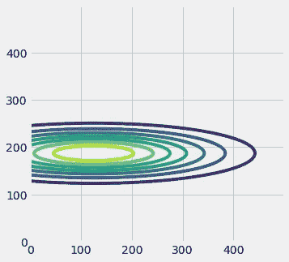

# 正态分布(高斯)

> 原文：<https://medium.com/analytics-vidhya/normal-distributions-gauss-2f081072dc6a?source=collection_archive---------30----------------------->

在数据科学中，通常假设一些变量符合正态分布。这是因为，它易于管理，并且计算成本较低，因为使用其他方法(如核密度估计)来估计分布。这是管理连续变量最简单的方法之一。

正态分布是一种理论模型，能够将随机变量数据调整为密度函数，以平均值为中心，具有方差。正态分布的一个例子可以在图 1 中找到。在 Y 轴上，该图显示密度函数，而在 X 轴上，随机变量的值形成对比。

图 1:正态分布，平均值为 0，方差为 0.1。y 轴显示密度函数，而 X 轴显示随机变量的变量

这种分布的特点是数据在域中的分布方式。数据以平均值为中心，相对于平均值有一个方差。这意味着变量的大部分实例接近或处于平均值。*极限中心定理*说大约 69%的数据在[均值-方差，均值+方差]范围内，95%在[均值-2 *方差，均值+2 *方差]范围内。这就是图中所示的所谓高斯钟的原因。当我越接近变量的平均值时，越有可能找到更多的数据(数据密度越大)，当我远离平均值时，越不可能找到数据(数据密度越小)。

在图 1 中显示了一维空间中的正态分布。但是，所解释的理论也适用于更多的维度。在图 2 中，示出了二维空间中的正态分布。

图 2:二维空间中的正态分布。两个变量都集中在平均值 0，方差 5。x 轴显示变量 1 的值，Y 轴显示变量 2 的值，Z 轴显示数据的密度函数。

在图 2 中，显示了一个正态分布，其中两个变量集中在相同的平均值上，并且具有相同的方差。当使用二维正态分布时，两个变量之间的依赖关系成立，因为两个变量都必须符合*中心极限定理。*因此，空间中的实例将被分布，使得 69%的数据将在范围[(0，0) +/-方差]内，等等。分布的一个例子如图 3 所示。

图 3。以 0 为中心，方差为 5 的双变量正态分布的实例分布

如图 3 所示，实例的密度随着远离分布的平均值(0，0)而降低。让我们看看当两个变量不在同一均值中心时会发生什么(图 4)。

图 4:二维空间中的正态分布。第一个变量以均值-4 为中心，方差为 25，而第二个变量以均值-2 为中心，方差为 1。x 轴显示变量 1 的值，Y 轴显示变量 2 的值，Z 轴显示数据的密度函数。

图 4 显示了两个变量具有不同均值和方差的情况。因此，高斯钟不像在最后的二维图中那样完美。密度函数符合两个变量的中心极限定理。让我们看看实例的分布情况。

图 5。两个变量具有不同参数的二元正态分布的实例分布。

如图 5 所示，实例的密度并不像图 3 中那样呈正圆分布。

有更多的方法来管理连续的随机变量。其他方式例如是 KDE(核密度估计)或将数据变换到离散域(离散化)，以使用离散域技术。

许多算法将这种分布用于不同目的。例如，多元正态分布

二维正态分布的绘图代码如下: