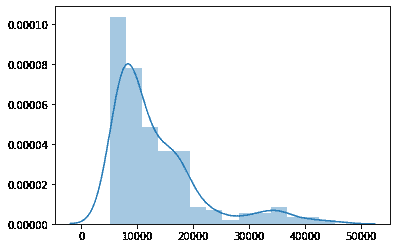
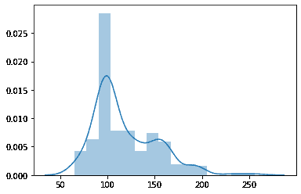
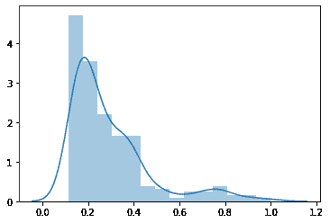
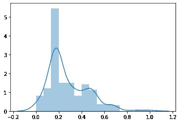

# 正态/高斯分布/钟形曲线

> 原文：<https://medium.com/analytics-vidhya/normal-gaussian-distribution-bell-curve-bf0c51519686?source=collection_archive---------4----------------------->

你可以在[https://github.com/jay6445/Data-Analytics-Projects.git](https://github.com/jay6445/Data-Analytics-Projects.git)查看我的分析项目

正态分布是围绕平均值对称的。在数据点的样本中，数据点在平均值的两侧会有相等的分布。正态分布有助于我们去除异常值，并使推断计算更容易，因为比较两个正态分布的变量比比较两个不同的分布更快，这在现实世界分析中很常见。将分布转换为正态分布的过程称为标准化。正态分布的一个重要特征是它没有偏斜，当我们说分布是对称的时，应该理解这一点。在这个分布中，均值=中位数=众数。正态分布如下所示。

将任何分布转换为正态分布:

1.**最小最大缩放比例**

使用以下公式计算分布 x 中的新值

**(X1 —最小(X1) )/最大(X1) —最小(X1)**

同样的 x2，x3，x4…xn 是为分布计算的。我在下面的例子中演示了同样的情况

2.**标准分数**

标准分数的计算方法是从每个值中减去分布的平均值，然后除以分布的标准偏差。

**(x1 — μ) / σ**

其中 **μ** =均值， **σ** =标准差。我们将同样地计算所有的值。

3.**除以最大值**

标准化分布最简单的方法之一是用最大值除以它。我已经在下面演示过了

**x1/max(x1)**

# 什么时候规范化很重要？

看下面两个分布的 x 轴。第一个是价格，从 0 到 50000 不等，第二个是损失，从 50 到 250 不等。这种具有显著不同范围的分布很难分析，尤其是在分析因果关系时。当你开始问这样的问题，是价格上涨导致了损失还是损失导致了价格上涨？当所述分析中的两个变量在相似的范围内时，可以计算出这样的推论。

价格

损耗

因此，我们将通过使用**除以最大值**来标准化价格分布，如下所示:

价格

我们将使用**最小最大缩放**方法进行第二次损失分配。

损耗

因此，通过观察分布前后的上述差异，价格和损失的范围在标准化后变得相似，现在更容易比较和推断。

**注意:**还有一个更重要的方法，我们可以将样本中的单个变量标准化，并创建一个具有均值分布的新样本。这样的分布永远是正态分布。这就是所谓的中心极限定理。我们将在我的下一篇文章中看到 CLT。

在这里取得联系【https://www.linkedin.com/in/jayeshrao 