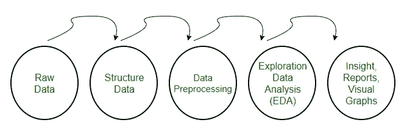
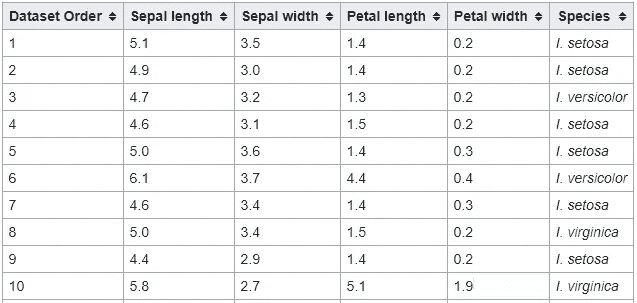
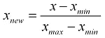
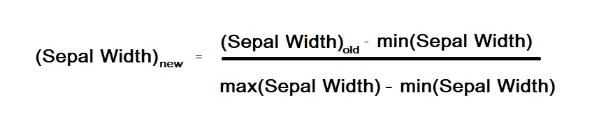
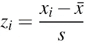
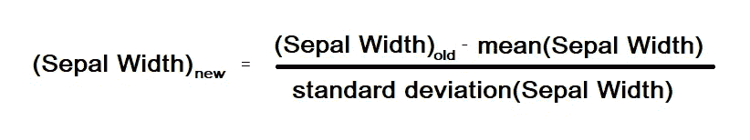
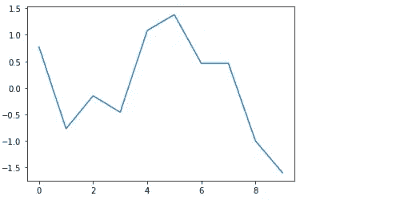
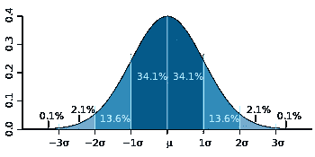

# 规范化与标准化

> 原文：<https://medium.com/analytics-vidhya/normalization-vs-standardization-8937f45b3e20?source=collection_archive---------6----------------------->

## 不要互换使用

如果您正在开始您的数据科学之旅，或者已经花了一些时间处理一些数据集，那么您肯定理解跟上数据预处理术语的难度。

# 为什么要进行数据预处理？

真实世界的数据通常是不完整的、不一致的，并且缺少某些行为或趋势，并且很可能包含许多错误。即

*   不完整:缺少属性值，缺少某些感兴趣的属性，或者只包含聚集数据
*   嘈杂的:包含错误或异常值的
*   不一致的:包含代码或名称不一致的

数据预处理是解决这类问题的一种行之有效的方法。

D 数据预处理，一种更侧重于数据清洗、数据集成、数据转换、数据降维、数据离散化的技术。

因此，今天我们将只关注两种主要的数据预处理技术，以便我们更容易理解降维技术。

数据规范化和数据标准化属于数据降维任务。在实现经典的机器学习模型之前，这些是需要理解的最重要的技术。

# 理解数据

我们将通过[虹膜数据集](https://en.wikipedia.org/wiki/Iris_flower_data_set)来理解这两个概念。

虹膜数据集有 4 个特征

*   分离长度，
*   SepalWidth，
*   PetalLength，和
*   佩塔尔维特

“物种”列包含所有类别级别。即 Setosa、Versicolor 和 *V* irginica。

这是数据集的一个示例。我们将看到如何通过使用这个样本数据集来执行规范化和标准化。

# 数据标准化:

*数据规范化*通常意味着将一个变量的值调整到 0 到 1 之间，我们可以通过使用以下公式来实现:

让我们以数据集“萼片宽度”的一个特征为例。

萼片宽度= [3.5，3.0，3.2，3.1，3.6，3.7，3.4，3.4，2.9，2.7]

由此我们需要标准化萼片宽度列。

通过使用归一化公式，我们可以如下计算新的萼片宽度

最大(萼片宽度)= 3.7

最小(萼片宽度)= 2.7

(萼片宽度)new = [0.7，0.2，0.5，0.3，0.8，1.0，0.6，0.6，0.1，0.0]

现在你可以看到我们所有的空间宽度值都被转换成介于 0 和 1 之间的值。我们可以对其余的数据特性做同样的事情，比如 SepalLength、PetalLength 和 PetalWidth

由于我们正在对列进行规范化，人们将其命名为**列规范化。**

现在你可能会问我一个问题，为什么要学习这个概念？

答案非常简单，无论以何种方式收集数据，我们都可以通过列规范化进入新的空间，我们可以创建新的特征，使所有值都位于 0 和 1 之间。

# 数据标准化:

标准化将数据转换为平均值为零，标准差为 1。数据点可以用以下公式标准化:

让我告诉你，与数据标准化相比，数据标准化在实践中更常用。

现在让我们以我们的案例来理解，

xi =萼片宽度= [3.5，3.0，3.2，3.1，3.6，3.7，3.4，3.4，2.9，2.7]

x̄ =平均值(萼片宽度)= 3.25

S =标准偏差(萼片宽度)= 0.3248673867867

通过使用归一化公式，我们可以如下计算新的萼片宽度:

(萼片宽度)new =[0.77，-0.77，-0.15，-0.46，1.08，1.38，0.46，0.46，-1.0，-1.6]

我们可以对其余的数据特性做同样的事情，比如 SepalLength、PetalLength 和 PetalWidth。

让我们画出来，

我所说的标准差为 1 是指所有的点都在-1σ和 1σ之间。由于 [68%](https://en.wikipedia.org/wiki/68%E2%80%9395%E2%80%9399.7_rule) 的数值位于平均值的一个标准偏差内。

这里我们可以说一个标准差在-1.6 到 1.6 之间。

列标准化也称为**意思是居中。**有时也被称为 **z-score。**

# 结论

*   何时对数据进行规范化，何时对数据进行标准化，完全取决于我们正在处理的问题的上下文以及该特定问题所需的功能规模。
*   如果我们希望所有特征的值都在范围[0，1]内，我们就进行归一化，如果我们希望所有特征都具有以均值为中心的方差缩放，我们就进行标准化。
*   建议采用标准化，因为大多数模型在标准化数据上训练时会比规范化数据给出更好的结果。

恭喜你已经到了博客的结尾。我希望你现在相信了。

如果你认为这篇文章遗漏了什么，请在下面回复。

感谢阅读到目前为止。

我将在下一篇文章中看到你！！！