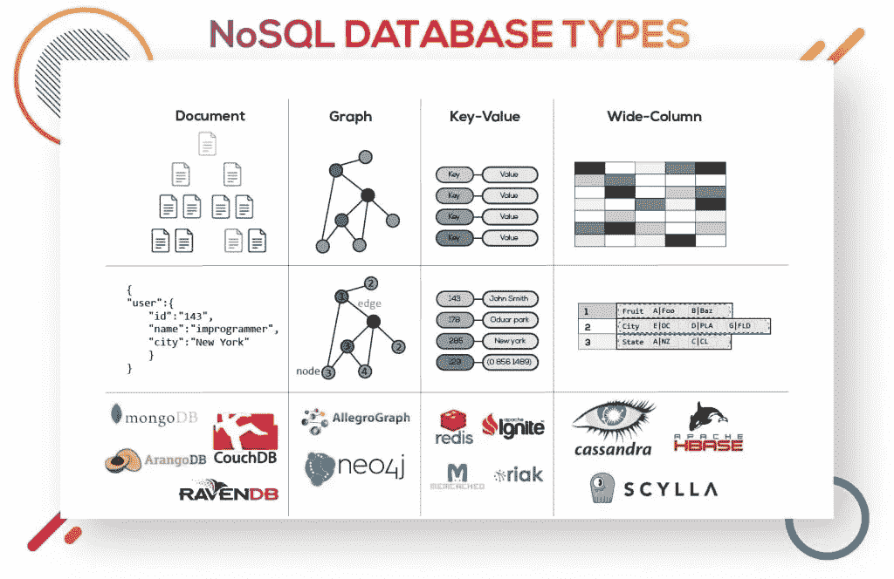
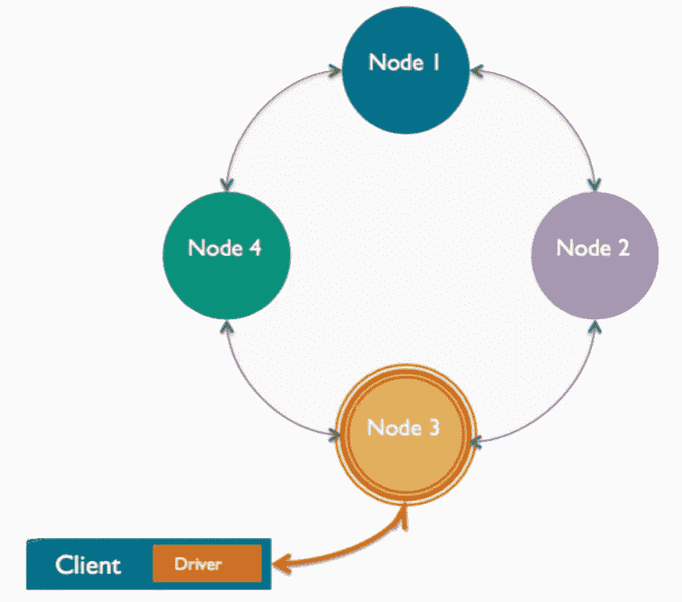
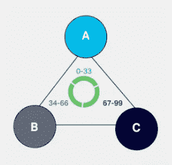
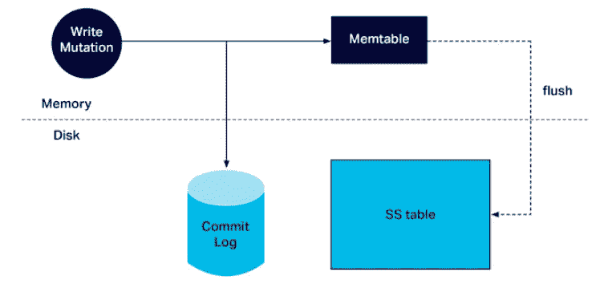

# NoSQL-阿帕奇卡桑德拉建筑

> 原文：<https://medium.com/analytics-vidhya/nosql-apache-casandra-architecture-dcf3a309999a?source=collection_archive---------6----------------------->

我们都是带着正式定义开始学习数据库的，对！数据库是一组数据的集合，这些数据被组织起来，使得它能够结合各种数据处理操作来方便地存储、检索、修改和删除数据

# 但是为什么了解数据库架构如此重要呢？

数据库中的架构侧重于软件设计、维护和管理，处理程序底层的实际数据。关于设计的正确决策将对数据库效率和纵向扩展能力产生有益的影响。

能不能在这篇文章里深入挖掘了解一下卡珊德拉建筑！是的，在此之前，让我们了解 NoSQL，类型和上限定理的基础知识。

# NoSQL

我们经常听到“非关系数据库”这个术语，它就是 NoSQL。有人说术语“NoSQL”代表“非 SQL”，有人说它代表“不仅仅是 SQL”

*   NoSQL 数据模型允许相关数据嵌套在单个数据结构中，因此相关数据不必在表之间拆分。他们可以轻松处理结构化、半结构化和非结构化数据。
*   NoSQL 数据库采用无主控对等架构，所有节点都是相同的，并保证一致性以确保持续可用性。这提供了简单的扩展来适应应用程序上的数据量。而且零停机时间，因为数据将通过多个副本分布在不同的节点上。
*   与酸性(原子性、一致性、隔离性和持久性)属性不同，NoSQL 系统被称为具有碱性(基本可用、软状态、最终一致)属性。

## NoSQL 数据库的类型

数据库类型图片来源:[https://www.improgrammer.net/most-popular-nosql-database/](https://www.improgrammer.net/most-popular-nosql-database/)

1.  ***文档数据库*** 在文档中存储数据类似于 JSON (JavaScript Object Notation)对象。每个文档都包含成对的字段和值。根据 DB- engines，MongoDB 被认为是世界上最受欢迎的文档数据库。
2.  ***键值数据库*** 其中每一项都包含键值。值通常只能通过引用其值来检索。常见的用例包括存储用户偏好或缓存。Redis 和 DynanoDB 是流行的键值数据库。
3.  ***宽列数据库*** 在表格、行和动态列中存储数据。与关系数据库相比，宽列存储提供了很大的灵活性，因为不要求每行都有相同的列。通常用于存储物联网数据和用户档案数据。Cassandra 和 HBase 是两家最受欢迎的宽栏商店。
4.  ***图形数据库*** 在节点和边中存储数据。当我们需要遍历关系以寻找模式(如社交网络、欺诈检测和推荐引擎)时，通常会用到它。Neo4j 和 JanusGraph 就是图形数据库的例子。
    *节点* →存储关于人、地点和事物的信息
    *边* →存储关于节点间关系的信息

## **什么是 CAP 定理？**

CAP 定理又称布鲁尔定理，由埃里克·布鲁尔提出。**分布式数据库**基于 CAP 定理。

该定理指出 ***“尽管在每个系统中拥有一致性、高可用性和分区容差是可取的，但不幸的是，没有一个系统能同时实现这三者。”***

一致性:所有数据库客户机将为同一查询读取相同的值，即使给定并发更新。
·可用性:—所有数据库客户端将始终能够读取和写入数据。
·分区容忍度:—数据库可以拆分到多台机器上；它可以在网络分段中断时继续运行。

# 卡珊德拉架构和复制因子策略

Apache Cassandra 是一个开源的分布式 NoSQL 数据库。它提出了一个具有最终一致语义的分区宽列存储模型。

让我们从 Cassandra 的基本组件开始，这样可以使我们的学习变得简单有趣。

节点:数据将被存储在一个叫做节点的地方。换句话说，我们可以把一个 Cassandra 实例称为一个节点。
**数据中心:**节点组称为数据中心。Cassandra 既可以水平扩展(添加更多数据中心)，也可以垂直扩展(添加更多节点)。
**集群:**数据中心的组称为集群。

## 数据库结构

Cassandra 将数据存储在表中，每个表都像其他数据库一样按行和列组织。Cassandra 的表以前被称为**列族**。一个*键空间*可以被用来分组用于类似目的的表。所以在这里，为了简单起见，我们可以从业务的角度理解，所有的事务表或者元数据表或者信息表都可以在一个 ***keyspace*** 下调用。

Apache Cassandra 的结构是“为规模而建”的，可以跨系统处理大量数据和并发用户。由于没有单点故障，该系统提供了真正的连续可用性，通过 ***数据复制*** 避免了停机和数据丢失。

数据复制是根据
→每个数据中心的复制系数
→复制策略来定义的

**复制因子** 放置在不同节点上的副本总数由复制因子决定。
1 复制因子=只有一份数据副本
3 复制因子=三个不同节点上的三份数据副本

剩余的副本由 Cassandra 使用 ***副本放置策略*放置在特定节点上。**

**复制策略** 复制策略在键空间级别设置。有两种策略:1。simple strategy——用于临时和小型集群。节点上的数据副本按顺序放置。
2。NetworkTopologyStrategy-当有两个以上的数据中心时使用。为每个数据中心分别设置副本。

## **什么是协调员？**

客户端选择该节点来接收对其群集的特定读取或写入请求。

*   任何节点都可以协调任何请求
*   每个客户端请求可以由不同的节点来协调
*   协调器管理复制因素—应该将写操作复制到多少个节点上？
*   协调器还应用一致性级别—多少节点必须确认读或写请求

## **什么是分区器，它是如何工作的？**

为 Cassandra 集群中的每个节点定义了一个令牌范围。

分区器是决定数据如何在集群节点间传播的因素。给定一行的分区键，Cassandra 使用[一致散列](https://en.wikipedia.org/wiki/Consistent_hashing)算法在集群中分发数据。

让我们考虑一个简单的例子:假设向节点 B(也就是说，节点 B 是这个请求的协调者)发出一个请求，其中有一行包含分区键“data science”。假设分割器将散列函数应用于分区关键字“数据科学”并获得令牌 87。节点 C 的令牌范围包括 87，因此该节点将是处理请求的节点。

Cassandra 提供了三种划分器:
Murmur3Partitioner(默认)，RandomPartitioner，ByteOrderedPartitioner

## 虚拟节点有什么用？

其中每个节点持有大量小令牌范围，以增强令牌重组并避免群集热点，也就是说，一些节点比其他节点存储更多的数据。虚拟节点还使得在集群中添加和移除节点以及自动管理令牌分配变得更加容易，从而不用为每个节点测量和分配新的令牌范围。

## 写入路径

**提交日志:**为了确保数据保护和数据完整性，Cassandra 有一个名为提交日志的备份方法——所有数据都写入提交日志，以确保数据不会丢失
**Mem-table:** 数据写入提交日志后，数据然后被索引并写入 Mem-table。每个表
**STable 都有一个活动的 mem-table:**当 mem-table 达到极限并变成不可变的 s table 时，数据被刷新到磁盘上。具体来说，这意味着当提交日志已满时，将导致内存表数据被写入表中的刷新

## **读取路径**

协调器发送给复制品的读取请求有三种类型:直接请求
摘要请求
读取修复请求

1.  协调器向其中一个复制品发送直接请求。
2.  然后，协调器将摘要请求发送到由一致性级别规定的副本数量，并检查返回的数据是否是更新的数据。
3.  协调器随后向所有剩余的副本发送摘要请求。如果任何节点给出过时值，后台读取修复请求将更新该数据。这个过程称为读取修复机制。

到目前为止，在本文中，我们已经了解了 Cassandra 架构是如何以一种特定的方式来提供可伸缩性、可靠性和效率的。Cassandra 的复杂架构需要仔细的配置和调整。要有效地使用 Cassandra，理解组件是至关重要的。当您需要通过多个服务器存储和处理大量数据时，Cassandra 可能是一个不错的选择。这适用于那些无法承受数据丢失的公司，或者那些由于一台服务器停机而无法访问其数据库的公司。