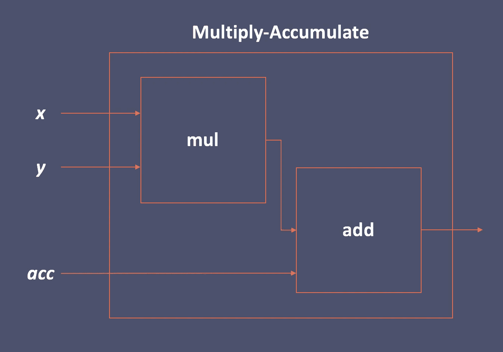

# 并非所有的陀螺都是平等的

> 原文：<https://medium.com/analytics-vidhya/not-all-tops-are-created-equal-e1911ffb4a82?source=collection_archive---------3----------------------->

到底是什么限制了我深度神经网络的速度？

一次乘加是两次运算。一顶就是万亿次运算。

深度学习处理器公司经常以每秒万亿次运算(TOP/s)或每秒万亿次乘累加指令(TMAC)等指标来强调其产品的超快的速度。这到底意味着什么，这些数字真的有用吗？

但首先，这和深度学习有什么关系？

让我们考虑一个具有 3x3x100 个滤波器和 100 个输出通道的卷积层。

*   假设该图层的输入格网大小为 50x50x100。所以，对于正向传递，这需要 3*3*100*100*50*50 = 225，000，000 台 MAC，相当于 450，000，000 次操作，因为一台 MAC 就是两次操作。
*   但是，当一个处理器公司说一个处理器每秒可以完成一定数量的 MAC 或 OPs 时，你真的会达到这个数字吗？处理器公司引用的数字是“峰值”(即理论上的最佳情况)数字。
*   实际上，您的里程可能会有所不同。例如，在最近一篇名为 [EMBench](https://arxiv.org/abs/1905.07346) 的论文中，显示了具有相同数量 MAC 的两个深度神经网络(dnn)在同一计算平台上的延迟可能有 10 倍的差异。

是什么导致了这些减速？在下文中，我们给出了一个(不完整的)问题列表，这些问题可能会阻止您的 DNN 在计算平台上达到理论峰值速度。我们主要关注那些限制 DNN 推理速度的常见问题，但其中许多也与 DNN 训练相关。

## 问题 1 —内存访问太多

很容易认为代码运行的速度受到处理器运行速度的限制。然而，在几乎所有的计算平台上，内存访问都比计算慢。一个算法(或深度神经网络层)的计算与内存访问的比率可以用一个叫做*算术强度*的度量来捕捉，这是由威廉*等人*描述的。在[车顶模型](https://people.eecs.berkeley.edu/~kubitron/courses/cs252-S12/handouts/papers/RooflineVyNoYellow.pdf)论文中。

每个计算平台都有一个特定的算术强度阈值，低于该阈值，执行速度就会受到内存访问(而不是计算)的限制。并且，每个 DNN 层设计都有特定的算术强度。因此，如果您的层具有较低的运算强度，那么它的执行速度很可能会受到内存而不是计算的瓶颈。

解决方案:

*   修改你的 DNN 图层，使其具有更高的算术强度。比如 [MobileNetV2](https://arxiv.org/abs/1801.04381) 和 [ShuffleNetV2](https://arxiv.org/abs/1807.11164) 的 MAC 数量差不多，但是 ShuffleNet 的运算强度更高。因此，ShuffleNet 在智能手机上运行时明显快于 MobileNet 也就不足为奇了。**(难度等级:容易)**
*   在您的实现中，在将结果写到主内存之前，进行*层融合*来计算多个层。例如，MobileNet 的整个模块(三个卷积、一些 ReLUs 和一些 batch-norms)可以在缓存中完成，而无需写回内存。如果你的框架使用了可以做层融合的[Tensor Virtual Machine(TVM)](https://www.usenix.org/system/files/osdi18-chen.pdf)之类的图形编译器，这可能会很容易，否则会很麻烦。**(难度等级:高级)**
*   修改你的计算平台，增加内存带宽。这在金钱和能源消耗方面都是昂贵的。或者，选择片上缓存更多的平台。**(难度:视情况而定)**

## 问题 2 —没有足够的并行性(也称为:工作饥饿)

假设您有一个能够执行 30，000 个并发线程的 GPU。此外，还有一个 1x1x10 滤波器卷积、一个 7x7x10 输入网格和 5 个输出通道。

这一层的总工作量是 1*1*10*5*7*7 = 2450 台 MAC。这里没有足够的工作来允许设备上的 30，000 个线程中的每一个执行一个 MAC，因此我们在这个计算过程中让一些 GPU 硬件空闲。当我们不使用整个 GPU 时，我们不太可能达到制造商声称的最佳 MAC/s 数。

请注意，这是一个有些简化的示例，实际上，您通常需要在每个线程上执行许多 MAC，以使 GPU 在一段有意义的时间内达到饱和。

解决方案:

*   如果可行，增加批量大小(即 DNN 并行处理的图像或数据样本的数量)。这对于某些实时应用程序来说是行不通的，在这些应用程序中，您需要尽可能低的延迟，并且批处理大小固定为 1。但是，它可能适用于在服务器上运行的离线应用程序，或者需要并行处理许多摄像机(例如汽车上的全景摄像机)的应用程序。**(难度:容易)**
*   变浅变宽。最近的 ML 文献中的趋势是开发更深的 dnn。当在固定的计算预算上更深入时，每一层变得更薄，计算量更少，因此可并行化的工作也更少。因此，当工作饥饿是一个问题时，逆潮流而动，用每层有更多工作的较浅的 dnn 进行实验是有意义的。**(难度等级:容易)**
*   层融合。(见上文)
*   降级您的硬件。使用提供更少 TMAC 的更便宜的 GPU，因为无论如何你都不会用到它。例如，如果你在亚马逊网络服务云上运行，你可以从支持英伟达 V100 的 [P3](https://aws.amazon.com/ec2/instance-types/p3/) 降级到支持英伟达 K80 的 [P2](https://aws.amazon.com/ec2/instance-types/p2/) 。但是，如果您正在开发消费者应用程序，您可能会受到客户使用的任何设备的支配，而这是您无法控制的。**(难度:视情况而定)**

## 问题 3-等待输入数据加载

在训练或推断过程中，将图像从相机或硬盘传输到主存储器的时间可能很长。此外，将数据从 CPU 内存传输到 GPU 或其他加速器内存的时间可能会很长。当将深度神经网络应用于高分辨率图像或体素数据(如 MRI 或其他医学扫描)时，数据加载可能是一个瓶颈。

解决方案:

*   压缩您的输入图像。选择在哪里压缩和在哪里解压缩取决于您的输入/输出(I/O)瓶颈在哪里。例如，如果瓶颈是在 CPU 和 GPU 之间传输图像，那么您将在 CPU 上压缩，将压缩的图像发送到 GPU，然后在 GPU 上解压缩。如果您的平台有快速压缩库，那么这应该很简单。否则，你会有很多工作要做。**(难度等级:取决于库支持)**
*   购买更快的硬件。如果磁盘是瓶颈，请购买速度更快的磁盘。如果以太网是瓶颈，升级你的以太网。如果 CPU 内存是瓶颈，你可以升级它。如果 CPU 到 GPU 的复制是瓶颈，请确保您使用的至少是 PCIe 3。如果您拥有硬件，这可能会很简单。如果你在云中或者你正在开发客户在本地运行的应用程序，这将会更加困难。**(难度:视情况而定)**

## 问题 4—I/O、内存和计算的重叠不佳

现代计算平台具有重叠 I/O 传输、内存传输和算术运算的能力。而且，如果你正在使用一个现有的具有后端的深度学习框架，如 [cuDNN](https://developer.nvidia.com/cudnn) 或 [MKL-DNN](https://github.com/intel/mkl-dnn) ，那么 I/O、内存和计算很可能会正确重叠。

但是，如果您编写自己的数据加载器来接收自定义类型的数据，那么您有责任确保发生 I/O 重叠，通常是在当前图像正在计算时预取下一批图像。而且，如果你为你在深度神经网络中使用的新操作编写自己的计算内核，你有责任确保内存传输和计算是重叠的。

解决方案:

*   编写自己的数据加载器时，如果可能的话，预取下一批数据。**(难度等级:容易)**
*   当编写自己的计算内核时，你可能想考虑为[软件流水线](https://en.wikipedia.org/wiki/Software_pipelining)显式编写代码，以重叠通信和计算。或者，在编译器将您的代码翻译成汇编代码后，[检查汇编代码](https://stackoverflow.com/questions/840321/how-can-i-see-the-assembly-code-for-a-c-program)以查看数据是否在使用之前被预取。**(难度等级:高级)**

## 问题 5——没有利用专门的操作(因为不是所有的陀螺都是一样的)

NVIDIA V100 和谷歌 TPU 等产品在 peak TOP/s 上取得突破的部分原因在于*专业化*。例如，NVIDIA V100 拥有“张量核”，在计算 16 位数字的 4x4 矩阵乘法时速度极快。

好消息是，如果您的深层神经网络层可以分解为一组可并行化的 4x4 矩阵乘法，并且如果您使用 16 位数字，您的层将运行得非常快。然而，处理器在计算大多数其他事情时相对要慢得多。

因此，如果我们设计我们的深度神经网络，使它们干净地细分为 4x4 矩阵乘法运算，它将在现代人工智能硬件上快速运行，对吗？没那么快。Google TPUv1 针对 [256x256](https://www.anandtech.com/show/12429/google-cloud-announces-cloud-tpu-beta-availability) 8 位矩阵乘法进行了优化。Google TPUv2 针对多个并发的 [128x128](https://www.anandtech.com/show/12429/google-cloud-announces-cloud-tpu-beta-availability) 32 位浮点矩阵乘法进行了优化。

华为麒麟 970 是一款智能手机芯片，包含一个神经处理单元，针对 [3x3](https://www.anandtech.com/show/11815/huawei-mate-10-and-mate-10-pro-launch-on-october-16th-more-kirin-970-details) [16 位浮点](https://www.androidauthority.com/huawei-announces-kirin-970-797788/)矩阵乘法进行了优化。我们相信，针对深度神经网络优化的计算硬件将继续变得更加多样化。

解决方案:

*   承认失败。没有一个单一的深度神经网络设计能够在所有计算平台上实现最好的 TOP/s。**(难度等级:容易)**
*   重新设计您的 DNN，以利用在您的计算平台上有效实现的操作。有几种方法可以做到这一点。一是考虑平台的优化目标，并选择合适的 DNN 层尺寸。另一个是测量平台上各种层维度的延迟，并选择运行速度快的层维度。第三是将这些测量的查找表馈送到神经架构搜索(NAS)系统(例如 [FBNet](https://arxiv.org/abs/1812.03443) 或 [SqueezeNAS](https://arxiv.org/abs/1908.01748) )，并允许 NAS 系统帮助设计正确的 DNN。**(难度等级:高级，但我们预计会变得更容易)**

明确地说，我们认为随着神经架构搜索(NAS)变得更好，为不同平台创建不同的 dnn 将变得更容易。如果你有一个支持 DNN 的应用程序，需要在每部智能手机上运行深度神经网络(从高通 GPU，到三星 GPU，到华为 npu)，NAS 将会给你很大帮助。

然而，维护所有这些不同的 dnn 可能需要大量的工程工作。我们非常有兴趣看到 Snapchat 和 Instagram 等支持 DNN 的移动应用程序最终决定如何处理这个问题，这些应用程序需要在多种类型的智能手机处理平台上运行。

## 问题 6 —未优化的代码

在一天结束的时候，如果你的代码路径中有一些缓慢的东西，[阿姆达尔定律](https://en.wikipedia.org/wiki/Amdahl%27s_law)说它将支配你的执行时间。那么，你做的那个快速破解，你添加了一个在 Python 中本地实现的新层？那可能会很快赶上你。您可能会发现自己优化了一些代码，这些代码的计算成本很低，但最终却占据了执行时间。

## 荣誉奖

还有几个问题会阻止 DNN 在硬件平台上实现峰值每秒。以下是一些荣誉奖:

*   冷却和热外壳。当芯片过热并且芯片的频率被抑制时，你不能达到峰值 TOP/s。
*   异质性。今天的许多芯片都有几种处理器和加速器。达到制造商的峰值通常需要充分利用一组异构计算单元。
*   内核启动开销。特别是在 GPU 上，启动每个 GPU 功能(通常称为*内核*)的延迟可能会[显著](https://devblogs.nvidia.com/cuda-10-features-revealed/)。因此，特别是在具有大量轻量级层的深度神经网络中，内核启动开销可能是执行时间的主要因素。层融合(如上所述)在这里会有所帮助。

## 结论—

现在，让我们回到最初的问题。当一家深度学习处理器公司告诉你，他们的产品可以执行一定数量的 TOP/s 或 TMAC/s，这到底意味着什么，这些数字实际上有用吗？

是的，这些数字很有用，因为它让我们知道在这个平台上可以达到的最好速度是多少。然而，有许多警告。为了达到接近这个最好的速度，你必须努力工作。您可能需要仔细查看 DNN 及其实现中的内存带宽使用、I/O 使用和每层并行性。你可能需要重新考虑你的 DNN 设计。您可能需要重新考虑您的实现，看看像层融合这样的东西。您可能需要更改硬件，例如添加速度更快的硬盘，以跟上应用程序其余部分的速度。你愿意做的事情越多，你的应用就越有可能接近制造商宣传的 TOP/s 或 TMAC/s 编号。

最后，我们认为单个 DNN 设计不可能在各种平台(例如，GPU 和 GPU 服务器和移动设备)。dnn 将需要为每个计算平台定制，否则平台将需要变得更加标准化。幸运的是，由于已经开源的 DNN 模型的多样性，以及神经架构搜索的兴起，这变得更加容易。

## 相关阅读

*   [如何制作糟糕的深度学习硬件](http://www.markbuckler.com/post/bad-dnn-asic/)，作者 Mark Buckler

## 承认

感谢 Steena Monteiro 和 Suresh Krishna 对本文早期草稿的有益评论。

## 脚注

从技术上讲，GPU 可能不会并行执行所有线程，但线程可以并发执行(即所有线程同时运行)。

请注意，I/O 重叠只有在当前图像正在处理时下一个图像(或下一批图像)准备就绪的情况下才有可能。在一些实时应用中，下一幅图像直到当前图像被处理后才准备好，因此在这些情况下重叠可能是不可能的。

专用硬件已经存在很长时间了。大多数 CPU 都有矢量化运算，只能在某些问题维度上实现加速。此外，数字信号处理器和 GPU 历来都是针对特定问题维度进行优化的。但是，一些以 DNN 为中心的处理平台在问题维度上特别严格，必须使用这些维度来实现接近广告中的最佳情况