# 不是另一个细分项目！

> 原文：<https://medium.com/analytics-vidhya/not-another-segmentation-article-8353a9cc8c3f?source=collection_archive---------31----------------------->

我们被要求为我们的客户群发展洞察力和战略，目的是增加公司的盈利能力。我们只有很少的时间来想出一个计划。知道我们的组织会有很多客户，为每个客户开发策略可能是多余的，详尽的，有时会适得其反。规避这一点的有效工具在于**集群**。

聚类是一种无监督的机器学习技术，它根据相似性对数据点进行分组。我们将关注可能是最常用的(或滥用的)技术，称为 K-means 聚类，其中 K 指的是你想要的段的数量(是的，你有这个能力！).在我的文章中，我不再赘述技术细节(你会在网上找到足够的解释这些概念的内容),而是更多地关注实现。不多说了，让我们开始吧！

我在这篇文章中使用了 Tableau 的样本超市数据集(多么方便和懒惰)。该数据集提供了整个客户群的收入(销售额)和利润信息。Tableau 有一个内置的集群功能，但是调整超参数(简单来说就是集群的数量)是很麻烦的。因此，我使用 R 来寻找我的数据集中的最佳段数。

你可以在我的 Github 上访问这个项目的代码。

[https://github . com/rohitTheSupplyChainGuy/Customer-segmentation-using-K-means-clustering/blob/main/Customer segmentation。Rmd](https://github.com/rohitTheSupplyChainGuy/Customer-segmentation-using-K-means-clustering/blob/main/customerSegmentation.Rmd)

销售 v/s 利润图如下:

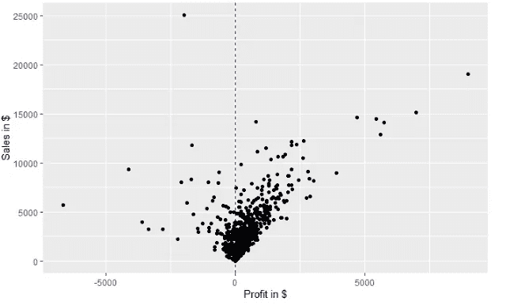

现在，让我们后退一步，尝试在数据中挖掘细分市场。一个自由党人(选举季节，看了一大堆深夜节目！)eye 将创建如下集群:

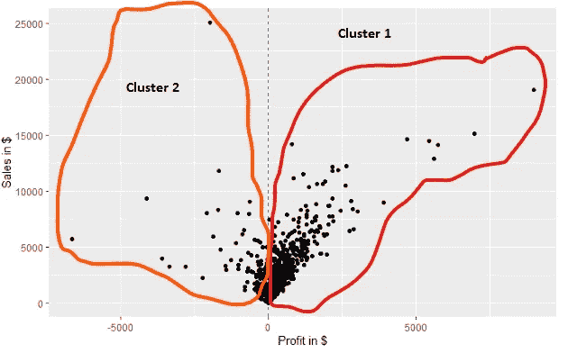

开明的眼光

根据上述分类，盈利或亏损的客户被同等对待。但是，嘿，想象一下你是一个为公司增加了很多销售额的优质客户，难道你不想被特殊对待吗？

保守的眼光来了，可以将数据细分如下:

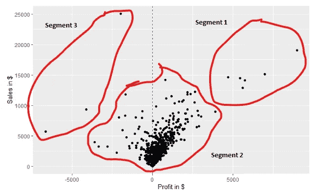

保守的眼光

保守的观点根据他们为公司创造的利润对细分进行了细微的调整。

**谁对，谁错？谁来评判！**

这就是使用机器学习进行参数调整(在数据中选择正确的分段数)的地方。请记住，我们还没有标准化数据(将销售额和利润放在同一尺度上——比较苹果和苹果),其影响将在本文后面解释。确定数据中线段数量的一个有用工具是**肘图。让我们实现这个情节，试着理解它:**

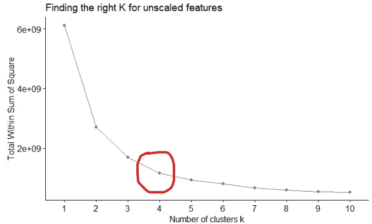

所使用的技术迭代地创建分段(在本例中为 1 到 10 个分段),并测量从算法随机放置在数据集上的质心的分段内欧几里德距离(太重)。

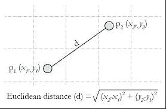

来源:媒体

我们的目的是找到最小的距离平方和，正如我们注意到的，在第四段之后，距离平方和的减少并不令人鼓舞。我们这里坚持用 4。该算法创建的分段如下:

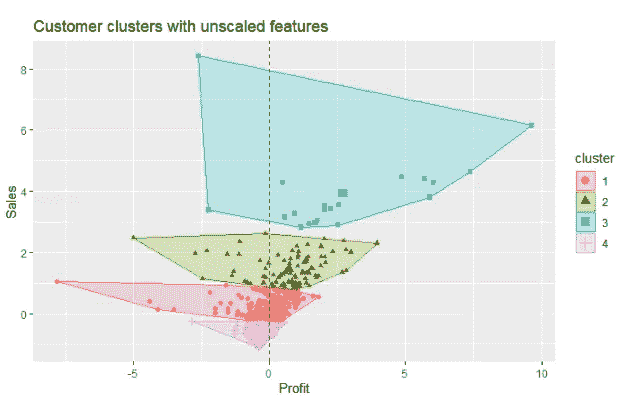

我们还没有扩展，我们有一个问题

如果我们看看上面创建的细分市场，似乎销售是主要特征，利润被忽略了。这是因为我们在运行算法之前没有缩放我们的特征。因此，数据中变化越大的特性越重要，在我们的例子中就是销售，如下所示:

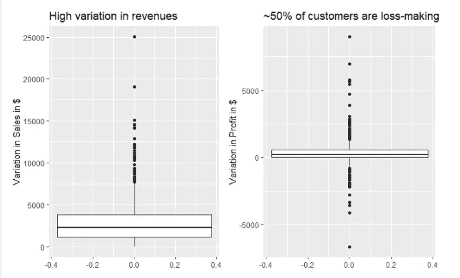

把苹果比作橘子，是吗？

让我们快速缩放数据，并重新运行箱线图:

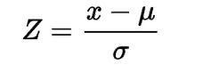

其中 x 是数据点，μ是特征平均值，适马是标准偏差

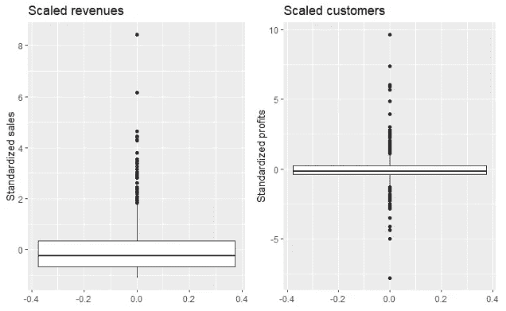

苹果对苹果！

肘图和分段可视化如下:

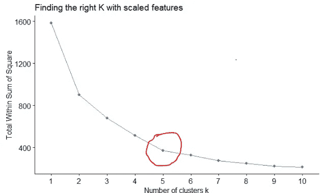

神奇的 K 是 5

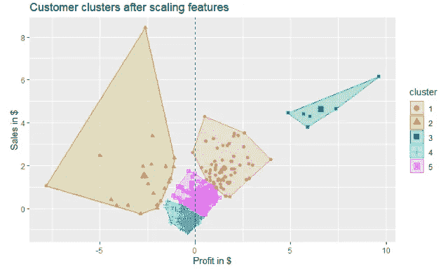

现在这说得通了

所以，我们有分段。现在怎么办？

我必须强调，聚类是一种有效的探索性数据分析技术。一旦有了细分市场，分析师和企业就可以轻松地给予客户应得的待遇。这些细分现在必须作为获得洞察力的基础。我选择使用 Tableau 构建一个仪表板，它可以帮助管理我们正在工作的假设组织。

到仪表板的链接如下:

[https://public.tableau.com/profile/rohit.tolawat#!/viz home/customer segmentation _ 16044225689930/customer analysis](https://public.tableau.com/profile/rohit.tolawat#!/vizhome/Customersegmentation_16044225689930/CustomerAnalysis)

**根据建立的仪表板，以下是我们的见解和今后的战略:**

就收入而言，我们的总利润为 12%，其中第 3 部分的利润最高(42%)。这 6 个客户遵循的做法是否可以在其他细分市场中复制。

细分市场 2 的销售额下降了 30%,无利可图。它给组织造成了 15%的总体损失。我们必须分析构成这一细分市场的 21 个客户。分析向这些客户发货是否效率低下，或者重新协商价格更优惠的合同。

产品子类书架，用品，桌子都是亏损的。这很可能是错误的定价。我们必须继续使用这些产品还是消除属于这些子类别的 SKU？

**总结:**

我们的目的是对顾客进行细分。我们试图在不扩大利润和销售额的情况下做到这一点，结果却发现由算法创建的细分市场毫无意义。

缩放特征后，我们使用肘图并最终创建了 5 个部分。

直观地分析这些片段(可能是因为我们只有 2 个特征)以意识到它是有意义的。

开发了一个交互式仪表板，以提供见解和建议。