# 非营利组织:我们如何获得富有的捐赠者？

> 原文：<https://medium.com/analytics-vidhya/not-for-profit-organizations-how-do-we-get-wealthy-donors-7c7724b91b74?source=collection_archive---------18----------------------->

# 预测建模方法。


## 介绍

许多非营利公司正在寻找为他们的事业筹集资金的方法，很多时候他们的努力可能是徒劳的，仅仅是因为他们没有接近正确的人或者他们遇到了错误的前景。

## 业务需求

因此，有必要调整寻找主要潜在客户的艺术，找到对这项事业慷慨解囊的捐助者。预测建模提供了一个解决方案。有了数据，你就可以利用基本的人口统计信息来预测潜在的捐赠者，也就是有可能对你的事业做出重大贡献的人。

在这个[项目](https://github.com/AyonzOnTop/Charity-Donor-Project/blob/Newleg/home/finding_donors.ipynb)中，我使用 1994 年美国人口普查收集的数据，采用了几种监督算法来精确模拟个人收入，然后从初步结果中选择最佳候选算法，并进一步优化算法以最佳模拟数据。这个实现的目标是构建一个模型，准确预测一个人的收入是否超过 50，000 美元。

了解个人的收入可以帮助非营利组织更好地了解需要多少捐款，或者他们是否应该从一开始就伸出援手。虽然很难直接从公共来源确定一个人的一般收入等级，但我使用预测模型从其他公开可用的特征(如年龄、工作阶层、教育水平、资本损失和资本收益等)中推断出该值。

## 数据理解

这个项目的数据集来源于 [UCI 机器学习知识库](https://archive.ics.uci.edu/ml/datasets/Census+Income)。该数据集由 Ron Kohavi 和 Barry Becker 捐赠，发表在文章*“提高朴素贝叶斯分类器的准确性:决策树混合”*中。你可以在网上找到罗恩·科哈维的文章。

该数据由以下特征组成

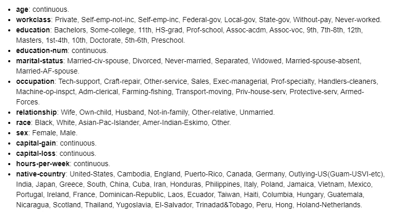

所提供记录的摘要

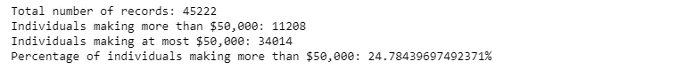

## 数据准备

在数据可以被用作机器学习算法的输入之前，它通常必须被清理、格式化和重构，这通常被称为预处理。幸运的是，对于这个数据集来说，没有我们必须处理的无效或缺失的条目，但是有一些关于某些特性的质量必须进行调整。

***处理偏斜数据***

存在一些特征，其值趋向于位于单个数字附近，但是也具有比该单个数字大得多的小得多的非平凡数量的值，算法可能对值的这种分布敏感，并且如果范围没有被适当地归一化，则可能表现不佳。在我们的数据集中，符合这一描述的特征是资本收益和资本损失。

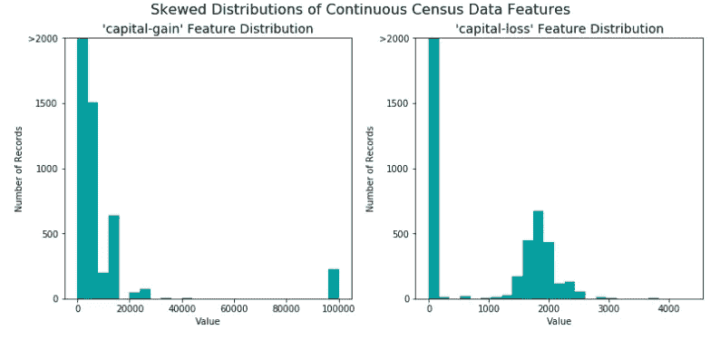

对于上述高度偏斜的特征分布，通常的做法是对数据应用对数变换，使得非常大和非常小的值不会负面影响学习算法的性能，实质上对数变换减小了由异常值引起的值的范围。应用此转换时必须小心。0 的对数是未定义的，所以我将这些值在 0 以上平移了一小段，以成功应用对数。

```
*# Log-transform the skewed features*
skewed = ['capital-gain', 'capital-loss']
features_log_transformed = pd.DataFrame(data = features_raw)
features_log_transformed[skewed] = features_raw[skewed].apply(**lambda** x: np.log(x + 1))

*# Visualize the new log distributions*
vs.distribution(features_log_transformed, transformed = **True**)
```

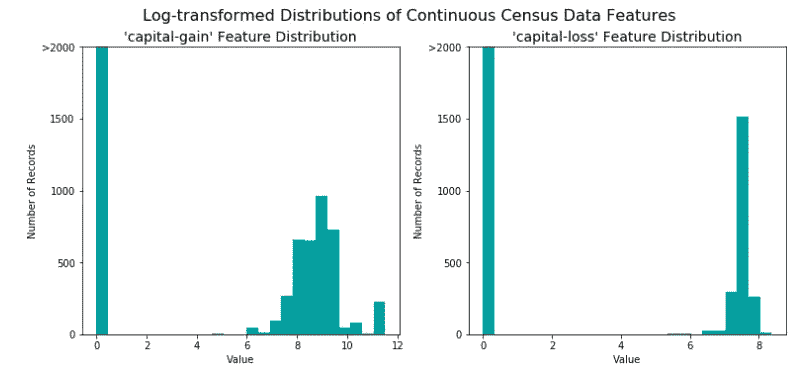

请注意，倾斜的特征值已被转换为适当分布的值范围，并考虑了第 0 个值，确保它不会被转换为未定义的值。

***处理数值特征***

对数字要素执行某种类型的缩放通常是一种很好的做法。应用数据缩放不会改变每个要素的形状，但是，归一化可确保在应用监督学习器时平等对待每个要素。这适用于诸如“教育数量”、“资本收益”、“资本损失”等值

```
*# Import sklearn.preprocessing.StandardScaler*
**from** **sklearn.preprocessing** **import** MinMaxScaler

*# Initialize a scaler, then apply it to the features*
scaler = MinMaxScaler() *# default=(0, 1)*
numerical = ['age', 'education-num', 'capital-gain', 'capital-loss', 'hours-per-week']

features_log_minmax_transform = pd.DataFrame(data = features_log_transformed)
features_log_minmax_transform[numerical] = scaler.fit_transform(features_log_transformed[numerical])
```

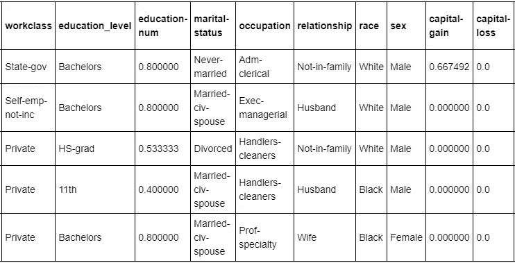

从上表中可以看出，每个记录都有几个非数字特征，如工作类别、教育水平、职业，通常学习算法期望输入为数字，这就要求转换非数字特征(称为分类变量)。一种方法是使用**一键编码**方案。一个热编码为每个非数字特征的每个可能类别创建一个虚拟变量。

```
*# One-hot encode the 'features_log_minmax_transform' data using pandas.get_dummies()*

features_final = pd.get_dummies(features_log_minmax_transform)

*#Encode the 'income_raw' data to numerical values*
income= income_raw.map({'<=50K':0,'>50K':1})

*# Print the number of features after one-hot encoding*
encoded = list(features_final.columns)
print("**{}** total features after one-hot encoding.".format(len(encoded)))display(features_final.head())
```

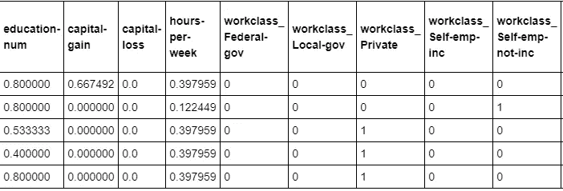

请注意，工件类特征已根据其类别被分割成列

***拆分数据***

现在，所有分类变量都已转换为数字特征，且所有数字特征都已规范化。

然后，我将数据(包括特征及其标签)分成训练集和测试集。80%的数据将用于训练，20%用于测试。

```
*# Import train_test_split*
**from** **sklearn.cross_validation** **import** train_test_split

*# Split the 'features' and 'income' data into training and testing sets*
X_train, X_test, y_train, y_test = train_test_split(features_final, 
                                                    income, 
                                                    test_size = 0.2, 
                                                    random_state = 0)
```

## 系统模型化


通过研究，这家非营利组织知道，收入超过 5 万美元的个人最有可能向他们的慈善机构捐款。因此，该组织对准确预测收入超过 50，000 美元的个人感兴趣。

***基础型号***

有一个基础模型，一个起点模型是很重要的，它有助于为你的模型是否表现良好建立一个基准。这个基础模型可以是以前模型的结果，也可以是基于你希望改进的研究论文的模型，也可以是一个简单的预测模型或随机选择模型。当你没有以前的模型或研究论文时，天真的预测者通常是最好的选择。

***评估模型***


使用准确性作为评估模型的指标似乎是合适的，因为将收入不超过 50，000 美元的人识别为收入超过 50，000 美元的人会对组织的需求不利，因为他们正在寻找愿意捐赠的个人。

因此，精确预测那些收入超过 50，000 美元的人的模型能力比回忆那些人的模型能力更重要

在评估分类模型时，使用以下指标进行评估。

**准确性**:这衡量分类器做出正确预测的频率。它是正确预测数与预测总数的比率，即测试数据点的数量)

**Precision** :以垃圾邮件分类器为例。这告诉我们被我们归类为垃圾邮件的邮件中，实际上有多少是垃圾邮件。它是真阳性(被分类为垃圾邮件的单词和实际上是垃圾邮件的单词)与所有阳性(被分类为垃圾邮件的所有单词，不管这是否是正确的分类)的比率。换句话说，它是

[真阳性/(真阳性+假阳性)]

**回忆一下**(敏感度)告诉我们实际上是垃圾邮件邮件中有多少被我们归类为垃圾邮件。它是真阳性(被分类为垃圾邮件的单词和实际上是垃圾邮件的单词)的比率。换句话说，它是

[真阳性/(真阳性+假阴性)]

F-beta 分数。该指标在数学上考虑了输出其分值时的精确度和召回率。

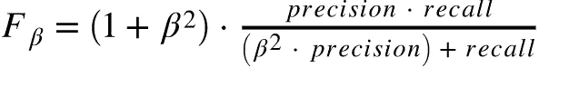

特别是β = 0.5 时，更加强调精度。为简单起见，这被称为 F-score 的强 F 0.5 分数

***建筑模型***

在这个项目中，我使用了一个简单的预测模型作为我的基础模型。在这里，我假设模型预测每个数据点有 1(即个人收入超过 50k)。

这意味着我们的模型没有真阴性或假阴性，因为我们没有做出任何负面预测。因此，我们的准确性变得与我们的精度相同(真阳性/(真阳性+假阳性))，因为我们用值 1 做出的每一个应该为 0 的预测都变成了假阳性，因此，在这种情况下，我们的分母是我们总共拥有的记录总数

我们的回忆分数(真阳性/(真阳性+假阴性))在这个设置中变成 1，因为我们没有假阴性

我根据评估指标、准确性和 F 值对模型进行了评估。

```
TP = np.sum(income) *# Counting the ones as this is the naive case. Note that 'income' is the 'income_raw' data* 
*#encoded to numerical values done in the data preprocessing step.*
FP = income.count() - TP *# Specific to the naive case*

TN = 0 *# No predicted negatives in the naive case*
FN = 0 *# No predicted negatives in the naive case*

*#Calculate accuracy, precision and recall*
accuracy = (TP+TN)/(TP+FP+TN+FN)
recall = TP/(TP+FN)
precision = TP/(TP+FP)

*#Calculate F-score using the formula above for beta = 0.5 and correct values for precision and recall.*
fscore = (1+0.5**2)*(precision*recall)/(((0.5**2)*precision)+recall)

*# Print the results* 
print("Naive Predictor: [Accuracy score: **{:.4f}**, F-score: **{:.4f}**]".format(accuracy, fscore))
```

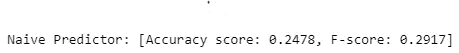

如上所示，该模型的准确率为 24.78%，F 值为 0.2917。这些值表明，朴素预测器对收入超过 50，000 英镑的个人的预测很差，但它足以作为基础模型或起点。

现在，我为这个项目考虑了一些监督学习模型。可用的型号选项包括:

*   高斯朴素贝叶斯
*   决策树
*   集成方法(Bagging、AdaBoost、随机森林、梯度增强)
*   k-最近邻(近邻)
*   随机梯度下降分类器(SGDC)
*   支持向量机(SVM)
*   逻辑回归

我选了 3 款。

*   集合模型(随机森林模型)
*   高斯朴素贝叶斯模型
*   支持向量机

***集合模特***

集合模型是非常有用的模型。它们结合了两个模型的能力，最大限度地发挥每个模型的潜力，以实现数据的良好拟合。这意味着一个模型将提供可接受的偏差水平，而另一个模型将提供良好的方差水平。本质上，一个模型将稀疏地拟合数据，而另一个模型将完全拟合数据，集合模型选择两个模型之间的中间立场，但是如果有三个或更多集合，它使用投票系统来选择最优选的拟合。

集合模型的主要缺点是计算量大。它们需要大量处理器来运行。此外，找到要使用的模型的正确组合是一项任务，这意味着找到具有正确偏差和方差水平的两个模型的组合，一个模型将适合数据的结构，但不会太多，这是一项相当费时费力的任务。然而，这是一个很好的模型选择，可以给出很好的预测。

集合模型包括 Bagging、AdaBoost、随机森林和梯度增强。然而对于这个项目，我使用了上述随机森林。

***随机森林***

随机森林使用几个决策树模型的组合能力来进行预测，这是树的集合。实际情况是这样的，训练数据的子集通过每个决策树，模型拟合数据，每个模型输出一个预测，来自每个树的预测被聚合，并选择投票最多的预测。

为了细化，每个决策树采用训练数据的子集，并基于树的节点处的某些条件将它分成两个最佳类别，根据分支和节点的数量进行进一步的分割，它基本上寻找最佳特征值对来创建节点和分支，在每次分割之后，递归地执行任务，直到达到树的最大深度或找到最佳树。

对于分类，它使用单棵树预测的最频繁的类(多数投票)，而对于回归任务，它使用每棵树的平均预测。随机森林模型可能非常慢，因为它必须在训练阶段生长许多树，模型也有过度拟合的趋势，因此需要随着它的进展进行交叉验证。

***高斯朴素贝叶斯***

该模型试图根据某个结果的概率进行预测，前提是出现与该结果同义的某些特征。该模型独立考虑每个特征来预测结果

当使用朴素贝叶斯预测个人收入是高于还是低于 50，000 美元时。该模型首先检查过去的数据，个人特征，挑选一个特征，如工作类别，它计算个人在给定工作类别的情况下成为可能的捐赠者(收入超过 50，000 美元)的概率，还计算个人在给定工作类别的情况下是否也是可能的捐赠者。它为其他特征如婚姻、教育等做这件事。在给定所有特征的累积概率的情况下，将该个体是可能的供体的概率与在给定所有特征的累积概率的情况下该个体不是可能的供体的概率进行比较，两个概率中的最大值决定了该个体是否被分类为潜在供体。

当您没有大量的训练数据和数据正态分布的假设时，这可能很有用。假设要素是独立的，该模型是非常天真的，在某些情况下，它可能会过度拟合，导致数据集的概化效果不佳，从而导致性能不佳。鉴于数据集中有许多独立的要素，其应用程序可能会满足需求。同样值得注意的是，该模型在处理分类变量时比处理连续变量时更加准确

***支持向量机***

支持向量机也是一个很好的分类器，它试图找到两个类的最近数据点之间的最小距离的中心，它试图使用超平面来分类数据，同时考虑一些参数 C、γ、rbf。

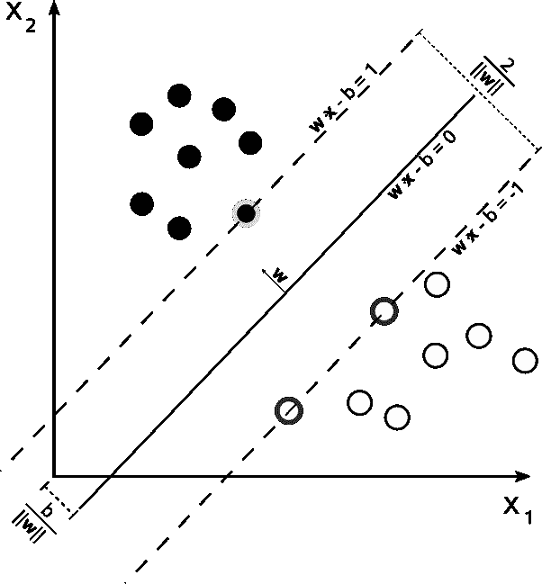

SVM 是一种线性分离器。假设我们想通过画一条线把上面的黑色圆圈和白色圆圈分开。请注意，有无限多行代码可以完成这项任务。特别是，支持向量机找到了“最大利润”线——这是“在中间”的线。直观地说，这样做效果很好，因为它考虑到了噪声，并且对任何一方的错误都是最宽容的。

这就是(二进制)SVM 的真实面目。我们在数据中间画一条直线，将数据分成两类。但是如果我们想要的不是直线而是曲线呢？我们不是通过绘制曲线，而是通过将我们观察到的特征“提升”到更高维度来实现这一点

SVM 分类器在执行非线性分类时非常有效，因为它可以很容易地找到一个超平面来准确地对数据进行分类。当使用带标签的数据时，SVM 分类器并不合适，导致其应用受到一定的限制

## ***建立训练和预测管道。***

为了正确评估我选择的每个模型的性能，我创建了一个训练和预测管道，允许我使用各种大小的训练数据快速有效地训练模型，并对测试数据进行预测。

```
*# Import two metrics from sklearn - fbeta_score and accuracy_score*
**from** **sklearn.metrics** **import** fbeta_score
**from** **sklearn.metrics** **import** accuracy_score

**def** train_predict(learner, sample_size, X_train, y_train, X_test, y_test): 
    *'''*
 *inputs:*
 *- learner: the learning algorithm to be trained and predicted on*
 *- sample_size: the size of samples (number) to be drawn from training set*
 *- X_train: features training set*
 *- y_train: income training set*
 *- X_test: features testing set*
 *- y_test: income testing set*
 *'''*

    results = {}

    *#Fit the learner to the training data using slicing with 'sample_size' using .fit(training_features[:], training_labels[:])*
    start = time() *# Get start time*
    learner.fit(X_train[:sample_size], y_train[:sample_size])
    end = time() *# Get end time*

    *# Calculate the training time*
    results['train_time'] = end - start

    *# Get the predictions on the test set(X_test),*
    *# then get predictions on the first 300 training samples(X_train) using .predict()* start = time() *# Get start time*
    predictions_test = learner.predict(X_test)
    predictions_train = learner.predict(X_train[:300])
    end = time() *# Get end time*

    *# Calculate the total prediction time*
    results['pred_time'] = end - start

    *# Compute accuracy on the first 300 training samples which is y_train[:300]* results['acc_train'] = accuracy_score(y_train[:300], predictions_train)

    *#Compute accuracy on test set using accuracy_score()*
    results['acc_test'] = accuracy_score(y_test, predictions_test)

    *#Compute F-score on the the first 300 training samples using fbeta_score()*
    results['f_train'] = fbeta_score(y_train[:300], predictions_train, 0.5)

    *#Compute F-score on the test set which is y_test*
    results['f_test'] = fbeta_score(y_test,predictions_test,0.5)

    *# Success*
    print("**{}** trained on **{}** samples.".format(learner.__class__.__name__, sample_size))

    *# Return the results*
    **return** results
```

在下面的代码块中，我初始化了模型，并使用上面的训练和预测管道来运行我为这个项目考虑的不同模型。

```
*#Import the three supervised learning models from sklearn*
**from** **sklearn.ensemble** **import** RandomForestClassifier
**from** **sklearn.svm** **import** SVC
**from** **sklearn.naive_bayes** **import** GaussianNB*#Initialize the three models*clf_A = RandomForestClassifier(n_estimators= 20, random_state = 0)
clf_B = SVC(C = 5, kernel = "rbf", degree = 3 )
clf_C = GaussianNB()

*#Calculate the number of samples for 1%, 10%, and 100% of the training data*
*# Note: samples_100 is the entire training set i.e. len(y_train)*
*# Note: samples_10 is 10% of samples_100 (ensure to set the count of the values to be `int` and not `float`)*
*# Note: samples_1 is 1% of samples_100 (ensure to set the count of the values to be `int` and not `float`)*samples_100 = len(y_train)
samples_10 = int(0.1*len(y_train))
samples_1 = int(0.01*len(y_train))

*# Collect results on the learners*
results = {}
**for** clf **in** [clf_A, clf_B, clf_C]:
    clf_name = clf.__class__.__name__
    results[clf_name] = {}
    **for** i, samples **in** enumerate([samples_1, samples_10, samples_100]):
        results[clf_name][i] = \
        train_predict(clf, samples, X_train, y_train, X_test, y_test)

*# Run metrics visualization for the three supervised learning models chosen*
vs.evaluate(results, accuracy, fscore)
```

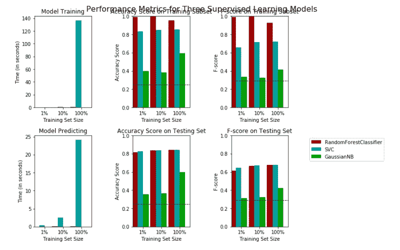

模型的输出显示了在 1%、10%和 100%的数据上训练时每个模型的运行时间和性能。

如左图所示，SVC 模型花费了最多的时间来训练和预测 100%数据集。

在相邻的地块中，随机森林分类器在训练数据的准确性和 F 值方面都具有最高的值，在百分之百的数据上具有大约 95.6%的准确性，这表明随机森林分类器模型能够充分拟合数据集，在其属性上给出良好的分类。对于不同数据比例的测试数据，它也给出了相对较高的准确性和 F 值。随机森林和 SVC 共享在测试集上执行的相似

SVC 模型显示了训练集的高精度范围，而随着用于训练的数据百分比的增加，特别是在 100%数据使用率时最高，F 分数在相当高/平均的标记内稳步上升。拟合超平面以对数据集进行分类，同时考虑 C 参数以及核以减小误差幅度，这是影响模型的准确性和 F 分数的主要因素。

高斯朴素贝叶斯在训练集和测试集上都具有较低的准确性和 F 值。这可能是因为数据集要素之间的相关性很小

对于测试集的预测，SVC 模型花费了最长的时间对所有不同百分比的数据进行训练。对于精度和 Fscore，RandomForest 下降到与 SVC 模型相同的值，这表明当涉及到新数据集的泛化时，RandomForest 分类器的灵活性略有下降，使得高斯朴素贝叶斯仍然很低。

## 模型调整


模型可以微调，以改善或优化其预测。它主要处理挑选最合适的模型参数，使模型能够充分拟合数据。

由于 Random Forest 表现最好，所以我选择它作为我的模型。然而，我相信，如果我微调它的参数，它可以表现得更好。我使用网格搜索(GridSearchCV ),其中至少有一个重要参数用至少 3 个不同的值进行了调整。

```
*# Import 'GridSearchCV', 'make_scorer', and any other necessary libraries*
**from** **sklearn.grid_search** **import** GridSearchCV 
**from** **sklearn.metrics** **import** make_scorer
**from** **sklearn.ensemble** **import** RandomForestClassifier
*# Initialize the classifier*
clf = RandomForestClassifier(n_estimators= 20, random_state = 0)

*# Create the parameters list you wish to tune, using a dictionary if needed.*
*# HINT: parameters = {'parameter_1': [value1, value2], 'parameter_2': [value1, value2]}*
parameters = {"n_estimators": [10, 20, 35],"max_features": ['sqrt','log2', 'auto'],"min_samples_leaf":[50,80, 105]}

*# Make an fbeta_score scoring object using make_scorer()*
scorer = make_scorer(fbeta_score, beta=0.5)

*# Perform grid search on the classifier using 'scorer' as the scoring method using GridSearchCV()*
grid_obj = GridSearchCV(estimator=clf,param_grid = parameters, scoring =scorer)

*# Fit the grid search object to the training data and find the optimal parameters using fit()*
grid_fit = grid_obj.fit(X_train,y_train)

*# Get the estimator*
best_clf = grid_fit.best_estimator_

*# Make predictions using the unoptimized and model*
predictions = (clf.fit(X_train, y_train)).predict(X_test)
best_predictions = best_clf.predict(X_test)

*# Report the before-and-afterscores*
print("Unoptimized model**\n**------")
print("Accuracy score on testing data: **{:.4f}**".format(accuracy_score(y_test, predictions)))
print("F-score on testing data: **{:.4f}**".format(fbeta_score(y_test, predictions, beta = 0.5)))
print("**\n**Optimized Model**\n**------")
print("Final accuracy score on the testing data: **{:.4f}**".format(accuracy_score(y_test, best_predictions)))
print("Final F-score on the testing data: **{:.4f}**".format(fbeta_score(y_test, best_predictions, beta = 0.5)))
```

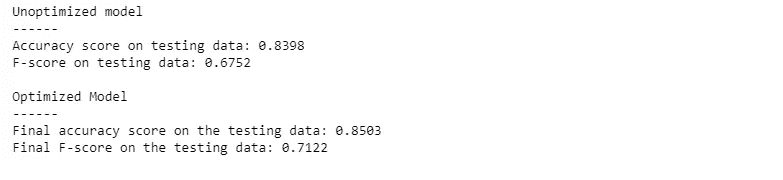

如上所述，与未优化的模型相比，优化的模型显示出更高的准确性和 F 值。结果表明，GridSearch 方法能够为随机森林找到最佳参数，从而给出良好的分类。

将原始预测值与优化模型进行比较，显示出数值上的巨大差异，因为优化模型显示出供体预测的准确性和 F 值的显著提高。

总之，在其他模型中，随机森林模型在测试数据上给出了最好的准确性和 F 分数，这表明它对数据有很好的拟合，并且可以对年收入超过 50，000 美元或更少的个人给出很好的预测，年收入超过 50，000 美元的个人是非营利组织的潜在捐赠者。