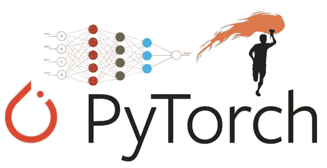

# 用 PyTorch 进行深度学习不是折磨

> 原文：<https://medium.com/analytics-vidhya/not-torturing-in-learning-pytorch-b2f7f169923a?source=collection_archive---------6----------------------->

许多读者希望在 PyTorch 中学习深度学习，但概念复杂，编程代码(Python 或 R)令人望而生畏。这篇文章为你全面介绍了**深度学习**及其在图像识别中的应用。如果你只是想对深度学习如何工作有一个整体的了解，这篇文章将会给你一个很好的概述。然而，这篇文章是写给你看如何使用 PyTorch