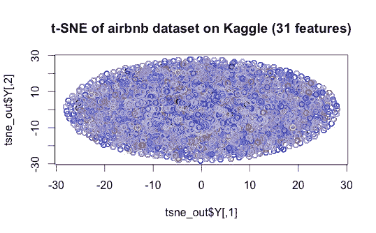
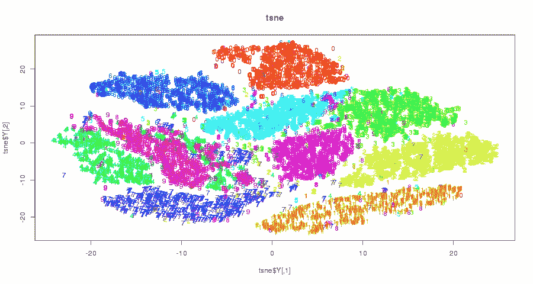
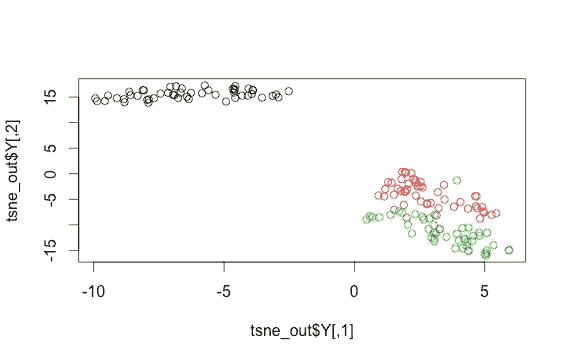
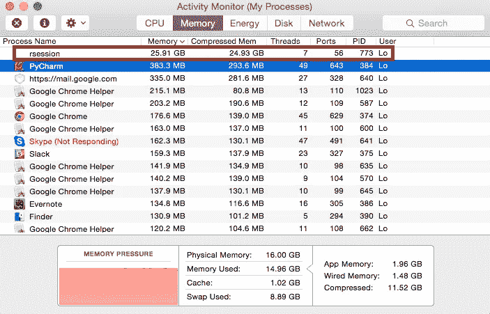
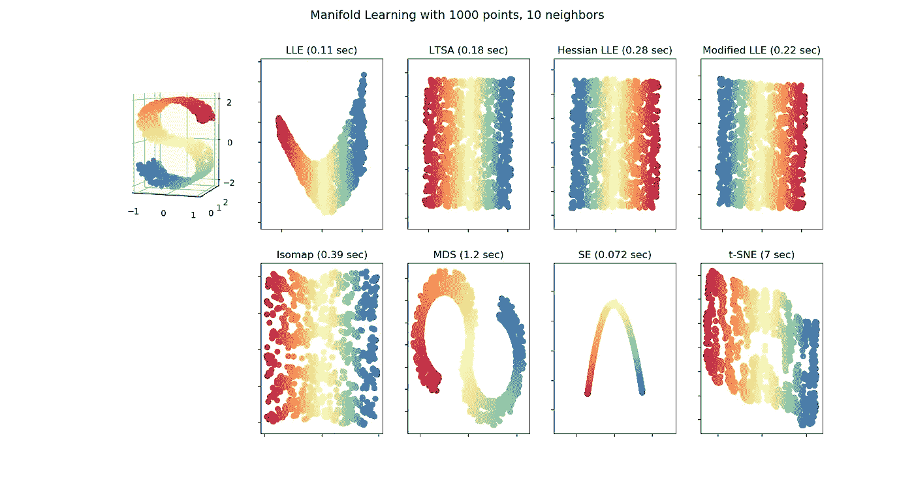

# 使用 t-SNE 在 2D 图中可视化多维数据集(以 Airbnb 预订数据集为例)

> 原文：<https://medium.com/analytics-vidhya/note-visualize-multi-dimension-datasets-in-a-2d-graph-using-t-sne-airbnb-bookings-dataset-as-824541cc5388?source=collection_archive---------9----------------------->



使用用户预订数据集中的 31 个数字特征进行预测，该数据集中有 12 个不同的旅行目的地——是的，我知道这真的很混乱，至少我们立即知道我们有一些特征工程工作要做:D

## t 分布随机邻居嵌入(t-SNE)算法

首先，**什么是 t-SNE** 和**我们什么时候为什么要用它**？这是一个`unsupervised`和`non-linear` `dimension reduction`算法，人们通常在`exploratory data analysis`期间使用它，这是整个机器学习管道的早期阶段。它帮助我们通过 2D 或 3D 图(或其他相对较低的数字)来显示高维数据集(例如，许多要素)，从而快速直观地了解数据。它不是以直接将其应用于分类任务的方式设计的。

**PCA 怎么样？**在降维区，人们常将其与`PCA`，或`Principal Component Analysis`相提并论。实际上，`t-SNE`是一种更新的方法，由 Laurens van der Maatens 和 Geoffrey Hinton 在 2008 年开发(参见论文 [*“使用 t-SNE 可视化数据”此处*](http://www.jmlr.org/papers/volume9/vandermaaten08a/vandermaaten08a.pdf) )，而 PCA 是由 Hotelling H .早在 1933 年( [*将复杂的统计变量分析成主成分*](https://psycnet.apa.org/record/1934-00645-001) )开发的，几乎是三代之前！

正如 t-SNE 论文中提到的，线性类型的模型肯定有一些限制，如 PCA、*“对于位于或接近于* ***低维*** *、* ***非线性流形*** *的高维数据，通常更重要的是将非常相似的数据点的低维表示保持在一起，* ***，这对于线性映射通常是不可能的***

为了更好地理解这一点，我们可以看看底层算法(以及许多在线的伟大的“PCA vs t-SNE”文章)，除了原始论文中的算法部分，我还强烈推荐这本[*t-SNE 算法*](https://www.oreilly.com/learning/an-illustrated-introduction-to-the-t-sne-algorithm) 的图解介绍读物，它为模型提供了非常直观但数学的视角。为了继续讨论编码部分，在这里，我们只能说与`PCA`的线性方法相比，`t-SNE`在处理某些类型的复杂数据时更有效。如下图所示，一个由 *puyokw* 创作的 [Kaggle 脚本](https://www.kaggle.com/puyokw/clustering-in-2-dimension-using-tsne/code)清晰地展示了 t-SNE 的能力。



## 密码

对于 R

**步骤 1** :安装并加载`Rtsne`包

```
install.packages("Rtsne")  # Install Rtsne from CRAN library
library(Rtsne)
```

**第二步**。为我们的示例用例加载数据集

```
> iris_unique <- unique(iris) # remove duplicate rows 
> head(iris_unique)Sepal.Length Sepal.Width Petal.Length Petal.Width Species 
1 5.1 3.5 1.4 0.2 setosa 
2 4.9 3.0 1.4 0.2 setosa 
3 4.7 3.2 1.3 0.2 setosa 
4 4.6 3.1 1.5 0.2 setosa 
5 5.0 3.6 1.4 0.2 setosa
```

**第三步**。适应 t-SNE 和视觉化

是的——真的就这么简单

```
> iris_matrix = as.matrix(iris_unique[,1:4]) # note: we can only pass in numeric columns
> tsne_out <- Rtsne(iris_matrix) 
> plot(tsne_out$Y,col=iris$Species) # graph is now generated
```



t-SNE 可视化对于简单的虹膜数据集，三种类型的花被清楚地分成不同的 3 个簇

现在，让我们尝试另一个真实世界的数据集，但要复杂得多——Kaggle 比赛中的 *Airbnb 的用户预订数据集*。通过下面的代码，我们可以查看它在 2D 空间中的可视化效果。

**第一步。**加载数据: [*Airbnb 数据集*](https://www.kaggle.com/c/airbnb-recruiting-new-user-bookings/data) *(训练数据集中有 213451 行)*

```
> library(readr) 
> df_train = read_csv(“train_users.csv”) # subset numerical features
> numeric_columns = sapply(df_train, is.numeric) 
> countries = as.factor(df_train$country_destination) 
> df_train = df_train[, numeric_columns] 
> df_train$country_destination = countries # put destination column back 
> df_train_unique <- unique(train) # de-duplication
> dim(df_train_unique)[1] 213451 31
```

**第二步**。拟合 t-SNE 并生成图

```
> matrx = as.matrix(df_train_unique) 
> tsne_out <- Rtsne(matrx) 
> plot(tsne_out$Y, col=countries, main=’t-SNE of airbnb dataset on Kaggle (31 features)’)
```


31 个数字特征和 12 个不同的目标变量

在`Rtsne()`和`unique()`上花了 20-30 分钟，得到的图形很糟糕，这意味着我还没有想出好的功能来区分 **12 个不同国家的目的地**以进行准确的预测。
(可以通过*θ*、 *max_iter* 等参数提高速度。)

```
> colnames(df_train)[1] “timestamp_first_active” “age” [3] “signup_flow” “-unknown-” [5] “Android App Unknown Phone/Tablet” “Android Phone” [7] “Blackberry” “Chromebook” [9] “Linux Desktop” “Mac Desktop” [11] “Opera Phone” “Tablet” [13] “Windows Desktop” “Windows Phone” [15] “iPad Tablet” “iPhone” [17] “iPodtouch” “total_elapsed_time” [19] “-unknown-_pct” “Android App Unknown Phone/Tablet_pct” [21] “Android Phone_pct” “Blackberry_pct” [23] “Chromebook_pct” “Linux Desktop_pct” [25] “Mac Desktop_pct” “Opera Phone_pct” [27] “Tablet_pct” “Windows Desktop_pct” [29] “Windows Phone_pct” “iPad Tablet_pct” [31] “iPhone_pct”
```

**Python 代码**

对于 Python 人员来说，我们将使用`sklearn.manifold`下的`TSNE`包，一个简单的用例如下所示，其中有可选参数，包括***， *n_components**** **(嵌入空间的维度，默认=2)* ， ***n_iter*** *(优化的最大迭代次数)**

```
*from sklearn.manifold import TSNE
import matplotlib.pyplot as pltX_tsne = TSNE().fit_transform(df_train_unique)
scatter(X_tsne[:, 0], X_tsne[:, 1],
        c=countries,cmap=plt.cm.spectral,alpha=.4,
        edgecolor='k')*
```

***权衡:高时间和空间复杂度***

*当我传入 20 万个数据点的完整的 **150+** 特征(包括`dummyVars()`添加的分类字段)来构建 2D t-SNE 可视化时，它花费了很长时间，并耗尽了我的 MBP 的 **25GB** 内存，相当可怕…！*

**

*除此之外， **t-SNE 算法的计算量非常大**。如 [*sklearn 文档*](https://scikit-learn.org/stable/modules/manifold.html) 所示，在同一个*流形学习(非线性降维)*家族中，***t-SNE**可以比*【SE】**【MDS】*等其他**模型多取 6-100 倍******。****

********

****即使与其他非线性降维模型相比，t-SNE 也是非常计算密集型的****

****当我们考虑底层算法时，t-SNE 必须计算所有点之间的距离，并维护一个成对的 *N 乘 N* 距离矩阵(N = #个示例)。**因此，它的空间和时间复杂度都在二次水平， *O(n )*** ，这个问题自然成为人们试图优化的另一个热门研究领域，一个例子是 [*基于快速傅立叶变换加速插值的 t-SNE (FIt-SNE)*](https://github.com/KlugerLab/FIt-SNE) ，详细内容可以在论文[这里](https://arxiv.org/abs/1712.09005)找到。****

## ****未完待续 **……******

****回到 Airbnb 数据集的例子，我们应该能够用 t-SNE 生成更好的可视化结果——请继续关注，下次让我分享更多！****

## ****参考****

*   ****[**【Python】**sk learn . manifold TSNE](https://scikit-learn.org/stable/modules/generated/sklearn.manifold.TSNE.html)****
*   ****[**【R】**Rtsne { Rtsne }文档](http://www.inside-r.org/packages/cran/Rtsne/docs/Rtsne) [pdf](https://cran.r-project.org/web/packages/Rtsne/Rtsne.pdf)****
*   ****[**【R】**dummy vars()—将分类数据转换为数值数据，以用于建模目的](https://www.youtube.com/watch?v=7rgzCjrIA-o) ( [doc](http://www.inside-r.org/packages/cran/caret/docs/dummyVars) )****
*   ******[**ka ggle script】**—t-SNE 可视化，奥托竞赛](https://www.kaggle.com/benhamner/otto-group-product-classification-challenge/t-sne-visualization/code)******
*   ********[**[**【ka ggle script】**—2D 的集群，采用 tsne VS pca，数字识别器](https://www.kaggle.com/puyokw/digit-recognizer/clustering-in-2-dimension-using-tsne/code)******
*   ******[**【文章】**关于 t-SNE 算法的综合指南，用 R & Python](https://www.analyticsvidhya.com/blog/2017/01/t-sne-implementation-r-python/) 实现，由 Analytics Vidhya 提供******
*   ******[**【文章】**如何有效使用 t-SNE](https://distill.pub/2016/misread-tsne/)******
*   ******[**【论文】**马滕，L. V. D .，&辛顿，G. (2008)。使用 t-SNE 可视化数据。*机器学习研究杂志*，*9*(11 月)，2579–2605。](http://www.jmlr.org/papers/volume9/vandermaaten08a/vandermaaten08a.pdf)******

## ********结尾备注:********

> ******感谢您阅读本文，非常感谢您的任何反馈/问题。请随时寻求进一步的合作😃******

******【paullo.myvnc.com/blog/】*早在 2016 年* [*同一作者发表了一篇相关文章但只是简单版本)*](http://45.55.83.242:4000/blog/2015/12/24/note-Use-t-SNE-to-visualize-multi-dimension-dataset-to-2D-graph/)******