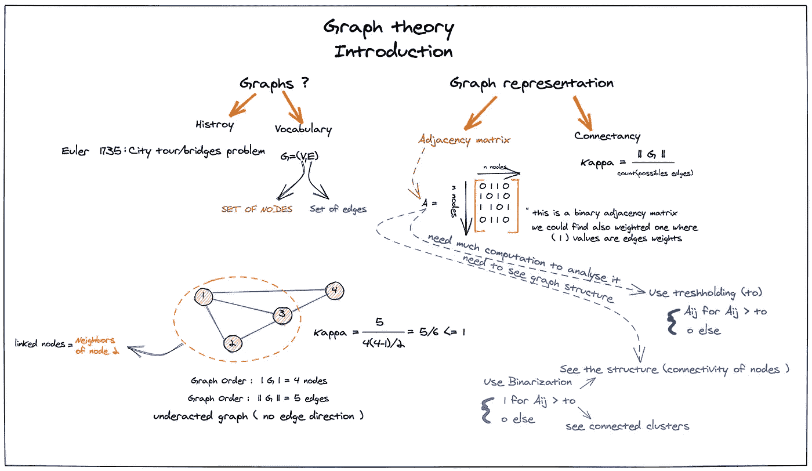
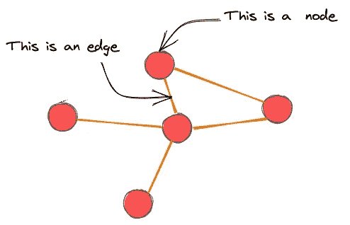
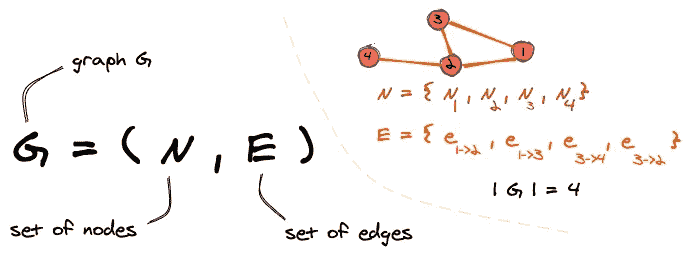
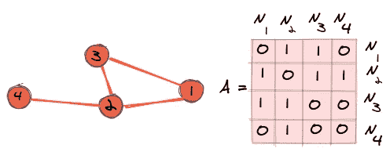

# 图论笔记—第一部分

> 原文：<https://medium.com/analytics-vidhya/notes-on-graph-theory-4883b1d36d31?source=collection_archive---------19----------------------->

## 为好奇的学习者准备的一系列易于掌握的图论笔记

我的《图论导论》札记

# 为什么我要创建这个笔记？

作为一个好奇的学习者，我发现自己在消耗大量的材料，以便在我最喜欢的领域保持更新，或者为进入新的领域打下坚实的基础。这些大量的材料在被理解后需要被储存起来以备将来使用。

这就是为什么我发起了一个名为 **Brain Box** 的个人项目(希望我能完成这个项目……)，这是一个易于阅读的小而紧凑的笔记集，它将帮助我和感兴趣的社区获得信息丰富的重要材料，而无需浪费时间阅读长篇论文或观看无限的 YouTube 播放列表。

这本笔记集将简短而直接，并附有例子来帮助你理解。

# 先说图论！

## 为什么需要学习图论？

两个月前，我读到图形神经网络是机器学习领域的趋势。我知道，每个 ml 模型所需的输入数据不能总是用欧几里德空间(向量、矩阵……)来表示，而可以不仅仅是简单的值，而是具有有意义的连接的特征集合，例如:分子、社会网络和其他形式的网络，因此我们需要一种与这种数据类型输入兼容的模型。

图形神经网络可以成为分析和处理这类数据的解决方案，但使用它们需要对图形进行预先研究:它的数学和解剖学。

学习图论不仅会让你开始了解 GNN，还会帮助你发现一个新的世界:网络的世界，我个人喜欢在现实世界的应用程序中投射其概念，如我所在城市附近的本地道路网络或我最喜欢的系列角色关系。

## 图论:概述

在第一篇文章中，我将尝试通过给出定义和数学表示来介绍作为对象的图，因为我们稍后会用到它。

*   **图形定义**

图表无处不在，它是一个非常适合的工具来呈现数据，其中连接和链接对于我们理解它很重要。就像分子结构呈现出基本原子的集合，这些原子相互连接，形成复杂的结构，在这个集合中每个原子的连接意味着这个分子的用法或特征，事实上，改变其中一个连接可以给你一个完全不同的分子。

这个例子将帮助我们理解**一个图的基本结构，这个图是由一堆通过边连接的节点生成的**。基础解剖学？是的，但是继续添加这些节点和边，你可以创建一些曾经存在的复杂网络。以脸书为例，节点是用户，边是友谊或追随者。

一个有 5 个节点和 5 条边的图的例子

*   **图形数学呈现**

如前所述，图可以构建成一个复杂的结构，以**的脸书社交网络为例。****因此，仅仅通过视觉观察很难研究它，因此，我们需要建立数学工具来帮助我们理解或分析我们的图形结构。**

**我们从作为数学对象的图形定义开始。一个图是由它的一组节点和一组边定义的，所以一个图 G 被定义为:**

****

**图形的数学表示**

**n 表示图中的节点集，E 是边集。我们还将图的范数定义为节点数**

*   ****邻接矩阵****

**正如我之前所说的，我们不能仅仅使用图形的几何形状来分析它们，但是我们需要某种工具来封装我们图形中的信息，并且容易对其进行数学分析。**

**为此，我们将**邻接矩阵**定义为二进制 2d 数组 n*n，其中 n 表示节点的数量。如果两个节点链接，则每个值可以是 1，否则将是 0。正如你在例子中看到的，无向图(一种图形结构)的邻接矩阵是对称的，我们将在接下来的故事中看到更多。**

****

**邻接矩阵示例**

## **结论**

**正如你可能看到的，我用这篇文章介绍了我正在做的一个有趣的项目，我希望你能以此为动力开始写你的个人笔记。我不希望它只是关于项目，但我想尽快开始与翔实的内容。**

**图表非常有趣，尤其是它的结构和它在现实生活中的许多应用和投影。这个故事只是图论系列的开始，在这个系列中，我们将了解更多关于它的结构和如何分析它。**

## **PS:**

**每个故事我都使用一个手写的笔记(这个故事中的第一个媒体)来总结文章的内容，你可以随意保留它，因为正如我之前所说的那样，每次你看它时，你都会很容易焕然一新。一旦你理解了内容，一个简单的笔记就可以完成这项工作。**

## **来源:**

*   **材料**

**巴西拉实验室的图论讲座**

** [## 图论

### 在数学中，图论是对数学结构的研究，这些数学结构用于模拟成对关系…

En.wikipedia.org](https://en.wikipedia.org/wiki/Graph_theory) 

*   草图工具

 [## Excalidraw

### Excalidraw 是一个虚拟协作白板工具，让您轻松地绘制具有手绘感觉的图表…

Excalidraw.com](https://excalidraw.com/)**