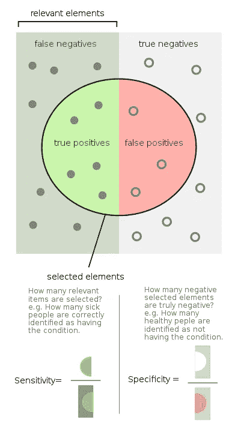

# 关于灵敏度、特异性、精确度、召回率和 F1 分数的注释。

> 原文：<https://medium.com/analytics-vidhya/notes-on-sensitivity-specificity-precision-recall-and-f1-score-e34204d0bb9b?source=collection_archive---------1----------------------->

阅读血液报告显示某些健康状况测试的阳性和阴性结果是很常见的。

假设报告称他们的登革热检测呈阴性。

测试呈阴性是什么意思？这意味着你有登革热还是没有？

如果我们不确定考试的目的是什么，这种困惑是很正常的。如果医学测试是为了检查登革热的存在，如果你测试呈阴性，这意味着你没有登革热。

这些测试大部分是分类。尤其是二元分类。其中输出总是布尔型的，即不是真就是假。

仅仅因为输出为真/假，并不意味着他们对分类的准确性有百分之百的把握。几乎所有的医学测试都不是 100%准确的，并且存在出错的可能。人们所能期望的是达到接近 100%。并且输出是基于其接近真或假的程度。

ref:[https://en . Wikipedia . org/wiki/Sensitivity _ and _ specificity #/media/File:Sensitivity _ and _ specificity . SVG](https://en.wikipedia.org/wiki/Sensitivity_and_specificity#/media/File:Sensitivity_and_specificity.svg)

因此，当某样东西按照二进制分类时，输出属于 4 个类别中的一个。
1。**真阳性(TP)，
2。真阴性(TN)，
3。误报(FP)，
4。假阴性(FN)**

这些是定义输出正确性的限定符。
**它们包含两部分<真/假> <正/负>。**

第一部分表示输出的正确性，而第二部分可以是分类的标签/值。

因此，当我们看到类似于
**登革热存在测试的输出时:** **真** 但患者没有登革热。则归类为**假阳性**。即输出被错误地声明为正。实际上，样本呈阴性(没有登革热),但分类器显示为阳性(有登革热)。

上述 4 个类别有助于我们评估分类的质量。

# **灵敏度:**

## 分类器的灵敏度是正确识别为阳性的数量与实际阳性的数量之间的比率。

**灵敏度= TP / FN+TP**

*用在什么地方？
阳性分类为高优先级的地方。机场的安全检查。*

# **特异性:**

## 分类器的特异性是多少被正确分类为阴性与多少实际上是阴性之间的比率。

**特异性= TN/FP+TN**

*用在什么地方？
否定分类优先级高的地方。
例如:在治疗前对健康状况进行诊断。*

# **精度:**

所有阳性中有多少被正确分类为阳性。
精度= TP/TP+FP

# **回忆:**

**回忆和敏感是一回事。
召回= TP / FN+TP**

*精度和召回用在哪里？
精度和召回率的调和平均值给出一个分数称为* ***f1 分数*** *这是对模型的分类能力的表现的度量。*

**F1 得分= 2 *(精度*召回)/(精度+召回)**

F1 分数被认为是比常规精度度量更好的分类器性能指标。