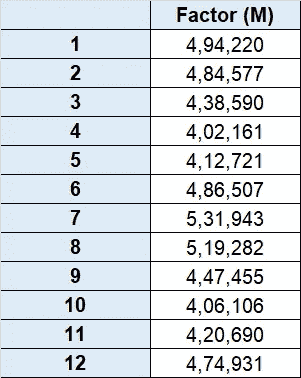

# 关于时间序列分析的注记

> 原文：<https://medium.com/analytics-vidhya/notes-on-time-series-analysis-dafc8388df95?source=collection_archive---------9----------------------->

时间序列是一系列按时间顺序排列的数据点。最常见的是，时间序列是在连续的等间隔时间点取得的序列。因此，它是一个离散时间数据序列。

时间序列分析包括分析时间序列数据的方法，以便提取有意义的统计数据和数据的其他特征。时间序列预测是使用模型根据以前观察到的值来预测未来值。

# 文章的布局

**了解您的数据**

绘制系列图

检查季节性的月度箱线图

检查趋势的每年平均值

**清理数据**

将数据分为训练和测试

根据每年的季节性进行调整

针对每周季节性进行调整

**时间序列预测的 ARIMA 模型**

ADF 测试检查静止

PACF 和 ACF 图决定 AR 和 MA 的滞后

在测试数据集上测试模型的性能

**使用 auto_arima 决定最佳滞后**

使用 auto_arima 的最佳模型

在测试数据集上测试模型的性能

比较上述两个模型的性能

# 1.了解您的数据

从 2004 年 1 月 1 日至 2013 年 12 月 31 日提供每日电力需求。请参考图 1(折线图)。

据观察，有很强的月度季节性，高峰在 1 月、7 月和 8 月，低谷在 4 月、5 月和 10 月。请参考图 2(箱线图)。

数据中没有年度趋势。请参考图 3(柱状图)。

图 1:绘制系列图

图 2:检查季节性的月度箱线图

图 3:检查趋势的每年平均值

# 2.清理数据

数据被分成训练和测试数据集。训练数据集包含 8 年的数据(2004 年 1 月 1 日至 2011 年 12 月 31 日)，测试数据集包含 1 年的数据(2012 年 1 月 1 日至 2012 年 12 月 1 日)。

观察到数据集中有很强的月季节性。根据训练数据集计算月平均功率需求。针对每月的季节性调整训练数据集和测试数据集。请参考表 1。

调整值(m) =价值/季节性因素(m)

观察到有很强的周季节性。从每月调整的训练数据集中计算一周中某一天的平均功率需求。针对每周的季节性调整训练数据集和测试数据集。请参考表 2。

调整值(mw) =调整值(m) /季节性因素(w)

*表 1:调整年度季节性*

*表 2:调整每周季节性*

# 3.时间序列预测的 ARIMA 模型

进行 ADF 测试是为了检查静止状态。发现该序列是平稳的:

> o ADF 统计:-15.848
> 
> o p 值:0.000

生成 PACF 和 ACF 图来确定 AR 和 MA 的滞后。由于 ACF 图显示逐渐下降，而 PACF 显示急剧下降，因此推断模型为 AR(p)。为了获得最佳的 AR 滞后，我们检查了 AIC 不同的可能的滞后组合。请参考图 4 (ACF 图)、图 5 (PACF 图)和表 3 (AIC 表)。

> o 如果系列的偏相关函数(PACF)显示一个锐截止和/或滞后-1 自相关为正，即，如果系列出现轻微的“差异不足”，则考虑向模型添加一个或多个 AR 项。PACF 截断的滞后是指示的 AR 项的数目。
> 
> o 如果系列的自相关函数(ACF)显示一个锐截止和/或滞后-1 自相关为负，即如果系列出现轻微的“过度差异”，则考虑在模型中添加一个 MA 项。ACF 切断超过的延迟是指示的 MA 项的数量
> 
> o 基于 AIC，得出 AR(3)是最佳模型的结论。当滞后从 3 增加到 4 时，AIC 的增加几乎不明显。

模型在测试数据集上的性能。

> o 首先，每周的季节性会成倍增加。然后，每月的季节性被放大。请参考图 6(实际与预测)。
> 
> o 将预测系列与 2012 年 1 月 1 日至 2012 年 12 月 1 日的实际电力需求进行比较。
> 
> o 观察到 RMSE 为 43，947.82，实际需求功率的平均值为 442，072.12。

图 4: ACF 图

图 5: PACF 图

表 3:不同 AR(p)的 AIC 值

图 6:实际与预测

# 4.使用 auto_arima 确定最佳滞后时间

python 库 pmdarima 提供了 auto_arima 过程来获得最佳模型。PMDARIMA 相当于 R 的 auto.arima 功能。它收集了平稳性、季节性和时间序列效用的统计测试。

> o AUTO_ARIMA 分别为 AR、I 和 MA 提供 p、d 和 q 的最佳值。
> 
> o Python 语法:
> 
> auto_arima(train['variable']，error_action='ignore ')。摘要()

ARIMA 模型

> o auto _ ARIMA 选择的最佳模型是 SARIMAX(1，1，2)
> 
> o 其中:p=1，d=1，q=2
> 
> o 适合模型的 Python 语法
> 
> 模型= ARIMA(火车['变量']，顺序=(1，1，2))
> 
> 结果= model.fit()
> 
> 结果摘要()

在测试数据集上测试模型的性能

> o 首先，每周的季节性会成倍增加。然后，每月的季节性被放大。请参考图 7(实际与预测)。
> 
> o 将预测系列与 2012 年 1 月 1 日至 2012 年 12 月 1 日的实际电力需求进行比较。
> 
> o 据观察，RMSE 为 40，663.4，实际需求功率的平均值为 442，072.12。

比较上述两种模型的性能

> 第一种方法(使用 ACF 图和 PACF 图)—观察到 RMSE 为 43，947.82，实际需求功率的平均值为 442，072.12。
> 
> o 第二种方法(使用 auto_arima) —观察到 RMSE 为 40，663.4，实际需求功率的平均值为 442，072.12。
> 
> o 与第一种方法(使用 ACF 图和 PACF 图)相比，第二种方法(使用 auto_arima)的结果更好。

图 7:实际与预测