# 注释:数据的属性(1)

> 原文：<https://medium.com/analytics-vidhya/notes-properties-of-data-1-63a66ffeb7dd?source=collection_archive---------28----------------------->

“我们相信上帝，所有其他人都会带来数据。”—W·爱德华兹·戴明

*“拷问数据，它会承认任何事情。”—罗纳德·科斯*

*“在没有数据之前就进行理论化是一个严重的错误。”—夏洛克·福尔摩斯*

所以真正的问题是，如果我们有数据，我们能做什么，我们如何对待它，让它说话。在之前的博客中，我们讨论了不同的数据类型，现在的重点是对**数字**数据的描述性统计。

照片由[米卡·鲍梅斯特](https://unsplash.com/@mbaumi?utm_source=medium&utm_medium=referral)在 [Unsplash](https://unsplash.com?utm_source=medium&utm_medium=referral) 上拍摄

数据探索可以大致分为以下几类:

U

*双变量分析:将两个变量放在一起考虑，观察相关性、箱线图等方面。*

*多变量分析:将两个以上的变量放在一起分析，如聚类分析、回归分析等。*

在这个博客中，我们关注单变量数值分析。常用的术语有:**均值、中值、众数、切尾均值、加权均值、加权中值、离群值、范围**、**偏度、峰度**、 **IQR、标准差、方差、最小值、最大值、计数、MAD。这些共同解释了数据的位置和可变性。**

让我们来定义这些概念:

1.  **均值或平均值**:也叫数据的集中趋势。计算所有值的总和除以值的计数。

注意事项

*   它受到异常值和偏斜分布的影响
*   对于异常值，它可能不是集中趋势的最佳度量

2. **Trimmed Mean** :为了处理上述限制，我们在排序数据的每一端丢弃**‘n’**值。异常值的影响有限，因此被视为稳健的统计数据。

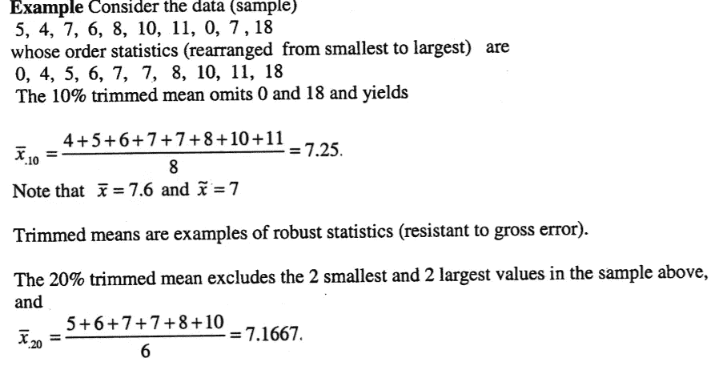

**修整均值示例**

3.**加权平均值**:如果每个数字的重要性程度不同，那么这种计算就是假设重要。我们将每个数据值' **xi** '乘以其权重' **wi** '，对其求和并除以权重' **w'** 的和

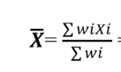

加权平均数

4.**中值:**我们选择数据的中间元素，从小到大排序。如果是偶数，取中间两个数的平均值。

注意事项

*   它不受离群值和偏斜分布的影响
*   对于非对称数据，这可能是一个更好的集中趋势的措施

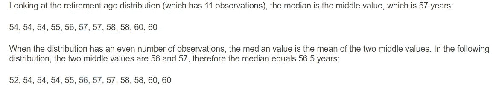

中位数的计算

5.**加权中位数**:非常类似于加权平均数，对数据进行排序，而不是中间值，加权中位数是这样的，列表的下半部分和上半部分的权重相同。根据我的经验，这不是常用的度量标准，但知道这一点很好。

需要注意的事项:

*   受异常值影响的是**而不是**。

6.**模式:**是数据中出现次数最多的值，即最大频率。如果有两个、三个或更多的值具有最大和相等的频率，则数据也分别称为双峰、三峰和多峰。

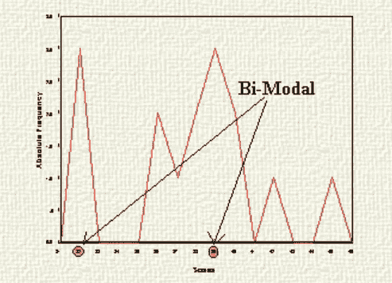

具有相同高频率的两个值的数据-双峰

7.**异常值**是极端的，或与其余数据非常不同的异常数据值。下面这张来自 xkcd 的图片说明了一切

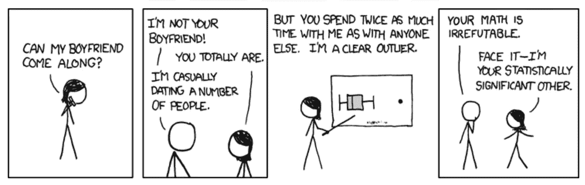

xkcd 异常值

***事实*** *:当一个分布对称时，众数、中位数、均值都在同一点。*

***注意*** *:分布可能是对称的和双模态的，在这种情况下，上述陈述不成立。*

8.**偏斜度:**被描述为数据集缺乏对称性的度量。如果分布在中心点的左侧和右侧看起来相同，则它是对称的，完美的对称分布(正态分布)的偏斜度为 0。不同偏度的不同中心性度量之间的关系如下所示:

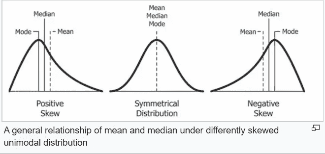

9.**峰度:**是分布尾部厚度的度量。也就是说，具有高峰值的数据集往往具有重尾，可能是离群值。峰度较低的数据集往往具有较轻的尾部，或者离群值较少。根据我的经验，我不经常使用这个指标。

上述指标解释了数据的集中趋势。类似地，用于解释数据中离差量或扩散量的指标有**范围、IQR、标准差、方差和 MAD**

下图显示了三种不同的分布，它们具有相同的平均值，但分布范围不同。因此，这两者对于理解数据都很重要

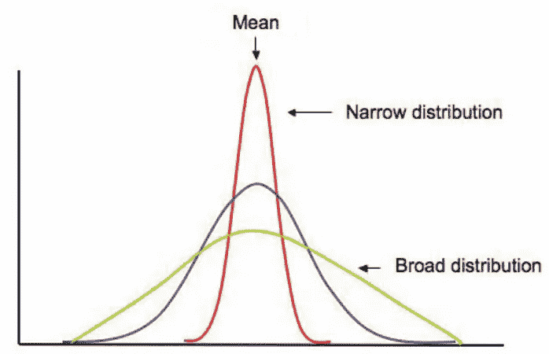

均值相同但分布不同

1.  **范围**:一组数据的范围是该组中最高值和最低值之差。它给出了数据扩散的快速感觉，但是更好的方法，如标准偏差，是首选的“扩散”。

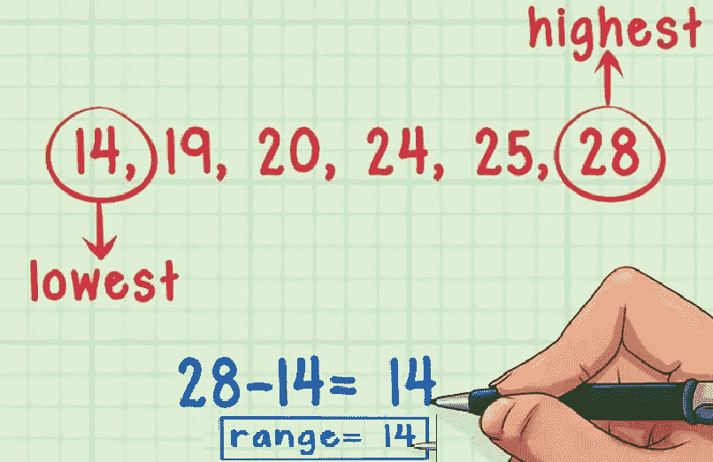

范围计算

2.**四分位数范围(IQR)** :四分位数将数字分成 4 等份。IQR 被定义为数据集中上四分位数( **Q3** )和下四分位数( **Q1** )之差[**IQR**= Q3 Q1]。自然地，这包括数据的中央部分，25%的数据在它之前，25%的数据在它之后。

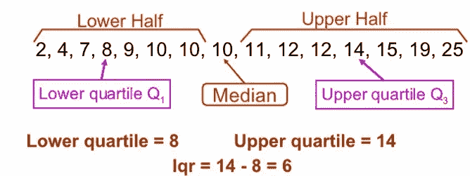

四分位间距

3.**标准偏差(L2 范数或欧几里德范数):**标准偏差和方差是解释数据中“分散性”或“可变性”的最佳衡量标准，即数据的分散程度(*宽分布*)或聚集程度(*窄分布*)。较小的标准差表示大多数数据点更接近平均值，而较大的标准差表示数据分散。 **sd** 大致是样本中观察值偏离平均值的典型距离。

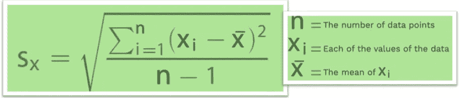

标准偏差公式

*2/3 的数据落在平均值的一个标准偏差内(正态分布)*

标准差的平方就是**方差**。标准偏差更容易解释，因为它与实际数据具有相同的尺度。

需要注意的是:这两个度量都会受到异常值的影响

在存在异常值的情况下，我们应该注意其他稳健的可变性测量:

4.**中位数绝对偏差(MAD)** :如果数据不正常，并且数据中存在异常值，则这种分布度量优于标准差。它被计算为相对于中位数的绝对偏差的中位数。有时，MAD 乘以 1.48 的比例因子，使其与标准偏差处于相同的比例

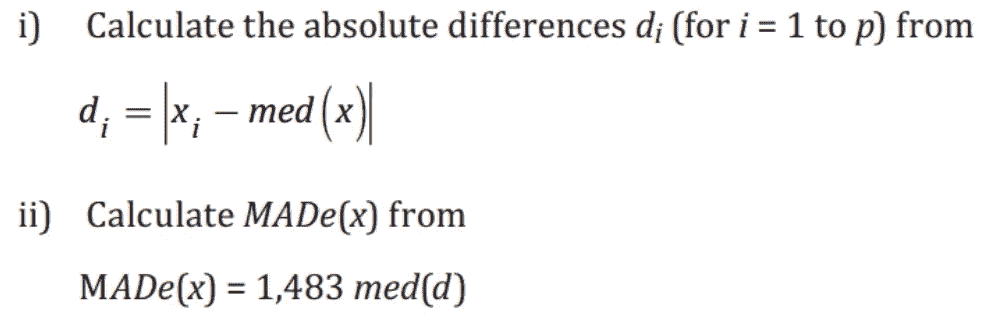

如何计算稳健的可变性度量

我们在这里所涵盖的是一个简单的位置和可变性的共同措施的复习。这些有助于将数据解释为单一数值。