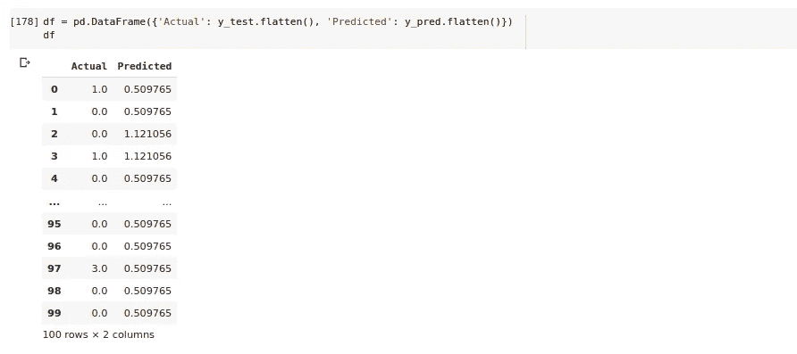

# 新型冠状病毒:探索性数据分析以及使用机器学习算法的预测。

> 原文：<https://medium.com/analytics-vidhya/novel-corona-virus-exploratory-data-analysis-along-with-prediction-by-using-machine-learning-adb7133a521?source=collection_archive---------5----------------------->

> 一种新的基于 SARS 冠状病毒的感染确实是致命的，它起源于中国武汉，并传播到世界其他地方。

**背景**

2019-nCoV 是一种β冠状病毒，与 MERS 和 SARs 一样，都起源于蝙蝠。

该数据集包含 2019 年新型冠状病毒的受影响病例数、死亡数和恢复数的日常信息。

数据从 2020 年 1 月 22 日开始。

**数据**

来自世卫组织——2019 年 12 月 31 日，世卫组织接到警报，中国湖北省武汉市出现几例肺炎病例。这种病毒与其他任何已知的病毒都不匹配。这引起了关注，因为当一种病毒是新的时，我们不知道它如何影响人。

因此，当更广泛的数据科学社区可以获得关于受影响人群的日常信息时，这些信息可以提供一些有趣的见解。

该数据具有关于 2019 年新型冠状病毒的受影响病例数、死亡数和恢复数的每日水平信息。

数据从 2020 年 1 月 22 日开始。

约翰·霍普斯金仪表盘为数据来源:[https://docs . Google . com/spreadsheets/d/1 yzv 9 w9 zrkwrgtar-yzmamaqmefw 4 wmlaxocejdxzats 6 w/html view？usp=sharing & sle=true#](https://docs.google.com/spreadsheets/d/1yZv9w9zRKwrGTaR-YzmAqMefw4wMlaXocejdxZaTs6w/htmlview?usp=sharing&sle=true#)

**读取数据**

最后更新、确认、死亡和恢复是重要的列

**可视化**

中国的死亡人数似乎是 100%

有一些病毒病例的国家→病例最多的中国

中国确诊病例

中国各州病死率

计算并绘制局部异常因子以检查数据集中是否存在异常

LOF 分数

k 均值聚类

簇状构造

**将各种模型应用于数据集**

线性回归

实际值和预测值

简单的可视化

利用随机梯度下降优化器应用神经网络模型

模型准确性似乎是 80%

使用“adam”优化器和“sigmoid”激活功能尝试另一个模型

模型精度仍然是 80%,优化器没有变化。

**结论** :-利用更多数据集，即实时冠状病毒可以在受影响区域之前根据传播情况进行预测。

**参考资料:-**

1.  [https://www.cdc.gov/coronavirus/2019-ncov/summary.html](https://www.cdc.gov/coronavirus/2019-ncov/summary.html)
2.  优化者:-[https://keras.io/optimizers/](https://keras.io/optimizers/)
3.  [关于冠状病毒的信息](https://hub.jhu.edu/novel-coronavirus-information/):-【https://hub.jhu.edu/novel-coronavirus-information/ 