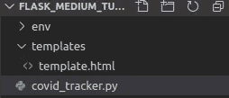
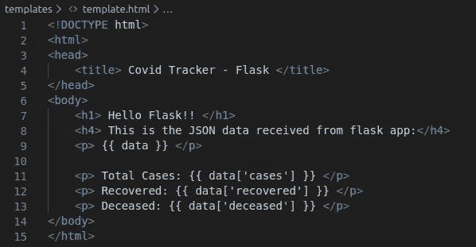

# 使用烧瓶的新型冠状病毒(新冠肺炎)跟踪器应用程序

> 原文：<https://medium.com/analytics-vidhya/novel-coronavirus-covid-19-tracker-app-using-flask-1fd08dc314b6?source=collection_archive---------19----------------------->


> 这是构建 Flask 应用程序系列的第 2 部分。如果你是 Flask 的绝对初学者，我建议你先浏览一下[之前的帖子](/@dkotnala5/simplest-guide-on-getting-started-with-flask-8f70bc1c5c96)。在那篇文章中，我解释了如何用最简单的方式编写你的第一个 flask 应用程序。

在本教程中，我们将从上一篇文章中离开的地方继续。您将学习如何:

1.  从 Flask 呈现 HTML 页面
2.  使用 API 获取数据
3.  将数据从 Flask 应用程序(后端)发送到 HTML 页面(前端)
4.  使用 Bootstrap 和 Materialize CSS 在前端整齐地显示数据。

# 如何从 Flask 渲染 HTML 页面？

HTML 是网页的标准标记语言。使用 HTML，你可以创建自己的网站。如果你不懂 HTML，那么我会推荐你先去浏览一下基本的 [HTML 教程](https://www.w3schools.com/html/)。你只需要知道如何创建一个基本的 HTML 页面，head，style，body，div，a，p，heading (h1，h2，h3，h4，h5，h6)标签。

说到这里，让我们继续创建我们的基本 HTML 页面，它将从我们的 flask 应用程序中呈现。


初始 HTML 页面

我们将在我们的项目目录中创建一个文件夹，其中包含我们的 flask 文件。在模板文件夹中以 template.html 的名字保存这个 HTML 文件。目录结构现在将如下所示:



目录结构

让我们在 flask 文件“covid_tracker.py”中编写一些代码来呈现这个 HTML 页面。


从 Flask 呈现 HTML 页面

从命令提示符运行该文件。(记得在运行之前激活您的虚拟环境！)

```
python covid_tracker.py
```


转到您的浏览器并打开 localhost:5000 URL


从 Flask 呈现的 HTML 页面

我们完事了。我们可以在 web 浏览器中看到我们的 template.html 文件的内容。

# 如何使用 API 获取新冠肺炎数据并发送到 HTML 页面？

我们将从 Worldometer 获得数据，这是一个相当可靠的信息来源。将使用此 API 检索数据:

```
[https://corona.lmao.ninja/v2/all](https://corona.lmao.ninja/v2/all)
```

下面是来自 API 的 JSON 响应:

```
{"updated": 1588389819839,"cases": 3401002,"todayCases": 2529,"deaths": 239602,"todayDeaths": 154,"recovered": 1081600,"active": 2079800,"critical": 51355,"casesPerOneMillion": 436,"deathsPerOneMillion": 30,"tests": 35249644,"testsPerOneMillion": 4518.9,"affectedCountries": 214}
```

我们将把这个 JSON 数据从 Flask 应用程序传递到我们的 HTML 页面，并使用“cases”、“recovered”等标签提取所需的信息。让我们看看如何做到这一点。

为了向 API 发出请求，我们需要 requests 模块。

```
pip install requests
```

以下是我们 Flask 应用程序的代码:


从 API 获取数据并将其发送到 HTML 模板

让我们来看看这些变化。

因为我们的 flask 应用程序可以有多个网页，所以根据某些条件从“/”或“home”路径重定向到相应的 HTML 页面路径会更好。

到目前为止，我们只有一个 covid19 页面。因此，我们将把用户从 home route 重定向到 covid19 页面。

为此，我们将需要 ***重定向*** 和 ***url_for*** 模块。

现在我们在 **/covid19** 路线上。这里，将调用 covid19()函数。我们在第 16、17 和 18 行获得 API 数据。一旦我们有了数据，我们可以像这样把它转发到我们的 HTML 页面:

```
return render_template(“template.html”, data=worldwide_data)
```

在 template.html 文件中，进行以下更改:


template.html

我们通过在{{ }}中写入变量来访问从 flask 接收的数据。

```
{{ data }}
```

让我们运行这个文件，看看前端的输出。


本地主机:5000/covid19

我们可以看到前端接收到的数据。看起来像一本字典，对吗？

让我们得到一个单独的标签值。我们可以使用 JSON 数据中的“cases”标签来获得总案例的值，如下所示:

```
{{ data[‘cases’] }}
```

在 template.html 文件中进行以下更改:



template.html

运行 Flask 文件并在前端检查输出:


本地主机:5000/covid19

到目前为止，我们已经学会了从 *Flask* 渲染一个 HTML 页面，重定向到一个不同的路由，使用 API 获取数据，将这些数据发送到一个 HTML 页面，并在前端显示单个标签的内容。

但这看起来不太妙，不是吗？

让我们用 CSS 对我们的前端做一些修饰。如果你不了解 CSS，那么我强烈建议你在继续学习之前，先学习 CSS，Bootstrap 和 Materialize CSS 基础知识。决不，你需要成为所有这些方面的专家。只要基础知识就够了。相信我，非常简单！以下是教程的链接:

[W3 学校 CSS 教程](https://www.w3schools.com/css/default.asp)

[自举 4 教程](https://www.w3schools.com/bootstrap4/bootstrap_get_started.asp)

[物化 CSS](https://materializecss.com/getting-started.html)

在一些 CSS 魔术之后，使用 bootstrap 和 Materialize CSS，我们得到以下输出:


本教程到此结束！

在下一篇文章中，我们将学习如何从用户那里获得输入，并基于该输入执行一些操作。例如，使用前端将一个*国家名称*作为输入，在后端获取这个国家的数据，并在前端显示这个国家的信息。

您可以在这个 [GitHub 资源库中找到完整的代码。](https://github.com/deepankarkotnala/COVID19Tracker_MediumArticle)我强烈建议你自己编写代码，不要只是复制粘贴。这些都是非常基本的东西，你应该能够自己写出来。如果需要，可以从 Bootstrap 和 Materialize CSS 文档中复制粘贴设计部分。这样，你就可以自己寻找所需的设计代码，无需任何指导就可以设计自己的应用程序。

我希望你喜欢这篇文章，并在今天学到了一些东西。如果这个教程对你有帮助，那么你可以在 LinkedIn 上*为我*背书 [*烧瓶技能。如果你有任何问题，请在下面的评论区告诉我。快乐学习！*](https://www.linkedin.com/in/deepankarkotnala/)