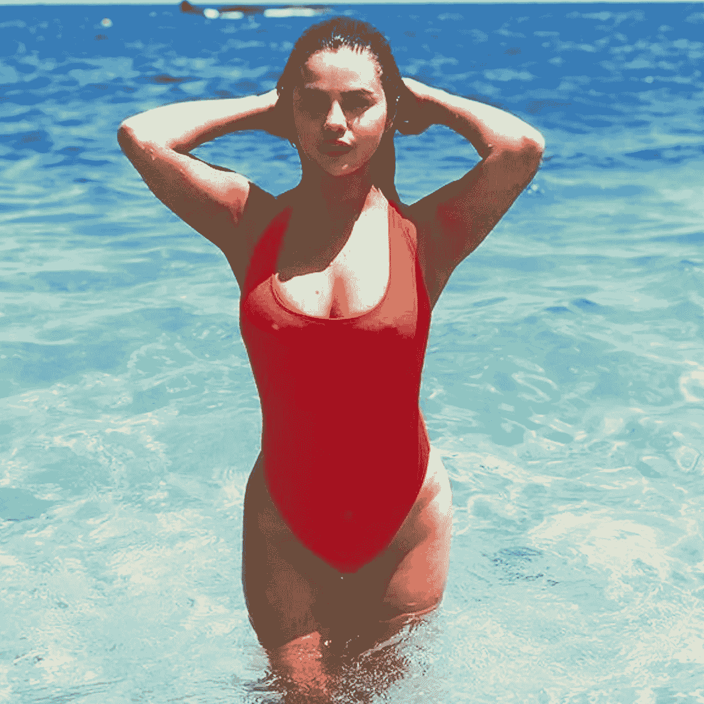

# NSFW 分类器遏制审查内容。

> 原文：<https://medium.com/analytics-vidhya/nsfw-classifier-to-curb-out-censored-content-d8e88dac165c?source=collection_archive---------5----------------------->


[迈卡·威廉姆斯](https://unsplash.com/@mr_williams_photography?utm_source=medium&utm_medium=referral)在 [Unsplash](https://unsplash.com?utm_source=medium&utm_medium=referral) 上拍照

**为了让网络对儿童更安全，许多社交媒体，如 Tumblr、脸书、Instagram，都在限制 NSFW 内容，打造一个更安全的社区。**

最近，印度政府禁止避孕套广告，因为它们对儿童来说是下流的。于是我产生了一个疑问，这些广告真的不雅吗？让我们利用深度学习的力量找到答案。所以让我们通过使用 **NSFW 分类器来找出广告的本质。**

# **建立模型的步骤:**

1.  检索数据
2.  预处理数据
3.  训练深度学习模型
4.  使用 OpenCV 测试广告
5.  改进模型以发现图像中的细节

# 1.获取数据:

获取数据是最重要的一步。但是 30%的互联网内容是色情的，所以我们有足够的数据。我们在 reddit 和 9gag 上也有很多不安全的内容。所以我们只需要提取图像来训练我们的模型。我在 Github 上发现了 Alex Kim 制作的这个很棒的回购。我用它下载了三种图像数据:色情、中性和性感。

# 2.预处理数据:

由于我们从脚本中下载的数据将被分类到 3 个不同的文件夹中，它们有各自的图像，所以我们不需要分别标记它们。我们将使用 Keras ImageDataGenerator 的强大功能来生成更多的数据。稍后我们可以使用 flowfromdirectory()函数来处理训练。

```
# File : NSFW.ipynb
train_data_generation **=** ImageDataGenerator(rescale**=**1.**/**255, rotation_range**=**30, width_shift_range**=**0.2, height_shift_range**=**0.2, shear_range**=**0.2, zoom_range**=**0.2, channel_shift_range**=**20, horizontal_flip**=True**)
```

# 3.训练深度学习模型:

我们将在 Keras 中使用迁移学习，并为此使用 MobileNetV2。因为它有很少的参数，非常适合应用程序。然后我在最后一层尝试了不同的架构，我在密集层使用了 256 个单位和 128 个单位，但是他们开始过度适应。然后，最后我想出了一个 32 个单位的单一密集层，批量标准化，辍学，并获得了 93.5%的测试数据的准确性。

```
# File : NSFW.ipynb
conv_m **=** MobileNetV2(weights**=**'imagenet', include_top**=False**, input_shape**=**(size, size, 3)) 
conv_m.trainable **= False** model.add(conv_m) model.add(AveragePooling2D(pool_size**=**(7, 7))) model.add(Flatten())
model.add(Dense(32, activation **=** 'relu')) model.add(BatchNormalization()) model.add(Dropout(0.5))
model.add(Dense(3, activation**=**'softmax'))
```

我使用了 ModelCheckpoint 和 ReduceLROnPlateau 回调，然后使用了带有动量的 SGD 分类器。

```
model.compile( loss**=**'categorical_crossentropy', optimizer**=**SGD(lr **=** 0.1, momentum **=** 0.9), metrics**=**['accuracy'])
```

然后，我以 10 的步长对它进行了 100 次训练，因为我没有任何 GPU，所以我花了大约 7-8 个小时来训练 25GB 大小的模型。我在 GCP 上用 60 GB 内存运行它。你可以从我的 Github 获得训练过的模型，见文章末尾。

**我们模型的输出:**

```
from PIL import Image
import numpy as np
from skimage import transform
def load(filename):
    np_image = Image.open(filename)
    np_image = np.array(np_image).astype('float32')/255
    np_image = transform.resize(np_image, (224, 224, 3))
    np_image = np.expand_dims(np_image, axis=0)
    img=mpimg.imread(filename)
    plt.imshow(img)
    return np_imageimage = load("selena.jpg")
ans = model.predict(image)
maping = {0 : "Neutral", 1 : "Porn", 2 : "Sexy"}
new_ans = np.argmax(ans[0])print(maping[new_ans], np.round(ans,2))
print("With {} probability".format(ans[0][new_ans]))
```

输入:



输出:
性感[[0.01 0。0.99]]
以 0.98 的概率

**在 iPhone 上部署模型。**

首先，我们需要 iOS 兼容形式的模型。因此，我们将使用 python 库 coremltools。

```
import coremltools
model.author **=** "Lakshay Chhabra"
model.short_description **=** "NSFW Image Classifier"
output_labels **=** ['Neutral', 'Porn', 'Sexy']ios = coremltools.converters.keras.convert(model, input_names=['image'], output_names = ['output'],                       class_labels = output_labels, image_input_names = 'image', image_scale=1/255.0)ios.save('NSFW.mlmodel')
```

我们的模型保存下来了，让我们将它加载到 swift 应用程序中。
**第一步:** 设计 app 的前端，我们为它使用了故事板。我们选择了带有模糊效果的图像视图，因为图像将是 NSFW，所以我们将它们隐藏在模糊层下。

**第二步:** 我们根据自己的需要调整了图像的大小。

```
func resizeImage(image: UIImage) -> UIImage {                        var newSize: CGSize 
newSize = CGSize(width: 224, height: 224)
let rect = CGRect(x: 0, y: 0, width: 224, height: 224)                UIGraphicsBeginImageContextWithOptions(newSize, false, 1.0)     image.draw(in: rect)        
let newImage = UIGraphicsGetImageFromCurrentImageContext()        UIGraphicsEndImageContext()               
return newImage!   
 }
```

**第三步:** 所以现在我们将使用我们训练好的模型来预测结果，让我们看看来自[文件](https://github.com/lakshaychhabra/NSFW-ios-ML/blob/master/NSFW%20Detect/ViewController.swift)的一小段代码。

```
let request = VNCoreMLRequest(model: model) { (request, error) in            print(request.results!)
guard let classification = request.results?.first as? VNClassificationObservation
else{ 
fatalError("cant find the image")
}
DispatchQueue.main.async {
let confidenceRate = (classification.confidence) * 100                self.output_label.text = "\(confidenceRate)% it's \(String(describing: classification.identifier))"
self.k = self.dict[classification.identifier]!                if(self.k == 0){
self.warning.text = "Safe Image"
}
else if(self.k == 1){
self.warning.text = "NSFW Image"
}else{ 
self.warning.text = "Not For Kids Image"
}                           
}
```

**让我们看看输出:**

# 4.使用 OpenCV 测试广告:

对于测试视频来说，openCV 是一个很棒的包。视频只是图像序列，所以我们可以对每个图像进行分类，如果任何图像不安全，我们可以将视频列为不安全。我们将使用 openCV 加载视频，不要忘记这一步，因为它非常重要。

```
# File : NSFW Video Detector
# We are dividing image by 255.0 as keeping image pixels in range of # 0-1 as it is easier to train. As we used 0-1 range in training so # we need our input as same as we provided while training #classifier.vs = cv2.VideoCapture(input_vid)
writer = None
(W, H) = (None, None)

# loop over frames from the video file stream
while True:
    # read the next frame from the file
    (grabbed, frame) = vs.read()

    # if the frame was not grabbed, then we have reached the end
    # of the stream
    if not grabbed:
        break

    # if the frame dimensions are empty, grab them
    if W is None or H is None:
        (H, W) = frame.shape[:2]

    output = frame.copy()
    frame = cv2.cvtColor(frame, cv2.COLOR_BGR2RGB)
    frame = frame/255.0
    frame = cv2.resize(frame, (224, 224)).astype("float32")

#     frame -= mean

    # make predictions on the frame and then update the predictions
    # queue
    preds = model.predict(np.expand_dims(frame, axis=0))[0]
    print(preds)
    Q.append(preds)# perform prediction averaging over the current history of
    # previous predictionsresults = np.array(Q).mean(axis=0)
    i = np.argmax(preds)
    label = labels[i]
    # draw the activity on the output frame
    text = "activity: {}:".format(label)
    cv2.putText(output, text, (35, 50), cv2.FONT_HERSHEY_SIMPLEX, 1.25, (0, 255, 0), 5)# check if the video writer is None
    if writer is None:
        # initialize our video writer
        fourcc = cv2.VideoWriter_fourcc(*"MJPG")
        writer = cv2.VideoWriter(output_vid, fourcc, 30, (W, H), True)# write the output frame to disk
    writer.write(output)# show the output image
    cv2.imshow("Output", output)
    key = cv2.waitKey(1) & 0xFF# if the `q` key was pressed, break from the loop
    if key == ord("q"):
        break

# release the file pointers
print("[INFO] cleaning up...")
# writer.release()
vs.release()
```

当运行避孕套广告时，上述代码的输出是:

一些场景被列为性感和色情，所以我想政府是对的😜。

# 5.改进模型以发现图像中的细节:

如果我们要分类的图像很大，而图像中只有很小一部分是 NSFW 内容，该怎么办？为了解决这个问题，我使用了滑动窗口技术来遍历图像中的小帧，并逐行对它们进行分类。当我把这张图片作为一个整体输入分类器时，它把它识别为色情图片。但是可能存在 NSFW 含量非常少情况。所以我们来试试吧。

PS。我在处理图像后输入了审查，所以对读者来说是安全的。

```
def check(unsave = 0):
    image = cv2.imread("final.png")
    (winW, winH) = (224, 224)
    maping = {0 : "Neutral", 1 : "Porn", 2 : "Sexy"}
    writer = None
    for resized in pyramid(image, scale=5):
        # loop over the sliding window for each layer of the pyramid
        for (x, y, window) in sliding_window(resized, stepSize=48, windowSize=(winW, winH)):
            # if the window does not meet our desired window size, ignore itif window.shape[0] != winH or window.shape[1] != winW:
                continue# THIS IS WHERE YOU WOULD PROCESS YOUR WINDOW, SUCH AS APPLYING A
            # MACHINE LEARNING CLASSIFIER TO CLASSIFY THE CONTENTS OF THE
            # WINDOW
            output = resized.copy()
            frame = cv2.cvtColor(window, cv2.COLOR_BGR2RGB)
            frame = frame/255.0
            preds = model.predict(np.expand_dims(frame, axis=0))[0]
            i = np.argmax(preds)
            label = maping[i]
            print(preds, label)

            if unsave:
                if i == 1:
                    return "Porn Found"

            if not unsave:
                clone = resized.copy()
                image = cv2.rectangle(clone, (x, y), (x + winW, y + winH), (0, 255, 0), 2)
                cv2.putText(image, label, (x, y+50), cv2.FONT_HERSHEY_SIMPLEX, 1.25, (0, 255, 0), 5)cv2.imshow("Window", clone)
                cv2.waitKey(1)
                time.sleep(0.09)if writer is None:
                # initialize our video writer
                    fourcc = cv2.VideoWriter_fourcc(*"MJPG")
                    writer = cv2.VideoWriter("1.avi", fourcc, 8, (1080, 720), True)# write the output frame to disk
                writer.write(clone)
    return "Save to View"# Frame by Frame ipynb
# Just added a very small change**def** isUnsave(): 
    ans **=** check(1)
    print(ans)
# This check function is similar to what we made during Video 
# Detection but sliding window concept is added. 
```

# 未来工作:

1.  该分类器未能识别男性生殖器，因为它没有在男性生殖器上进行训练。因此，从未来的角度来看，我们可以在更多的数据上训练我们的模型。
2.  这个分类器无法识别漫画、动漫和非常。因此，我们可以在 reddit 上废弃更多数据，并进一步训练它。

# 总结:

构建这个模型是一种很棒的体验，在各种图像上测试它更有趣。该模型在日常生活图像上效果很好，精确度可以进一步提高。对于失败案例，我们可以在动漫和更多色情资料上训练模型。

# 资源:

1.  我的 NSFW 分类器的 Github 库:[https://github.com/lakshaychhabra/NSFW-Detection-DL](https://github.com/lakshaychhabra/NSFW-Detection-DL)
2.  iOS 应用的 Github 库:[https://github.com/lakshaychhabra/NSFW-ios-ML](https://github.com/lakshaychhabra/NSFW-ios-ML)
3.  我的作品集:[lakshaychabra . github . io](https://lakshaychhabra.github.io)

# 参考资料:

特别感谢数据科学社区在网络上提供的精彩内容。

1.  数据集:[https://github.com/alex000kim/nsfw_data_scraper](https://github.com/alex000kim/nsfw_data_scraper)
2.  博客参考:[https://www . freecodecamp . org/news/how-to-set-up-nsfw-content-detection-with-machine-learning-229 a 9725829 c/](https://www.freecodecamp.org/news/how-to-set-up-nsfw-content-detection-with-machine-learning-229a9725829c/)
3.  OpenCV 参考:[https://www . pyimagesearch . com/2019/07/15/video-classification-with-keras-and-deep-learning/](https://www.pyimagesearch.com/2019/07/15/video-classification-with-keras-and-deep-learning/)，[https://www . pyimagesearch . com/2015/03/23/sliding-windows-for-object-detection-with-python-and-OpenCV/](https://www.pyimagesearch.com/2015/03/23/sliding-windows-for-object-detection-with-python-and-opencv/)
4.  关于 Ban 的新闻:[https://www . the Hindu . com/news/national/govt-bans-避孕套-广告-从早上 6 点到晚上 10 点-因为他们是不雅的/article21461765.ece](https://www.thehindu.com/news/national/govt-bans-condom-ads-from-6-am-to-10-pm-because-they-are-indecent/article21461765.ece)