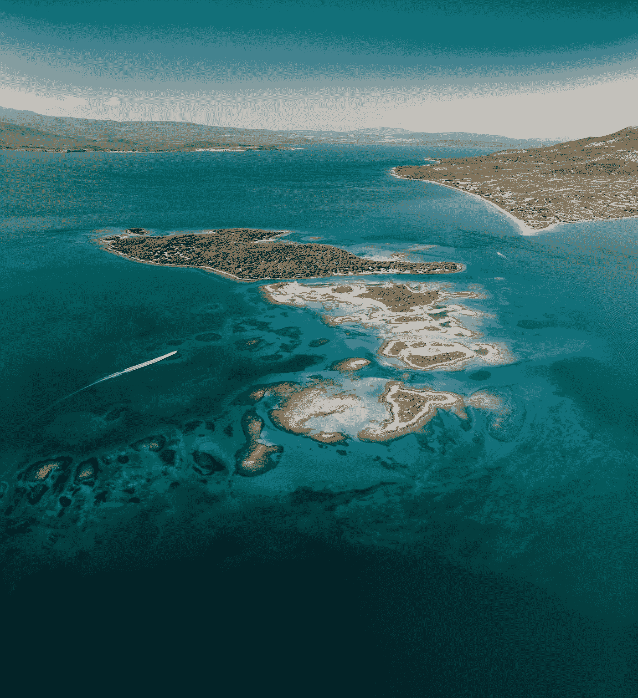

# 岛屿数量-第 5 天(Python)

> 原文：<https://medium.com/analytics-vidhya/number-of-islands-day-5-python-5c12783515b2?source=collection_archive---------0----------------------->

由[亚历克斯·安东尼亚迪斯](https://unsplash.com/@zizanius?utm_source=medium&utm_medium=referral)在 [Unsplash](https://unsplash.com?utm_source=medium&utm_medium=referral) 上拍摄的照片

今天我们将探讨面试官最喜欢的问题之一。技术编码面试中的一个常见问题。这个问题测试你对广度优先搜索和深度优先搜索的理解，我将用这两种方法来解决这个问题。

[**200**](https://leetcode.com/problems/number-of-islands/) **。岛屿数量**

给定一张二维网格图，图中有`'1'` s(陆地)和`'0'` s(水)，计算岛屿的数量。安…