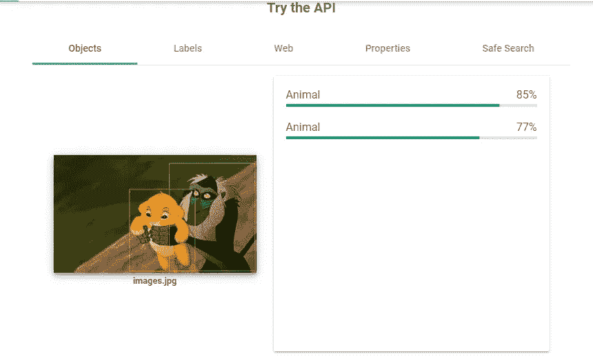

# 使用谷歌云视觉 API 的车牌识别系统

> 原文：<https://medium.com/analytics-vidhya/number-plate-recognition-system-using-google-cloud-vision-api-3a9847f046a5?source=collection_archive---------4----------------------->

车牌识别系统是使用 OCR(光学字符识别)来读取图像、文本和图案的系统。这个系统可以用来存储图像和更多的文本。

车牌识别

> 这个系统被全世界的安全人员使用。

# **谷歌云平台** ( **GCP** )

**谷歌云平台** ( **GCP** )，由[谷歌](https://en.wikipedia.org/wiki/Google)提供，是一套[云计算](https://en.wikipedia.org/wiki/Cloud_computing)服务，运行在谷歌内部为其终端用户产品使用的相同基础设施上，如[谷歌搜索](https://en.wikipedia.org/wiki/Google_Search)和 [YouTube](https://en.wikipedia.org/wiki/YouTube) 。除了一套管理工具，它还提供一系列模块化云服务，包括计算、[数据存储](https://en.wikipedia.org/wiki/Computer_data_storage)、[数据分析](https://en.wikipedia.org/wiki/Data_analysis)和[机器学习](https://en.wikipedia.org/wiki/Machine_learning)。

要创建一个谷歌账户，请跟随 Linux 学院[的教程](https://www.youtube.com/channel/UClGShptNEuvTWGAAfpa2Etw)

# 谷歌云视觉 API

它是谷歌云平台提供的一个 API，具有类似 OCR 的特性

视觉 API

使用图像识别

识别图像

您可以在以下网址试用

 [## 试试看！|云视觉 API |谷歌云

### 使用下面的应用程序返回图像文件的图像注释。单击 Show JSON 按钮查看原始…

cloud.google.com](https://cloud.google.com/vision/docs/drag-and-drop) 

# **使用谷歌云视觉 API 进行车牌识别的流程**

1.  导入库

像 io，os，OpenCV，google cloud 这样的库被用在这个程序中。

导入库

2.导入您的 google 云凭据

这里你需要放入你自己的 JSON 文件，你将使用你自己的 Google cloud 账户 [Google Cloud](https://medium.com/u/4f3f4ee0f977?source=post_page-----3a9847f046a5--------------------------------) 生成该文件。

源路径需要是您自己的文件路径，即图像路径的位置

使用 Google 凭据

3.导入图像并调整其大小

由于我们不知道图像的尺寸，用户可以放一个小的和大的图像，我们使用[opencvmachinehlearning](https://medium.com/u/624f5ec8e165?source=post_page-----3a9847f046a5--------------------------------)来调整图像的大小

4.使用图像注释

在这里，我们检查您是否有权限使用云 API

5.在图像中查找内容

6.在图像上查找和书写文本

> **最终结果**

该文件的代码和其他资源可以在

 [## shantamsultania/number plate _ recog

### 这是一个用于车牌识别系统的 python 程序。您需要创建自己的 JSON 文件，以便从…

github.com](https://github.com/shantamsultania/numberplate_recog) 

这篇文章是由

 [## Shantam Sultania -昌迪加尔大学-昌迪加尔，昌迪加尔，印度| LinkedIn

### 查看 Shantam Sultania 在世界上最大的职业社区 LinkedIn 上的个人资料。山塔姆的教育是上市…

www.linkedin.com](https://www.linkedin.com/in/shantam-sultania-737084175/) 

我的 Git Hub 配置文件

 [## shantamsultania -概述

### 在 GitHub 上注册你自己的个人资料，这是托管代码、管理项目和构建软件的最佳地方…

github.com](https://github.com/shantamsultania)