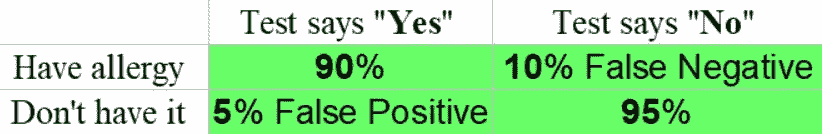
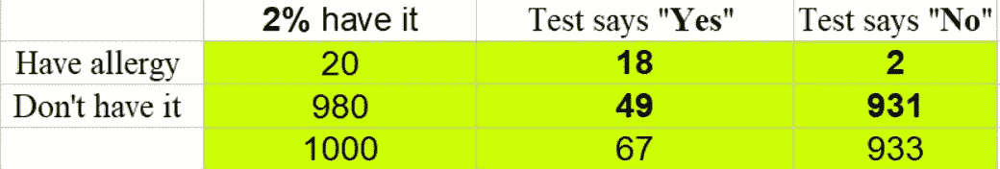
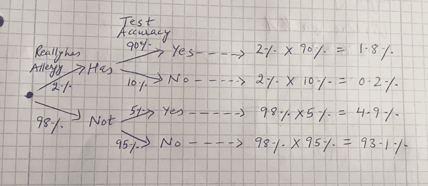

# 假阳性和假阴性情况下的数论

> 原文：<https://medium.com/analytics-vidhya/number-theory-in-false-positive-and-false-negative-scenarios-9a1fc79bf3d1?source=collection_archive---------31----------------------->

简·卡鲁扎在 [Unsplash](https://unsplash.com?utm_source=medium&utm_medium=referral) 上的照片

在上一篇文章中，我们了解了[假阳性和假阴性](/analytics-vidhya/beautiful-concept-of-false-positive-and-false-negative-7f47506b643f)的概念以及它的全部内容。我们讨论了整个概念，并讨论了测试或扫描结果的局限性如何给我们一些人/机器/活动或任何正在测试的东西错误的结果。

如果你试着将这种情况应用到新冠肺炎世界的现状中，你会明白，由于检测方法的某些限制，那里的一些人也会检测出阳性或阴性。就此而言，某些国家的媒体强调了这种情况，引起了对测试结果准确性的关注。

因此，在我们的世界中，不可能实现 100%的准确性是一个现实，因为需要考虑一些限制，因此结果可能会有所不同。但重要的是要知道——有多少不准确，这样才能采取适当的行动，否则这些数字会创造一个极度悲观(太多消极)或极度乐观(太多积极)的环境。如果不考虑到这一点，它可能会变得很危险。

在本文中，我们将了解**是**和**否**背后的实数概念。

你肯定知道对花粉过敏的人。花粉过敏导致一个人经历:眼睛发痒或流泪，喉咙发痒，流鼻涕，打喷嚏，鼻塞，喘息。

假设乔治在每个春天都出现过敏，他想做一个测试来了解他是否对花粉过敏。有一种对花粉过敏的测试，但这种测试并不总是正确的:

*   对于那些认为**真的**有过敏症的人来说，测试 90%**都说“有”**
*   **对于**没有**过敏的人，测试结果为“是”的几率为 5% (“假阳性”)**

****

**以表格形式检验假设**

**现在，我们的问题是，假设 2%的人口患有过敏症，而**乔治的测试结果为“是”**，那么**乔治**真的患有过敏症的可能性有多大？**

**你怎么想呢?是 70%还是 60%还是什么？**

**有三种不同的方法可以解决这个问题:**

*   **“想象一个 1000”，**
*   **“树形图”或**
*   **“贝叶斯定理”，**

**让我们一个一个来看:**

# **试着想象一千个人**

**当试图理解这样的问题时，想象一个大的群体(比如说 1000 人)并且玩数字游戏:**

*   **在 1000 人中，只有 20 人真正患有过敏症(1000 人中的 2%是 20 人)**
*   **对于**患有**过敏症的人来说，测试的正确率为 **90** %,所以在这 20 个正确的中，它将得到 **18 个。****
*   **但是 980 人**没有**过敏，测试会对其中的 5%说“是”，而
    也就是 **49 人**错误地对**说“是”**(假阳性)**
*   **因此，在 1000 人中，测试结果为“**是**”到(18+49) = **67 人****

**表格表示:**

****

**一千人的表格表示**

**因此，67 个人回答“是”,但只有 18 个人真的过敏:**

**18/67 = 0.268，即大约 27%**

**所以，即使乔治的测试说“是”，乔治对花粉过敏的可能性仍然只有 27%。**

# **作为一棵树**

**画一个树形图，可以帮助我们进行计算。我用普通的笔和纸画出了树形图和计算结果，如下所示:**

****

**带计算的树形图**

**首先，让我们检查一下所有的百分比加起来:**

**1.8%+0.2%+4.9%+93.1% =**100%**(好！)**

**而两个“是”的答案加起来是 1.8% + 4.9% = 6 **.7%** ，但只有 1.8%是正确的。**

**1.8/6.7 = **27%** (答案同上)**

# **贝叶斯定理**

**[贝叶斯定理](https://plato.stanford.edu/entries/bayes-theorem/)对于这种事情有一个特殊的公式:**

**P(A | B)= P(A)* P(B | A)/P(A)* P(B | A)+P(非 A)* P(B |非 A)**

**在哪里**

*   **p 的意思是“的概率”**
*   **|表示“鉴于此”**
*   **这种情况下的 a 是“其实有花粉过敏”**
*   **b 在这种情况下是“测试说是”**

**因此， **P(A|B)** 的意思是“假设测试结果为是，乔治实际患过敏症的可能性”**

**P(B|A) 表示“鉴于乔治确实患有过敏症，测试结果为肯定的可能性”**

**所以，A ( **有过敏**，B( **检测说有**)**

**P(A|B)或 P(has | Yes)= P(has)* P(Yes | has)/P(has)* P(Yes | has)+P(not has)* P(Yes | not has)**

**P(A|B)或 P(has | Yes)= 0.02 * 0.9/0.02 * 0.9+0.98 * 0.05 =**27%**(同答案)**

**这就是我们如何在数字的帮助下得到过敏人群的真实照片。因此，可能结果在上风描绘了一幅极端悲观或乐观的图画，但是真正的真相隐藏在可以用上述三种方法计算的数字后面。**

**希望这篇文章和前一篇文章能帮助你牢牢抓住背后的整个概念和数字。**