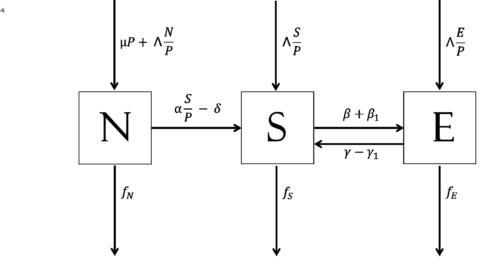
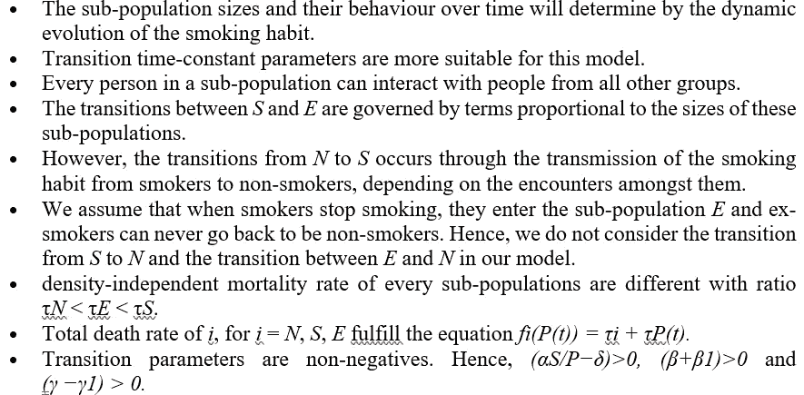

# 从数字上来说，反吸烟社会化最有效的对象是谁？

> 原文：<https://medium.com/analytics-vidhya/numerically-speaking-who-is-the-most-effective-target-of-anti-smoking-socialization-1fac03f47438?source=collection_archive---------27----------------------->

吸烟是最大的公共健康威胁之一。为了控制吸烟行为，以反吸烟社会化的形式对人群进行社会干预，旨在阻止不吸烟者吸烟，鼓励吸烟者戒烟。提供的社会化服务包括:关于吸烟危害的健康教育、禁烟运动、无烟场所的实现、平面媒体香烟广告上的图片健康警告、电子媒体香烟广告上的图片健康警告、香烟包装上的图片健康警告。

***问题是，谁是旨在减少吸烟人数的反吸烟社会化的最有效目标？***

要回答这个问题，我们需要谈论一下****吸烟流行模型*。***

*为了分析反吸烟社会化的效果，建立了一个数学模型。我们将人群分为 3 个亚人群，他们是不吸烟者(N)、吸烟者(S)和戒烟者(E)。图 1 以图形方式显示了这些亚群体之间的转变*

**

***图一**。具有反吸烟社会化的吸烟流行病模型的数学模型流程图。方框代表子群体，箭头代表子群体之间的转变。箭头由其相应的模型参数标记。*

*模型的参数定义如下:*

**

***图 1** 中所示的图形表示由*描述的数学模型一个常微分方程组*的解给出了三个子种群随时间的演化。为了建立模型，我们需要做一些假设:*

**

*在做了一些假设之后，现在我们可以建立模型了。由如下方程组描述的模型( *t* ，以年为单位的时间):*

****

***图 2** 。比例表*

*上面显示的模型方程与个体数量有关。但是，由于我们将处理从图 2 中获得的数据，这些数据与 T42 人口的百分比相关，这导致我们将模型转换成与数据相同的单位，以便将预测与数据进行比较。*

*缩放后，我们获得了以下系统:*

**

*其中，新的比例变量为:s = S/P，e = E/P*

*那么，情况怎么样？到目前为止你明白了吗？*

*正如我们看到的吸烟习惯是有传染性的，我想谈谈**基本繁殖数** **(R0)。** *R0* (读作 *R nought)* 是一个流行病学指标，用于描述传染原的传染性或传播性。当*平均*一个感染者感染一个以上其他人时， *R0* 大于(> ) 1，感染将能够开始在人群中传播。但当*平均*一个感染者不传染一个以上其他人时， *R0* 小于(< ) 1，不发生疫情传播。一般来说， *R0* 的值越大，疫情越难控制。*

*我们将看到我们的人口状况分为两种情况。*

**第一个*，未进行任何反吸烟宣传*第二个*，如果对这 3 个亚人群进行反吸烟宣传。用 ***Python*** 对*数值模拟*得到的一些图形显示了这种情况。*

*案例一。由于我们想知道在没有任何反吸烟社会化给定的情况下我们的人口状况，这意味着我们可以取参数 *δ=0，β1=0，*和 *γ1=0。*基于图 2 中的模型，使用从图 3 *、*中获得的参数，我们得到 *R0* = 1.67 > 1。*

*案例二。如果对这 3 个亚人群进行反吸烟社会化，我们可以取参数 *δ=0.0001，β1=0.003，*和 *γ1=0.00595* ，假设无烟场所的实现导致吸烟者和非吸烟者之间的互动减少，我们可以取参数 *α* 减少*为α=0.0281* ，其他参数保持不变。我们得到 *R0* = 0.452 < 1。*

**

*我们使用 ***Python*** 库，即 *Numpy、SciPy、*和 *Matplotlib* 进行数值模拟。从左图和**图 3** 所示的情况 1 和情况 2 的图形中可以看到一些*脚本*。*

**

***图 3** 。案例 1(左)和案例 2(右)*

*你能看出区别吗？这些图证明，假设 *δ* =0.0001、 *β1* =0.003、 *γ1* =0.00595，如果实现了无烟场所和给人群禁烟社会化，基本再生产数( *R0* )将从 *R0* = 1.67 > 1 下降到*R0*= 0.455 换句话说，我们可以得出结论，当 R0 < 1 时，模拟达到****无烟平衡。*****

***当禁烟社会化给予人口时，导致 R0 <1, the simulation reaches the smoking free equilibrium其中**无烟平衡是人口保持没有吸烟者的状态。*****

***在我们讨论了反吸烟社会化的影响后，现在我们将讨论哪个参数是减少吸烟人数的最有效目标？看看下面的图片***

******

***图四。反吸烟社会化参数对吸烟者比例的影响***

***从**图 4、**所示的图表中，我们可以看到 *δ* (给予非吸烟者的反吸烟社会化)的升级导致吸烟者的比例继续向无烟均衡下降，在该均衡中，人口保持在没有吸烟者的水平。我们可以得出结论，参数 *δ，即*与对吸烟者和前吸烟者进行的社会化相比，对非吸烟者进行的反吸烟社会化是减少吸烟人数的最有效方法。***

> ***参数***

> ****数学模型可以成为理解吸烟蔓延的有用工具，提供对这一问题的深入了解，并量化公共卫生战略的影响。根据上面显示的结果，我们可以得出结论，非吸烟者的亚人群(N)是旨在减少吸烟者人数的反吸烟社会化的最有效目标。****

> ****为了保持吸烟者人数的减少，政府应该关注增加和优化给予不吸烟者的反吸烟社会化。****
> 
> ****可以通过各种形式增加对不吸烟者的反吸烟宣传，如增加对父母，特别是母亲吸烟危害的咨询，以监督他们的孩子不吸烟，改善对学校，特别是小学和初中学生的教育，他们很容易受到环境的影响，以及针对不吸烟人群的其他努力。****