# 数字 101

> 原文：<https://medium.com/analytics-vidhya/numpy-7d67d039a5ea?source=collection_archive---------9----------------------->

Numpy 是 Python 对多维数组的扩展包。它是为科学计算而设计的。它也被称为 ***面向阵列计算*** 。

让我们从安装开始。Numpy 安装非常简单。你可以运行下面的命令来安装它。

> ***pip 安装数量***

# **基础知识**

*   它的主要对象是齐次多维数组。
*   数轴称为轴。
*   Numpy 的数组类叫做 ndarray。
*   Numpy 数组不同于标准的 Python 库类数组。

你可以在这里找到 [***笔记本***](https://github.com/namratesh/Machine-Learning/blob/master/_15Dec_Numpy.ipynb)*。*

***导入数字***

*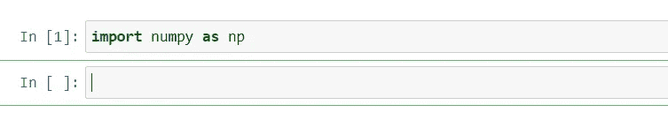*

***数组创建***

*   *一维数组*

*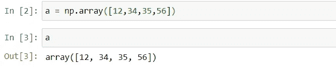*

*   *二维阵列*

*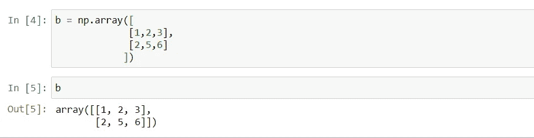*

*   *阵列形状*

*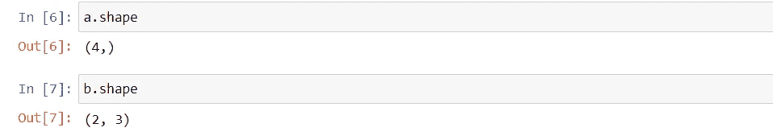*

*   *数组维数*

*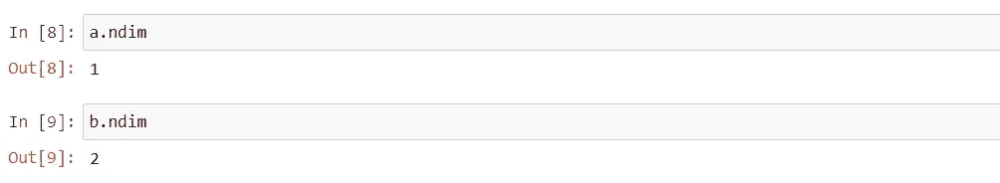*

*   *数组类型*

*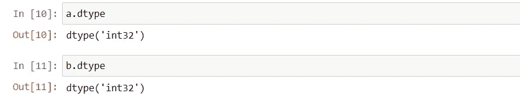*

*   *使用数组函数创建数组*

*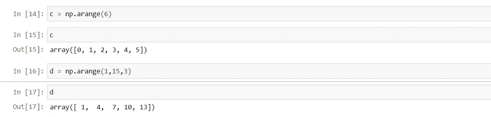*

# *算术运算*

*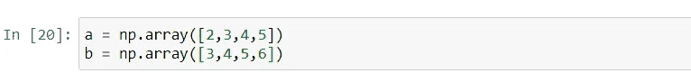*

*   *添加*

*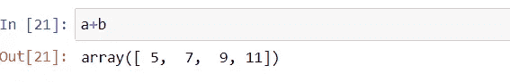*

*   *减法*

*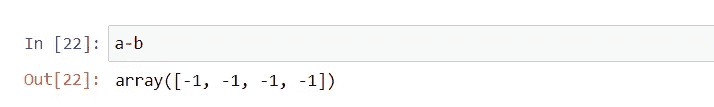*

*   *增加*

*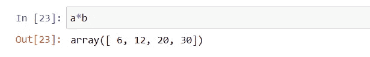*

*   *划分*

*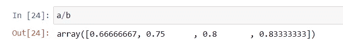*

# *逻辑运算*

*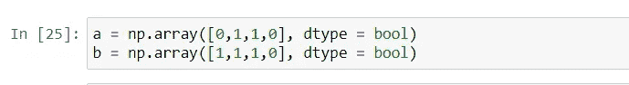*

*   *运筹学*

*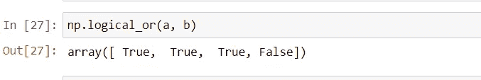*

*   *和*

*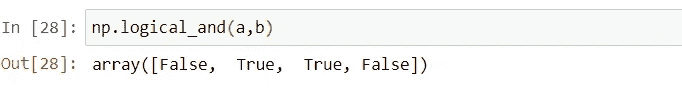*

# ***超越函数***

*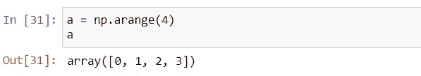*

*   *犯罪*

*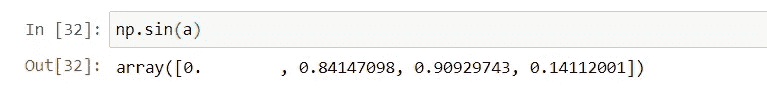*

*   *原木*

*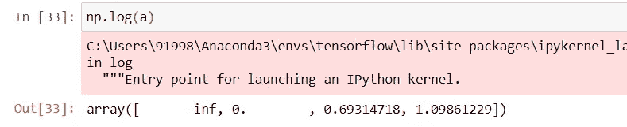*

*   *经历*

*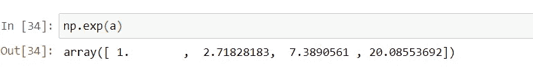*

# *减少*

*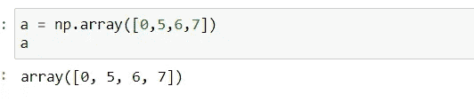*

*   *数组元素的和*

*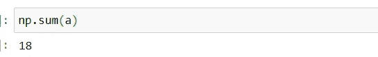*

*   *二维阵列*

*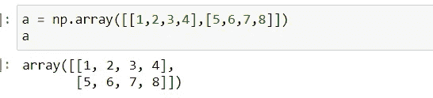*

*   *按行元素进行数组求和*

*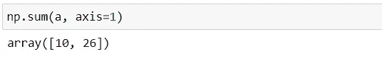*

*   *按列元素进行数组求和*

*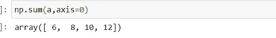*

*   *数组中的最大值*

*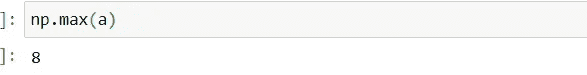*

*   *数组中的最小值*

*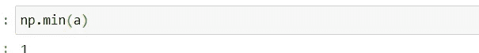*

*   *最大元素指数*

*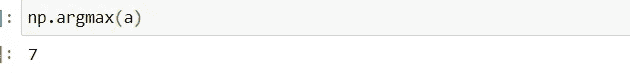*

*   *最小元素指数*

*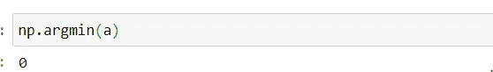*

# *统计数字*

*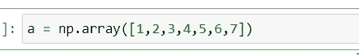*

*   ***均值:**均值是一个数据集的平均值。*

*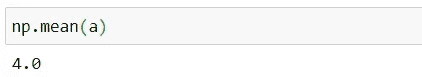*

*   ***中位数:**中位数是一组数的中间值。*

*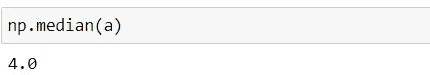*

*   *标准偏差:标准偏差是一组值的变化量或离差的度量。*

*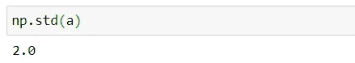*

# *线性代数*

*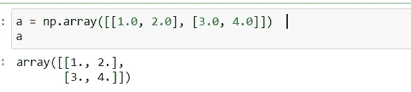*

*   ***转置:**一个矩阵的转置是一个新的矩阵，它的行是原矩阵的列。*

*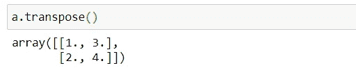*

***逆矩阵:**A 的逆矩阵只有当:*

> **A × A-1 = A-1 × A =我**

*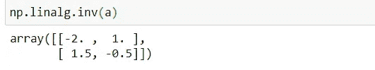*

*   ***矩阵产品:***

*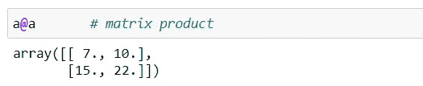*

*   ***特征向量:***

*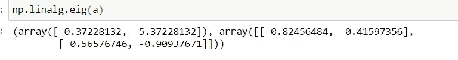*

*随时欢迎建议！！！*