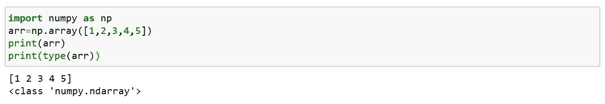
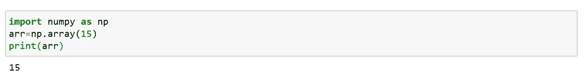
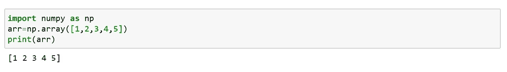
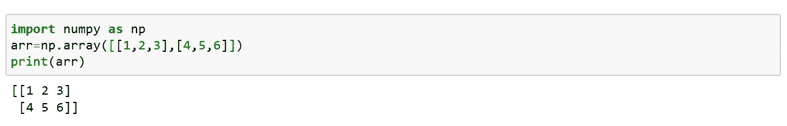
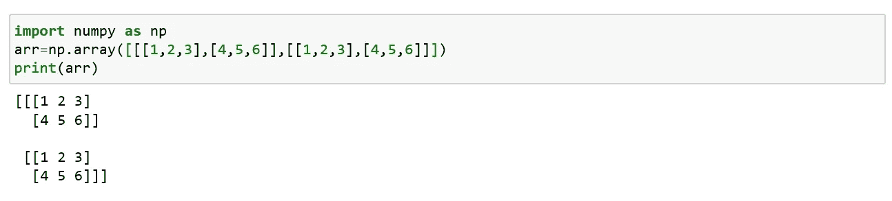
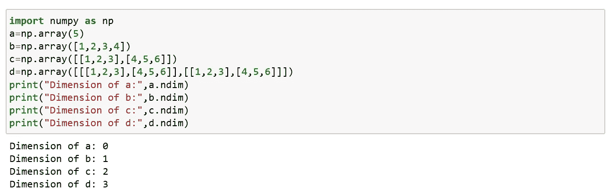

# Numpy 数组创建

> 原文：<https://medium.com/analytics-vidhya/numpy-array-creation-e55c8f004da7?source=collection_archive---------36----------------------->

Numpy 用于处理数组。NumPy 中的数组对象称为 ndarray。

我们可以使用 array()函数创建一个 numpy array ndarray 对象。

## 数组中的维度:

维度是数组深度的一个级别(嵌套数组)。

**嵌套数组:**是以数组为元素的数组。

## 零维数组:

0-D 数组或标量是数组中的元素。数组中的每个值都是 0 维数组。

## 一维数组:

以 0 维数组为元素的数组称为一维数组或 1 维数组。

## 二维数组:

以一维数组为元素的数组称为二维数组。

## 三维数组:

以二维数组(矩阵)为元素的数组称为三维数组。

## 检查尺寸:

n-dim 是一个返回整数的属性，它告诉我们数组有多少维。

就这样，我们来到了这篇文章的结尾。在下一篇文章中，我们将看到 numpy 索引和 numpy 切片。

快乐编码…😊😊😊