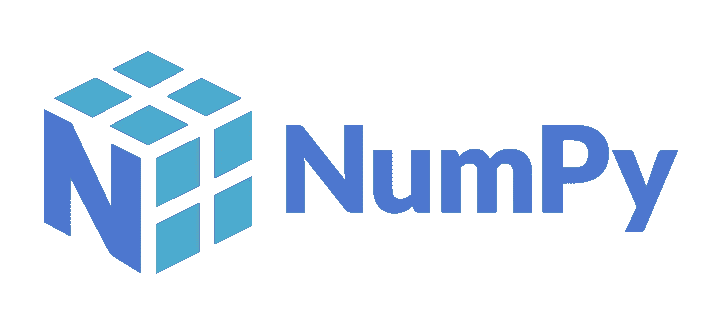
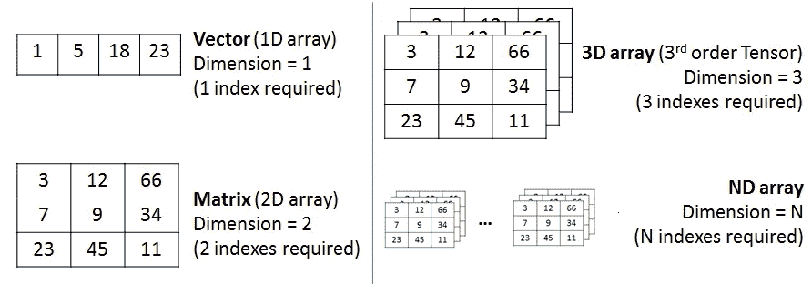

# NumPy 基础:Python 中的机器学习

> 原文：<https://medium.com/analytics-vidhya/numpy-basics-machine-learning-in-python-795c39d85bb4?source=collection_archive---------34----------------------->



NumPy 徽标创建者:[伊莎贝拉·普雷塞多-弗洛伊德](https://github.com/numpy/numpy/blob/master/branding/icons/primary/numpylogo.svg, CC BY-SA 4.0, https://commons.wikimedia.org/w/index.php?curid=92527666)

P ython 可以说是人们可以用来创建机器学习和人工智能项目的最佳编程语言。它的简单性、一致性、灵活性、平台独立性以及对优秀库和框架的访问使它成为 AI/ML 爱好者实现其愿景的首选。


图片来源:【Economist.com 

为了减少项目的开发时间，python 为程序员提供了近 137，000 个 Python 库。软件库是开发人员用来解决常见编程任务的预写代码。AI/ML 项目中常用的几个库是—

*   用于机器学习的 Keras、TensorFlow 和 Skikit-learn
*   用于高性能科学计算和数据分析的 NumPy
*   高级计算科学
*   用于通用数据分析的熊猫
*   Seaborn 和 Matplotlib 用于数据可视化

# NumPy:Python 中的数组和矩阵工具

NumPy 是 Numerical Python 的缩写，是 Python 的基础包之一，提供对大型多维数组矩阵的支持，以及一组高级数学函数来快速执行这些函数。NumPy 也是 skikit-learn 和 SciPy 等其他机器学习库的基础。NumPy 的计算能力可与 C 和 Fortan 等其他语言相媲美，它为科学家使用 Python 带来了更多优势，Python 是一种更容易学习和应用的语言。

## 为什么 NumPy 比传统的循环和索引要好？

> 简单的答案是数据的矢量化。

矢量化描述了没有任何显式循环、索引等。，在代码中。NumPy 没有在前端使用这些方法，而是在后台利用预编译和高度优化的 C 代码。这提供了一个更加简洁和易于阅读的代码。

速度和大小在科学计算中尤为重要。让我们举一个简单的例子来比较传统的 python 代码与 C 代码和 NumPy 代码。让我们用 Python 写一个代码将两个简单的一维数组相乘。

```
Result = []
for iter in range(len(array1)):
    Result.append(array1[iter]*array2[iter])
```

这在数组*结果*中产生了正确的答案，但是如果我们必须使用两个有数百万条目的数组，我们将不得不面对 Python 的低效。Python 是一种解释型语言，比其他主流语言如 C 和 Java 要慢。如果我们必须在 C 中完成同样的任务，我们可以通过编写以下代码获得更快的结果:

```
for(iter = 0; iter < rows; i++){
    Result[iter] = array1[iter]*array2[iter];
}
```

这节省了解释 Python 代码的开销。因此，为了保留用 Python 编码的好处，我们必须使用 NumPy。NumPy 能够减少代码行，同时使用预编译和优化的 C 代码以 *ndarray* 格式*执行逐个元素的操作。*

```
Result = array1*array2
```

在其核心，NumPy 创建了 *ndarray* 对象。它封装了同质数据类型的 n 维数组，并对编译后的代码执行操作以提高性能。因此，像加法、乘法等运算。，这需要循环显式地对单个数进行操作，现在可以用一行代码来表达。



图片来源: [pytolearn.csd.auth.gr](http://pytolearn.csd.auth.gr/b2-numat/20/whatnumpy.html)

NumPy 主要用于将图像、声波和其他二进制原始流表示为 n 维实数数组。

# NumPy 入门

*   **可以用:**
    *安装 NumPy 需要帮助吗？* [*自述。*](https://numpy.org/install/)

```
pip install numpy
```

*   **将 NumPy 导入到您的。py 文件:**

```
import numpy
or
import numpy as np
or
import numpy as <alias>
```

*   **创建数组:**

```
array1 = np.array([1,2,3]) #1-D Array
array2 = np.array([[1,2,3],[4,5,6]]) #2-D Array
array_dtype = np.array([1,2,3], dtype=<Data-Type>) #Data-Type is None by default.
```

*   **用随机元素创建数组:**

```
array_rand = np.random.randint(10,size=(3,4,5)) #Creates 3 arrays with 4 rows and 5 columns.
```

*   **选择元素:**

```
#Create a vector as a Row
vector_row = np.array([ 1,2,3,4,5,6 ])#Create a Matrix
matrix = np.array([[1,2,3],[4,5,6],[7,8,9]])
print(matrix)#Select 3rd element of Vector
print(vector_row[2])#Select 2nd row 2nd column
print(matrix[1,1])#Select all elements of a vector
print(vector_row[:])#Select everything up to and including the 3rd element
print(vector_row[:3])#Select the everything after the 3rd element
print(vector_row[3:])#Select the last element
print(vector[-1])#Select the first 2 rows and all the columns of the matrix
print(matrix[:2,:])#Select all rows and the 2nd column of the matrix
print(matrix[:,1:2])
```

*   **描述矩阵:**

```
#View the Number of Rows and Columns
print(matrix.shape)#View the number of elements (rows*columns)
print(matrix.size)#View the number of Dimensions(2 in this case)
print(matrix.ndim)
```

*   **应用操作:**

```
#Create Matrix-1
matrix_1 = np.array([[1,2,3],[4,5,6],[7,8,9]])#Create Matrix-2
matrix_2 = np.array([[7,8,9],[4,5,6],[1,2,3]])#Add the 2 Matrices
print(np.add(matrix_1,matrix_2))#Subtraction
print(np.subtract(matrix_1,matrix_2))#Multiplication(Element wise, not Dot Product)
print(matrix_1*matrix_2)
```

NumPy 的其他功能可以在这里阅读[。](https://numpy.org/doc/stable/user/absolute_beginners.html)

*这个博客提供了 Python 中 NumPy 库的优点和功能的一个小概述。本文档绝不是 NumPy 的完整指南，而是一种用 NumPy 启动机器学习之旅的方式。*

> 感谢阅读。
> **别忘了点击👏！**