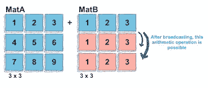
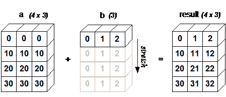
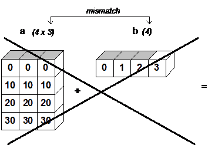
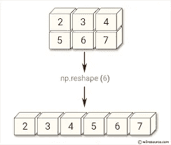

# NumPy:广播和形状操纵

> 原文：<https://medium.com/analytics-vidhya/numpy-broadcasting-and-shape-manipulation-8e2b6fd0f987?source=collection_archive---------20----------------------->


# 数字广播:

术语**广播**指的是 NumPy 在算术运算中处理不同形状数组的能力。数组上的算术运算通常在相应的元素上完成。如果两个数组的形状完全相同，那么这些操作可以顺利执行。



广播提供了一种向量化数组操作的方法，因此循环在 C 中而不是 Python 中发生，因为我们知道 Numpy 是用 C 实现的。它这样做不会产生不必要的数据副本，从而导致高效的算法实现。有些情况下，广播是一个坏主意，因为它会导致内存使用效率低下，从而降低计算速度。

NumPy 操作通常是在逐个元素的基础上对数组对进行的。在最简单的情况下，两个数组必须具有完全相同的形状，如下例所示:

```
**>>>** a = np.array([1.0, 2.0, 3.0])
**>>>** b = np.array([2.0, 2.0, 2.0])
**>>>** a * b
array([ 2.,  4.,  6.])
```

如果两个数组的维数不同，元素到元素的运算是不可能的。然而，由于广播能力，在 NumPy 中对非相似形状的数组的操作仍然是可能的。较小的数组被**广播**到较大数组的大小，以便它们具有兼容的形状。

# 广播规则:

如果满足以下规则，广播是可能的

*   ndim**比另一个小的数组在其形状前加上“1”。**
*   输出形状的每个维度中的大小是该维度中输入大小的最大值。
*   如果输入在特定维度中的大小与输出大小匹配，或者其值正好为 1，则可以在计算中使用输入。
*   如果输入的维度大小为 1，则该维度中的第一个数据条目将用于该维度上的所有计算。

如果上述规则产生一个有效的结果，并且下列条件之一为真，则称一组数组为**可广播的**

*   数组具有完全相同的形状。
*   数组具有相同的维数，每个维的长度要么是公共长度，要么是 1。
*   维度太少的数组可以在形状前添加长度为 1 的维度，因此上述属性成立。

**让我们看看下面的例子来理解广播:**

```
**>>> from** **numpy** **import** array
**>>>** a = array([[ 0.0,  0.0,  0.0],
**... **           [10.0, 10.0, 10.0],
**... **           [20.0, 20.0, 20.0],
**... **           [30.0, 30.0, 30.0]])
**>>>** b = array([0.0, 1.0, 2.0])
**>>>** a + b
array([[  0.,   1.,   2.],
       [ 10.,  11.,  12.],
       [ 20.,  21.,  22.],
       [ 30.,  31.,  32.]])
```

如图 1 所示，`b`被添加到`a`的每一行。当`b`比`a`的行长时，如图 2 所示，因为形状不兼容而引发异常。



图 1: *如果一维数组元素的数量与二维数组列的数量匹配，则二维数组乘以一维数组会导致广播。*



图 2 *当数组的尾部维数不相等时，广播失败，因为无法将第一个数组的行中的值与第二个数组的元素对齐以进行元素间的加法。*

# 广播的局限性

1️⃣广播是一种方便的快捷方式，在使用 NumPy 数组的实践中证明非常有用。

2️⃣:也就是说，它并不适用于所有情况，事实上，它强加了一个严格的规则，必须满足该规则才能进行广播。

包括广播在内的 3️⃣算法只能在数组中每个维度的形状相等或者其中一个维度的大小为 1 时执行。

# NumPy 中的形状操作:



Numpy 提供了灵活的工具来改变数组的维数。在更改维度之前，最好记住数组的维度是什么意思，以及不同维度的数组是什么样子:

```
# 2-dimensional
b = np.zeros((3,4))b
array([[0., 0., 0., 0.],        
       [0., 0., 0., 0.],        
       [0., 0., 0., 0.]])
b.ndim
2
# 3-dimensional
c = np.ones((2,2,2))
array([[[1., 1.],         
        [1., 1.]],

        [[1., 1.],         
         [1., 1.]]])
c.ndim
3
```

有不同的方法来改变数组的维数。 **Reshape** 函数通常用于修改一个数组的形状和维度。我们只需要将新形状作为参数传递给 shape 函数:

```
np.arange(8).reshape(2,2,2)
array([[[0, 1],         
        [2, 3]],          
        [[4, 5],         
        [6, 7]]])
```

# 更改数组形状:

**1️⃣整形** (a，newshape[，order])→给一个数组一个新的形状而不改变它的数据。

**2️⃣·拉威尔** (a[，order])→返回一个连续的扁平数组。

**3️⃣ ndarray.flat →** 数组上的一维迭代器。

**4️⃣ndarray . flatten**([order])→返回折叠成一维的数组的副本。

**因此，通过这种方式，可以在 NumPy** 中的数组上执行广播和形状操作。

> “你不一定要开始变得伟大，但你必须开始变得伟大。”–ZIG ZIG lar

# 谢谢大家！！