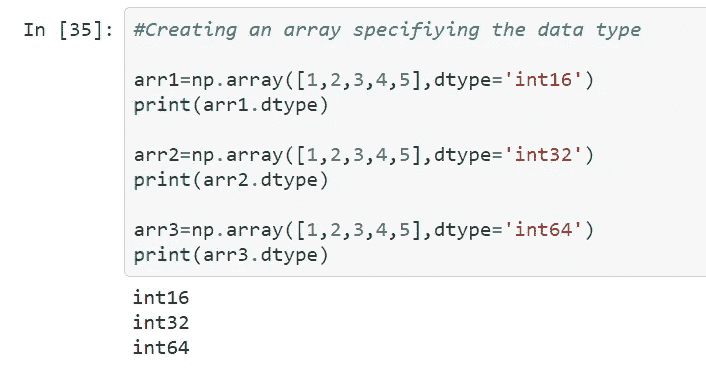

# Numpy 速成班(第一部分)

> 原文：<https://medium.com/analytics-vidhya/numpy-crash-course-part-1-82a5558de850?source=collection_archive---------24----------------------->

在这个故事中，我将尝试介绍 Numpy 的一些基本操作。因此，对于已经熟悉 Numpy 的人来说，或者如果他们只是想重温他们的技能或现有的知识，这可以作为一个修订/备忘单。这只是第 1 部分，它处理了下面的事情。

# **目录:**

> — [创建一个 numPy 对象](#1a2e)
> 
> — [访问 numPy 对象/数组](#1a97)
> 
> — [不同类型的 numPy 数组](#1ed2)
> 
> [—使用随机值](#4e82)
> 
> [—重塑数组](#27c1)

所以，事不宜迟，让我们开始吧！

# **创建一个 NUMPY 对象**

创建 1D 阵列

这实际上是 1D 阵列的一个例子。现在我们将看看如何制作其他维度的 numPy 数组。

**创建 2D、3D、0D 数组**

创建不同维度的数组

# **检查我们的 numPy 数组的属性**

# **创建指定属性的 numPy 数组**

**创建指定维度的数组:**

指定维度

**创建指定数据类型的数组:**

指定数据类型

# 访问 NUMPY 数组元素

访问数组的元素

在第一个例子中，我们访问 arr3 的索引 2 和索引 3，然后打印出它们值的总和。

在第二个示例中，我们正在访问 2d 数组的第 0 行第 1 列

让我们通过分析第三个例子来看看这里发生了什么

> arr5，1，2]

这里第一项 0 指的是 3d 数组的第一个元素

> [[1.1,2.2,3.3],[4.4,5.5,6.6]]

第二项 1 访问这个 2d 数组的第 2 个元素

> [4.4,5.5,6.6]

最后，最后一项 2 指的是第三个索引，即索引 2 指的是 6.6

> 最终产量:6.6

同样的，

让我们通过分析第二个例子来检查这里发生了什么

> arr5

这里的第一个 1 指的是 3d 数组的第一个元素

> [[7.7,8.8,9.9],[10.1,11.1,12.1]]

第二个 1 访问这个 2d 数组的第 2 个元素

> [10.1,11.1,12.1]

最后，最后一项 2 指的是第三个索引，也就是指 12.1 的索引 2

> 最终产出:12.1

**负分度:**

负索引

这里-1 是指最后一个元素。换句话说，这是从右边开始的第一个元素

同样，-2 表示倒数第二个元素，-3 表示倒数第三个元素

举个例子来说，

> arr[1，-1]

我们正在访问第二个元素

> [6,7,8,9,10]

所以-1 意味着我们正在访问 10

> 输出:10

**访问指定行、列的数组元素:**

**使用步长值访问所有其他元素:**

在第一个例子中，我们返回所有其他元素

在第二个例子中，我们跳过了 2 个元素

# **切片数组:**

切片数组

# **用新值替换数组值:**

# 使用不同种类的阵列:

代表它们的数据类型和字符有:

*   `i` -整数
*   `b` -布尔型
*   `u` -无符号整数
*   `f` -浮动
*   `c`——复浮
*   `m` -时间增量
*   `M` -日期时间
*   `O` -对象
*   `S` -字符串
*   `U` - unicode 字符串
*   `V` -其他类型的固定内存块(void)

输出

在最后一个例子中，将字符串类型数组转换为整数类型是不可能的，因此它会引发一个错误。

**使用随机值:**

numpy 中的随机值

在第一个例子中，我们生成一个随机的浮点值。

在第二个例子中，我们用随机值生成一个 2×4 的矩阵

通过指定维度和范围来生成随机整数值

通过指定维度和范围来生成随机浮点值

# 塑造和重塑阵列:

重塑数组

但是某些转换可能会导致错误。

整形时出错

展平数组

[**点击此链接查看本故事的代码**](https://github.com/Faizii992/NumpyCrashCourse/blob/master/NumpyCrashCoursePart1.ipynb)

第二部、第三部即将上映，敬请期待！