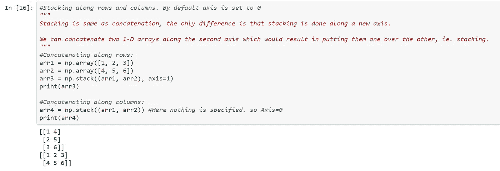
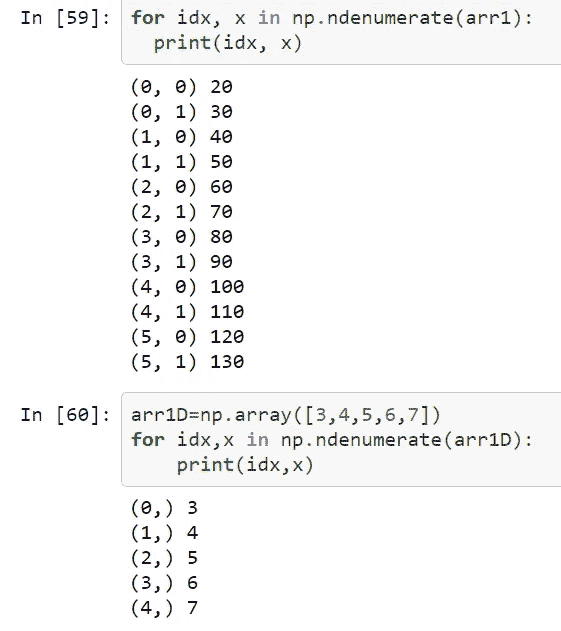

# Numpy 速成班(第二部分)

> 原文：<https://medium.com/analytics-vidhya/numpy-crash-course-part-2-9d3817ab4101?source=collection_archive---------21----------------------->

这是我的 numPy 速成班的第二部分。在这里，我们要看看 numPy 库的一些中间主题。

# 目录:

> [***串联数组***](#9297)
> 
> 
> 
> *[***拆分数组***](#078e)*
> 
> *[***迭代***](#555b)*
> 
> *[***枚举***](#150a)*
> 
> *[***排序***](#6ec1)*
> 
> *[***数学运算***](#b0c9)*
> 
> *[***在数组中搜索***](#40f8)*
> 
> *[***统计操作***](#3cbb)*

*[***如果你想要速成班的第一部分，点击这个链接。*T58**](/analytics-vidhya/numpy-crash-course-part-1-82a5558de850)*

# *连接两个数组:*

**

*在 numPy 中连接 1D 数组*

*这里，concatenate 函数只是接收我们想要连接的数组，然后将结果赋给一个新变量。*

*同样对于 2D 阵列，*

**

*在 numPy 中连接 2D 数组*

*这里，通过将 axis=1 作为 concatenate()函数中的第二个参数传递，我们基本上将两个数组沿着它们的行连接起来。*

*并且，通过将 axis=0 作为 concatenate()函数中的第二个参数，我们沿着它们的列连接了两个数组。*

# *堆叠两个阵列:*

***沿行、列堆叠使用 stack()函数:***

**

*按两个阵列的行或列堆叠*

*在 arr3 中，我们在一个新轴上按行堆叠两个数组*

*在 arr3 中，我们在新轴上沿列堆叠两个数组。在这种情况下，Axis=0，因为 stack()函数中没有指定任何参数作为第二个参数。*

***使用辅助功能堆叠:***

**

*名为 vstack 和 hstack 的辅助函数可以分别用于垂直和水平堆叠数组。*

**

*也可以使用 dstack()函数沿深度/高度进行堆叠，如上例所示。*

# *拆分数组:*

**

*这里的拆分是使用 array_split 函数完成的，它接受我们要拆分的数组，以及我们要拆分的次数。*

**

***沿轴分割:***

**

*在第一个例子中，我们沿着行分割数组。*

*在第二个例子中，我们沿着它的列拆分它。*

***垂直分割使用，水平分割使用指定功能:***

**

*hsplit 可用于水平分割数组*

*vsplit 可用于垂直拆分数组*

# *数组迭代:*

**

*我们可以使用简单的 for 循环遍历数组。*

**

*但是为了得到标量元素，我们需要多个 for 循环。*

*在上面的例子中，我们需要两个 for 循环来遍历 2D 矩阵 arr1、arr3。*

*外部 for 循环遍历 2D 数组的每个维度。*

*内部 for 循环遍历特定维度的元素。*

**

*在这里，我们使用 3 for 循环遍历一个 3D 数组。*

***在这种情况下，使用 for 循环的替代方法:***

**

*这里，函数 nditer 消除了创建多个 for 循环来遍历高维数组的标量元素的麻烦。通过使用这个函数，我们可以只使用一个 for 循环来达到目的。*

# *枚举/获取索引号，值:*

**

*在这里，我们可以获得 3D 矩阵中每个元素的索引号，以及该索引处的相应值。*

*更简单的例子:*

**

*这里我们展示了索引号，2D 数组和 1D 数组的值。*

# *排序数组:*

*在 numPy 中，只需使用 sort()函数并将数组作为参数传递给它，就可以对数组进行排序。*

**

*我们也可以像上面的例子一样按字母顺序排列字符串矩阵。*

# *矩阵的数学运算:*

*我们也可以执行矩阵的数学功能。*

****

# *在 NUMPY 数组中搜索:*

*我们可以通过指定一些条件来搜索 numPy 数组。*

**

**在这个速成课程的下一部分，我们将看看数组排序、过滤的一些高级功能。**

# *统计操作:*

**

*[**点击此处查看完整代码**](https://github.com/Faizii992/NumpyCrashCourse/blob/master/NumpyCrashCoursePart2.ipynb) **。***