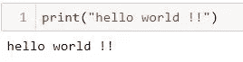
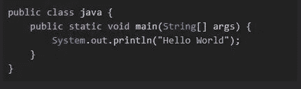
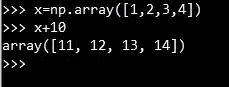
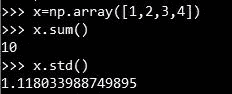
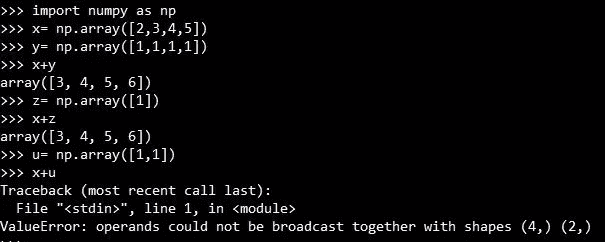
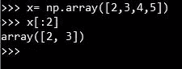
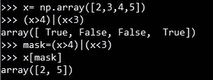
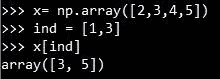

# 用于数据密集型计算的 Numpy。

> 原文：<https://medium.com/analytics-vidhya/numpy-for-data-intensive-computing-710f4d27aa5?source=collection_archive---------26----------------------->

数字最重要。

Python 在编写、测试和开发代码方面速度很快。与其他语言相比，你可以很容易地编写代码，而不需要付出太多的努力。你不需要学习类和公共方法等等。

python 中的 Hello world

java 的 hello world

python 提供的其他东西是高级库，它允许你像 seaborn 一样非常快速地做可视化的事情。这些类型的任务不太方便用其他语言编码。

> Python 速度很快，因为它是解释型、动态类型和高级语言。

同时 Python 速度很慢。执行缓慢。如果你编写一个重复循环的任务，那么会有一些开销，增加了大量的时间，原因是因为 python 是一种高级语言，在它运行代码之前，它需要做一些任务，如类型检查，引用计数等，这导致了一些开销。

> Python 的执行速度很慢，这在像循环这样的重复任务中很明显。

> 让 python 代码开发快速的原因就是让 python 代码执行缓慢的原因。

这就是数字的来源。

> Numpy 的设计就是为了让代码开发和执行更快。

它是通过将重复代码转换成编译形式来实现的。

# 数字策略:

在部署这些功能时，我们使用了一些固有的策略，包括:

1.  通用函数
2.  聚集
3.  广播
4.  切片、蒙版和花式索引

参考:PyCon 2015 youtube 视频关于[失去你的循环](https://www.youtube.com/watch?v=EEUXKG97YRw)。

# 通用函数

这些函数被定义为对数组元素进行元素操作的函数，不管它是一个单维数组还是多维数组。

按元素应用的通用函数

Ufuncs 包括数组算术、三角函数、指数和对数等。

# 聚合函数

当我们希望汇总数组中包含的信息时，这些函数非常有用。

汇总数组信息的聚合函数。

聚合函数包括 min()、max()、sum()、std()等。

# 广播

本节定义了通用函数如何对不同维数的 numpy 数组进行操作。

控制两个阵列是否具有兼容的广播形状的规则可以用一句话来表达:

> 为了广播，操作中两个阵列的*拖尾*轴的大小必须相同，或者其中一个必须为 1。

要深入了解广播，请参考:[EricsBroadcastingDoc]。

用不同维数的阵列广播。

# 切片、蒙版和花式索引

分割数组

我们可以使用一系列索引来索引数组，例如 is 示例中的`0 to 3` 。当我们将值设为`[:2]`时，它从索引`0`的开头开始读取，直到比索引`2`的结尾小 1。

掩饰

屏蔽使我们能够使用运算符来获得满足条件的数组中每个元素的布尔答案。如果条件满足，返回值为`True`，否则为`False`。例如，在上面的例子中，当我们定义掩码`x > 4| x < 3`时，我们得到的掩码为`[True False False True]`。然后，我们可以使用它来定义要在`x`数组中读取的值，并获得输出。

花式索引

花式索引是指我们定义一个索引列表，然后用它来获取`x`数组的元素。

希望这篇文章能帮助你理解 numpy 库的重要性。