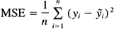
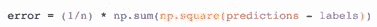

# 数据科学的数字

> 原文：<https://medium.com/analytics-vidhya/numpy-for-data-science-e31120b5f0ca?source=collection_archive---------10----------------------->

欢迎来到 NumPy！


NumPy(数字 Python)是一个开源 Python 库，几乎在科学和工程的每个领域都有使用。这是使用 Python 处理数值数据的通用标准，也是科学 Python 和 Py 数据生态系统的核心。NumPy 的用户包括所有人，从初级程序员到从事最新科学和工业研发的有经验的研究人员。NumPy API 广泛应用于 Pandas、SciPy、Matplotlib、scikit-learn、scikit-image 和大多数其他数据科学和科学 Python 包中。它包含 1D，2D 和多维数组和矩阵数据结构。它非常高效和强大，提供了巨大的库支持和强大的数据结构，保证了高效的计算和高级数学函数。

**安装 NumPy**

如果您已经有了 Python，您可以用

```
conda install numpy
```

或者

```
pip install numpy
```

**进口 NumPy**

(我们将 numpy 缩短为 np 是为了节省时间，也是为了保持代码的标准化，这样任何使用你的代码的人都可以容易地理解和运行它。)

**Python 列表和 NumPy 数组有什么区别？**

NumPy 为您提供了大量快速有效的方法来创建数组并操作数组中的数值数据。

虽然 Python 列表可以在单个列表中包含不同的数据类型，但是 NumPy 数组中的所有元素都应该是同质的。如果阵列不是同构的，那么应该在阵列上执行的数学运算将会非常低效。

**为什么要用 NumPy？**

NumPy 数组比 Python 列表更快更紧凑。数组占用的内存少，使用方便。NumPy 使用更少的内存来存储数据，并且它提供了一种指定数据类型的机制。这允许进一步优化代码。

**什么是数组？**

它是 NumPy 库的中心数据结构。数组是数值的网格，它包含关于原始数据的信息。我们可以初始化 NumPy 数组的一种方法是从 Python 列表开始，对二维或更高维的数据使用嵌套列表。

例如

```
>>> a = np.array([1, 2, 3, 4, 5, 6])
```

或者

```
>>> a = np.array([[1, 2, 3, 4], [5, 6, 7, 8], [9, 10, 11, 12]])
```

一个 N 维数组就是一个任意维数的数组。您可能还会听到一维或一维数组、二维或二维数组等等。NumPy (ndarray)类用于表示矩阵和向量。向量是一维的数组(行向量和列向量没有区别)，而矩阵是指二维的数组。对于 3-D 或更高维数组，术语张量也是常用的。

**数组的属性是什么？**

数组通常是由相同类型和大小的项目组成的固定大小的容器。数组中的维数和项数由其形状决定。数组的形状是一组非负整数，指定每个维度的大小。在 NumPy 中，维度被称为轴。这意味着如果你有一个 2D 数组，看起来像这样:

```
[[0., 0., 0.],[1., 1., 1.]]
```

您的数组有两个轴。第一轴的长度为 2，第二轴的长度为 3。

现在您将了解一些基本的 numpy 数组类型，

**np.array()，np.zeros()，np.ones()，np.empty()，np.arange()，np.linspace()，dtype**

要创建 NumPy 数组，可以使用函数 np.array()。

```
>>> import numpy as np>>> a = np.array([1, 2, 3])
```

**Numpy 个零:**

```
>>> np.zeros(2)array([0., 0.])
```

**数量:**

```
>>> np.ones(2)array([1., 1.])
```

**空数组:**

```
>>> # Create an empty array with 2 elements>>> np.empty(2)array([ 3.14, 42\. ]) # may vary
```

**NumPy arrange():**

```
>>> np.arange(4)array([0, 1, 2, 3])
```

第一个数字、最后一个数字和步长。

```
>>> np.arange(2, 9, 2)array([2, 4, 6, 8])
```

**Numpy Linspace()**

```
>>> np.linspace(0, 10, num=5)array([ 0\. , 2.5, 5\. , 7.5, 10\. ])
```

**您可以在使用该函数时指定您的数据类型，但这是一种可选方式，我们也来看看:**

```
>>> x = np.ones(2, dtype=np.int64)>>> xarray([1, 1])
```

**添加、移除和排序元素**

**np.sort()**

```
**>>>** arr = np.array([2, 1, 5, 3, 7, 4, 6, 8])**>>>** np.sort(arr)array([1, 2, 3, 4, 5, 6, 7, 8])
```

除了返回数组的排序副本的 sort 之外，还可以使用:

*   [**argsort**](https://numpy.org/doc/1.19/reference/generated/numpy.argsort.html#numpy.argsort) ，是沿指定轴的间接排序，
*   [**lexsort**](https://numpy.org/doc/1.19/reference/generated/numpy.lexsort.html#numpy.lexsort) ，是对多个键的间接稳定排序，
*   [**searchsorted**](https://numpy.org/doc/1.19/reference/generated/numpy.searchsorted.html#numpy.searchsorted) ，在排序后的数组中查找元素，以及
*   [**分区**](https://numpy.org/doc/1.19/reference/generated/numpy.partition.html#numpy.partition) ，这是一个偏排序。

**np.concatenate()**

```
**>>>** a = np.array([1, 2, 3, 4])**>>>** b = np.array([5, 6, 7, 8])>>> np.concatenate((a, b))array([1, 2, 3, 4, 5, 6, 7, 8])
```

如何知道一个数组的形状和大小？

- ndarray.ndim 将告诉您数组的轴数或维数。

- ndarray.size 将告诉您数组的元素总数。这是数组形状元素的*乘积*。

- ndarray.shape 将显示一个整数元组，该元组指示沿着数组的每个维度存储的元素的数量。例如，如果您有一个 2 行 3 列的二维数组，则数组的形状为(2，3)。

**重塑数组:**

```
**>>>** a = np.arange(6)**>>>** print(a)[0 1 2 3 4 5]**>>>** b = a.reshape(3, 2)**>>>** print(b)[[0 1][2 3][4 5]]
```

**分度和切片**

```
**>>>** data = np.array([1, 2, 3])**>>>** data[1]2**>>>** data[0:2]array([1, 2])**>>>** data[1:]array([2, 3])**>>>** data[-2:]array([2, 3])
```

**广播**

有时，您可能希望在一个数组和一个数字之间或者在两个不同大小的数组之间执行运算。例如，您的数组可能包含以英里为单位的距离信息，但您希望将该信息转换为千米。您可以使用执行此操作，

```
**>>>** data = np.array([1.0, 2.0])**>>>** data * 1.6array([1.6, 3.2])
```

**最大值、最小值、总和、平均值、乘积、标准差**

```
>>> data.max()2.0>>> data.min()1.0>>> data.sum()3.0
```

**生成随机数**

随机数生成的使用是许多数值和机器学习算法的配置和评估的重要部分。无论您需要在人工神经网络中随机初始化权重，将数据分成随机集合，还是随机洗牌，都可以生成随机数。

```
>>> np.random.rand(3,2)array([[ 0.14022471, 0.96360618], #random[ 0.37601032, 0.25528411], #random[ 0.49313049, 0.94909878]]) #random
```

**如何获得独特的物品和点数**

```
np.unique()**>>>** a = np.array([11, 11, 12, 13, 14, 15, 16, 17, 12, 13, 11, 14, 18, 19, 20])**>>>** unique_values = np.unique(a)**>>>** print(unique_values)[11 12 13 14 15 16 17 18 19 20]
```

**转置和整形一个矩阵**

```
>>> data.reshape(2, 3)array([[1, 2, 3],[4, 5, 6]])>>> data.reshape(3, 2)array([[1, 2],[3, 4],[5, 6]])
```

**排列转置**

```
>>> arr = np.arange(6).reshape((2, 3))>>> arrarray([[0, 1, 2],[3, 4, 5]])**>>>** arr.transpose()array([[0, 3],[1, 4],[2, 5]])
```

**np.flip 反转一个数组**

```
**>>>** arr_2d = np.array([[1, 2, 3, 4], [5, 6, 7, 8], [9, 10, 11, 12]])**>>>** reversed_arr = np.flip(arr_2d)**>>>** print(reversed_arr)[[12 11 10 9][ 8 7 6 5][ 4 3 2 1]]**>>>** reversed_arr_rows = np.flip(arr_2d, axis=0)**>>>** print(reversed_arr_rows)[[ 9 10 11 12][ 5 6 7 8][ 1 2 3 4]]
```

**或仅用**反转*列*

```
>>> reversed_arr_columns = np.flip(arr_2d, axis=1)>>> print(reversed_arr_columns)[[ 4 3 2 1][ 8 7 6 5][12 11 10 9]]**>>>** arr_2d[1] = np.flip(arr_2d[1])**>>>** print(arr_2d)[[ 1 2 3 4][ 8 7 6 5][ 9 10 11 12]]**>>>** arr_2d[:,1] = np.flip(arr_2d[:,1])**>>>** print(arr_2d)[[ 1 10 3 4][ 8 7 6 5][ 9 2 11 12]]
```

**如何访问 docstring 了解更多信息**[](https://numpy.org/doc/1.19/user/absolute_beginners.html#how-to-access-the-docstring-for-more-information)

```
help(), ?, ??
```

这也适用于您创建的**函数和其他对象。只需记住在函数中包含一个使用字符串文字的 docstring(" " " " "或''' ''括在文档中)。**

通过阅读您感兴趣的对象的源代码，您可以获得另一个层次的信息。使用双问号(？？)允许您访问源代码。

例如

```
help(max)max?a=np.array([1,2,3,1,2,3])a?**In [5]:** len??
```

签名:len(obj，/)

Docstring:返回容器中的项目数。

类型:内置函数或方法

**使用数学公式**

实现在数组上工作的数学公式的容易性是 NumPy 在科学 Python 社区中如此广泛使用的原因之一。

例如，这是均方误差公式(在处理回归的监督机器学习模型中使用的中心公式):

我特别觉得，使用 NumPy 处理更多的数学公式会让你成为一名更好的机器学习工程师，招聘人员真的很喜欢那些在算法中使用数学公式而不是使用 sci-kit 执行 ML 算法的人。



均方差公式

在 NumPy 中实现这个公式简单明了:



**如何保存和加载 NumPy 对象**

np.save，

```
**>>>** a = np.array([1, 2, 3, 4, 5, 6])**>>>** np.save(‘filename’, a)np.load**>>>** b = np.load(‘filename.npy’)
```

您可以将 NumPy 数组保存为纯文本文件，如. csv 或。带有 np.savetxt 的 txt 文件。

例如，如果创建此数组:

```
>>> csv_arr = np.array([1, 2, 3, 4, 5, 6, 7, 8])
```

您可以轻松地将其保存为. csv 文件，文件名为“new_file.csv ”,如下所示:

```
>>> np.savetxt(‘new_file.csv’, csv_arr)
```

您可以使用 loadtxt()快速轻松地加载保存的文本文件:

```
>>> np.loadtxt(‘new_file.csv’)array([1., 2., 3., 4., 5., 6., 7., 8.])
```

资源:[https://numpy.org/doc/](https://numpy.org/doc/)

关于我:大家好，我是 lakshman kattoju，一名本科生，我喜欢探索事物，不断学习新事物，并在我的社区中教授它们。

您可以关注我:

[](https://github.com/lakshman02manu) [## 拉克什曼 02 手册-概述

### arctic Code Vault Contributor Pro disse 在 GitHub 上注册您自己的个人资料，这是托管代码、管理…

github.com](https://github.com/lakshman02manu) 

https://twitter.com/lakshmanmanu1

[u/mike_mz02](https://www.reddit.com/user/mike_mz02/)

[https://www.linkedin.com/in/kattoju-lakshman-/](https://www.linkedin.com/in/kattoju-lakshman-/)