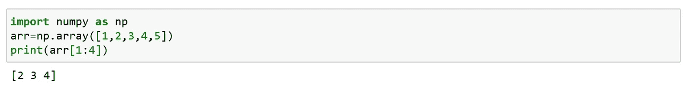
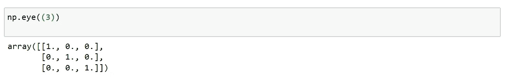

# 数字索引和切片

> 原文：<https://medium.com/analytics-vidhya/numpy-indexing-and-slicing-987706ee33f8?source=collection_archive---------16----------------------->

在上一篇文章中，我们已经看到了如何使用 numpy 创建数组。一旦创建完成，我们必须能够访问它们。在本文中，我们将看到如何通过索引、数组切片和其他一些创建数组的函数来访问数组。

## 数字索引:

我们可以通过引用数组的索引号，通过数组索引来访问数组。

NumPy 中的索引从 0 开始。

我们还可以访问和添加数组的元素；

## 访问二维数组:

要访问二维数组，我们可以使用逗号分隔的整数来表示元素的维度和索引。

## 访问三维数组:

要访问三维数组，我们可以使用逗号分隔的整数来表示元素的维度和索引。

## 负索引:

我们使用负索引从末尾访问数组。

## 数字切片:

python 中的切片意味着将元素从一个给定的索引带到另一个给定的索引。

我们传递切片而不是索引；[开始:结束]

如果我们不通过 start，它将被视为 0。

如果我们不传递 end，它会取那个维度中数组的长度。

如果我们不通过步骤，它被认为是 1。

包括开始索引，不包括结束索引。

## 负切片:

为了从末端切片元素，我们使用负切片。

使用减号运算符从末尾开始引用索引。

## 步骤:

使用步长值来确定切片的步长。

**创建数组涉及的函数:**

**重塑:**

整形意味着改变数组的形状。
一个数组的形状是每个维度中元素的个数。
通过重塑，我们可以添加或删除维度，或者改变每个维度中的元素数量。

**形状:**

数组的形状是每个维度中元素的数量。
NumPy 数组有一个名为 shape 的属性，它返回一个元组，每个索引都有相应元素的数量。

**Linspace:**

该函数生成彼此等距的元素。

**排列:**

该函数返回给定间隔内均匀分布的值。包括开始但不包括停止的时间间隔。

**零:**

此函数用零填充参数中指定的形状。

**个:**

此函数用 1 填充参数中指定的形状。

**单位矩阵:**

此函数仅使用对角线元素填充参数中指定的形状。

**对角矩阵:**

这个函数提取并构造一个对角线数组。

就这样，我们来到了这篇文章的结尾。

快乐编码…😊😊😊