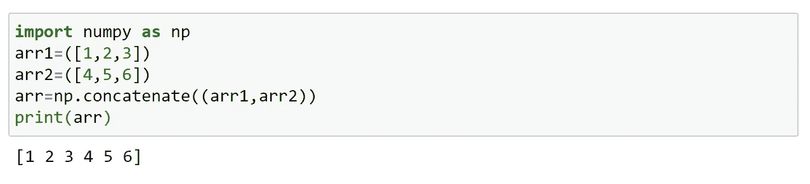
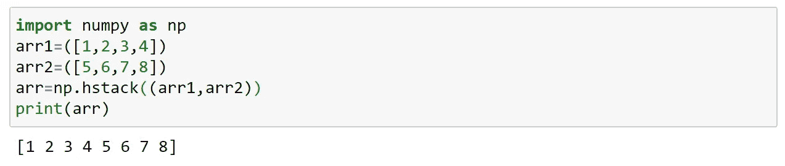
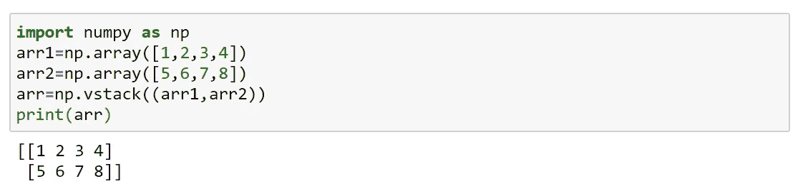
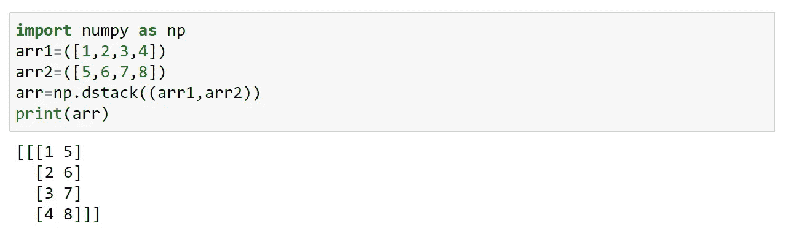
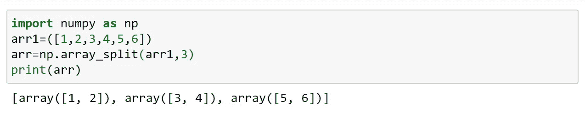
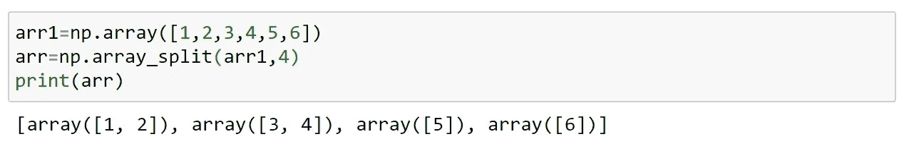
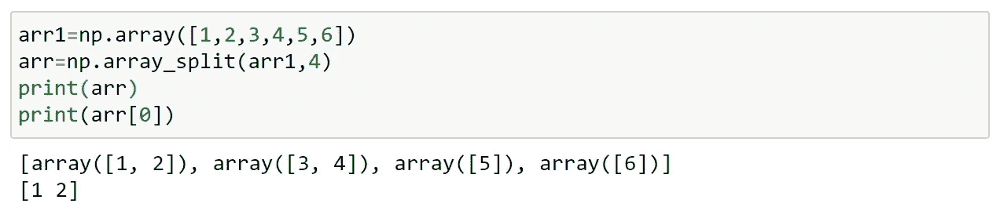
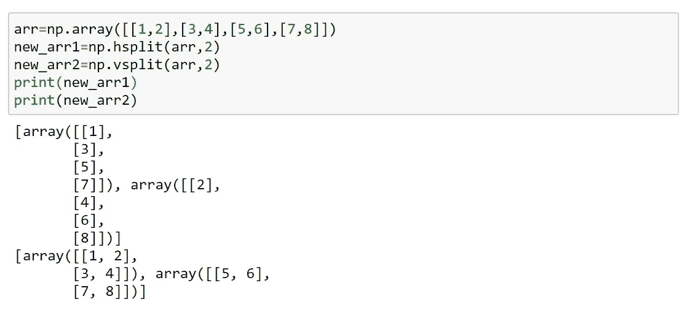

# 数字连接和分割

> 原文：<https://medium.com/analytics-vidhya/numpy-join-and-split-c090b765fa37?source=collection_archive---------6----------------------->

# Numpy 连接:

连接意味着将两个或多个数组的内容放在一个数组中。

我们使用 concatenate()和 axis 来实现这一点；如果轴没有被传递；它被视为 0。

带轴；

## 使用堆栈连接数组:

堆叠用于沿新轴连接相同维度的数组。

堆栈有三种类型:

水平堆叠

垂直堆叠

高度堆叠

## 水平堆叠:

水平堆叠沿行进行。

## 垂直堆叠:

沿着列进行垂直堆叠。

## 高度堆叠:

高度堆叠用于沿高度堆叠。

# 数字拆分:

Split 函数与 join 操作相反。

Join 将多个数组合并成一个，而 split 将一个数组拆分成多个数组。

我们使用 array_stack()来拆分数组。

如果数组的元素比要求的少，它将从末尾进行相应的调整。

还有一种方法做拆分；这是使用类似于 array_split()的 split()完成的。

但是当元素比要求的少时，split()不会调整，它会抛出错误。

访问拆分的数组；

类似地，我们可以对二维数组做同样的事情。有 hsplit()，vsplit()和 dsplit()。

dsplit 仅适用于 3 维或更多维的数组。

就这样，我们来到了这篇文章的结尾。

快乐编码…😊😊😊