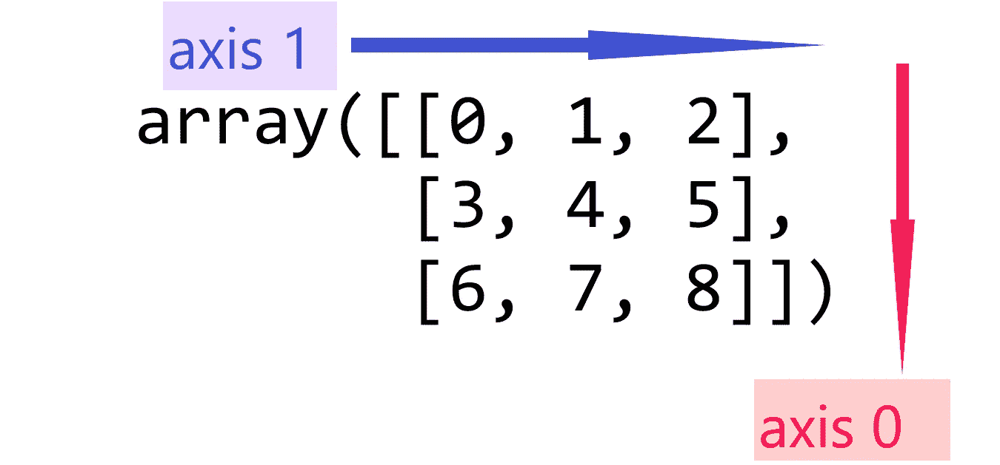
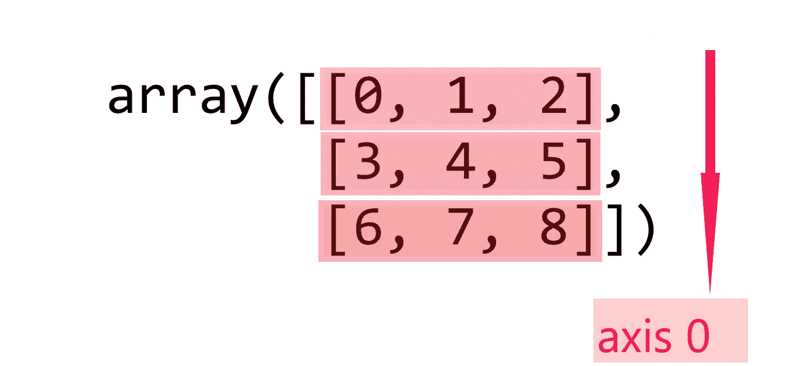
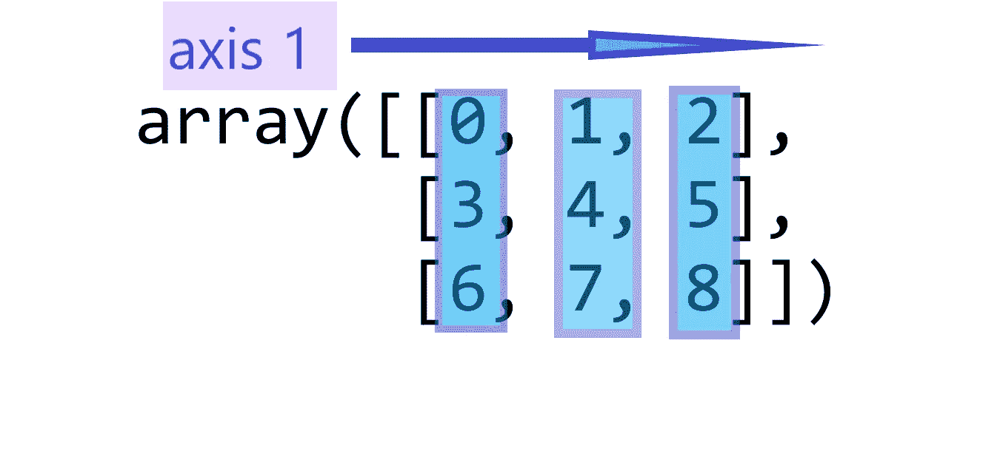
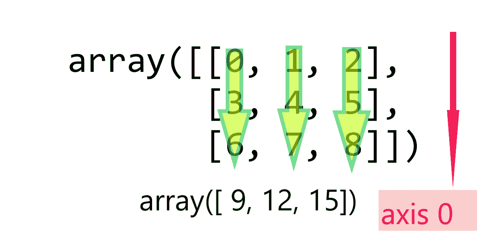
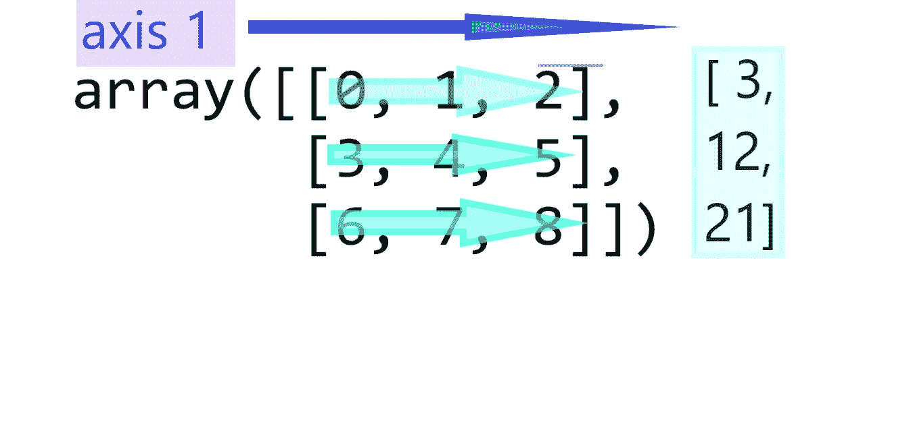
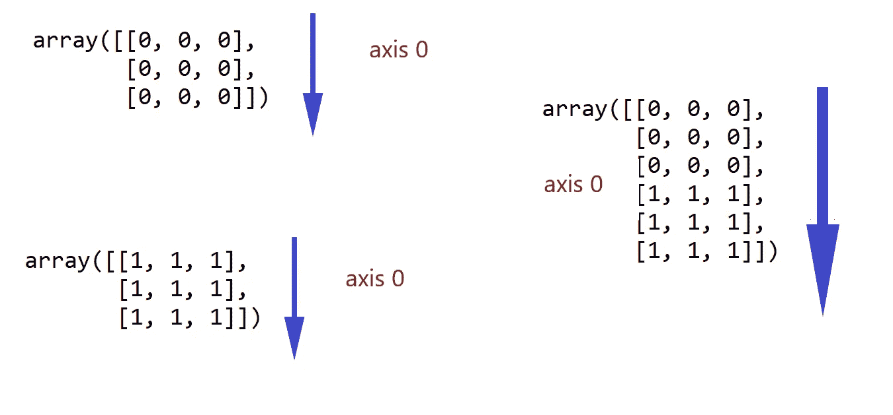
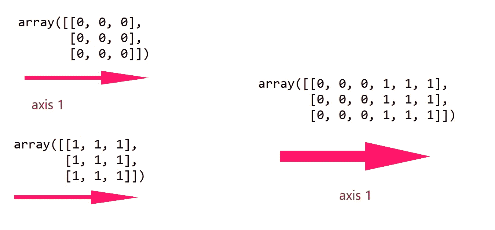

# NumPy 处理数组的尺寸和形状。

> 原文：<https://medium.com/analytics-vidhya/numpy-manipulating-the-dimensions-and-shape-of-arrays-413645365432?source=collection_archive---------15----------------------->

## 了解 numpy、numpy.transpose、numpy.fliplr、numpy.flipud、numpy.rot90 中的轴

## 数字轴是沿着行和列定义的



> **轴 0** :沿行的轴，该轴也称为“第一轴”



> **轴 1** :是沿着列的轴



> 沿 0 轴求和

```
array = np.arange(9).reshape(3,3)np.sum(array,axis = 0)
Out[4]: array([ 9, 12, 15])
```



> 通过**轴 1** 求和

```
array = np.arange(9).reshape(3,3)np.sum(array,axis = 1)
Out[5]: array([ 3, 12, 21])[ 3, 12, 21]
```



> 沿 0 轴串联

```
array1 = np.random.randint(0,1,size = (3,3))array1
Out[7]: 
array([[0, 0, 0],
       [0, 0, 0],
       [0, 0, 0]])array2 = np.random.choice([1],size = (3,3))array2
Out[9]: 
array([[1, 1, 1],
       [1, 1, 1],
       [1, 1, 1]])np.concatenate((array1,array2), axis = 0)
Out[10]: 
array([[0, 0, 0],
       [0, 0, 0],
       [0, 0, 0],
       [1, 1, 1],
       [1, 1, 1],
       [1, 1, 1]])
```



> 沿轴 1 串联

```
array1 = np.random.randint(0,1,size = (3,3))array1
Out[7]: 
array([[0, 0, 0],
       [0, 0, 0],
       [0, 0, 0]])array2 = np.random.choice([1],size = (3,3))array2
Out[9]: 
array([[1, 1, 1],
       [1, 1, 1],
       [1, 1, 1]])np.concatenate((array1,array2), axis = 1)
Out[11]: 
array([[0, 0, 0, 1, 1, 1],
       [0, 0, 0, 1, 1, 1],
       [0, 0, 0, 1, 1, 1]])
```



转置给定的矩阵

```
**numpy.transpose****(***a***,** *axes=None***)**
```

**轴:**包含轴值排列的元组或列表，如果有三个轴，轴参数可以包含(0，1，2)或(1，2，0)或(0，2，1)或(1，0，2)或(2，1，0)或(2，0，1)。如果未指定，则默认为(2，1，0)或反转维度。

考虑形状为(4，2，3)的矩阵，即维数为(2×3)的矩阵重复 4 次。

```
array = np.ones((4,2,3)) # four times repeat the matrix (2 X 3)array
Out[9]: 
array([[[1., 1., 1.],
        [1., 1., 1.]], [[1., 1., 1.],
        [1., 1., 1.]], [[1., 1., 1.],
        [1., 1., 1.]], [[1., 1., 1.],
        [1., 1., 1.]]])
```

在应用转置和检查维度之后，我们观察到矩阵的维度被反转了。

```
np.transpose(array)
Out[10]: 
array([[[1., 1., 1., 1.],
        [1., 1., 1., 1.]], [[1., 1., 1., 1.],
        [1., 1., 1., 1.]], [[1., 1., 1., 1.],
        [1., 1., 1., 1.]]])np.transpose(array).shape
Out[11]: (3, 2, 4)
```

交换维度(0，1，2) → (1，2，0):在这种情况下，维度(3 X 4)的矩阵重复 2 次

```
np.transpose(array,axes = (1,2,0))
Out[12]: 
array([[[1., 1., 1., 1.],
        [1., 1., 1., 1.],
        [1., 1., 1., 1.]], [[1., 1., 1., 1.],
        [1., 1., 1., 1.],
        [1., 1., 1., 1.]]])np.transpose(array,axes = (1,2,0)).shape
Out[13]: (2, 3, 4)
```

更多示例:

翻转数组*左右*或*上下*

```
array = np.diag([1,2,3,4,5])array
Out[8]: 
array([[1, 0, 0, 0, 0],
       [0, 2, 0, 0, 0],
       [0, 0, 3, 0, 0],
       [0, 0, 0, 4, 0],
       [0, 0, 0, 0, 5]])
# columns are preserved and rows are flippednp.fliplr(array)
Out[9]: 
array([[0, 0, 0, 0, 1],
       [0, 0, 0, 2, 0],
       [0, 0, 3, 0, 0],
       [0, 4, 0, 0, 0],
       [5, 0, 0, 0, 0]])
# rows are preserved but columns are flippednp.flipud(array)
Out[11]: 
array([[0, 0, 0, 0, 5],
       [0, 0, 0, 4, 0],
       [0, 0, 3, 0, 0],
       [0, 2, 0, 0, 0],
       [1, 0, 0, 0, 0]])
```