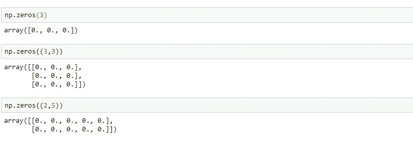

# 你必须知道的 Numpy 操作！

> 原文：<https://medium.com/analytics-vidhya/numpy-operations-that-you-must-know-745f5ee344b3?source=collection_archive---------29----------------------->


阿里·科卡布在 [Unsplash](https://unsplash.com/s/photos/batman?utm_source=unsplash&utm_medium=referral&utm_content=creditCopyText) 上的照片

如果你想在 Python 中使用机器学习，Numpy 和 Pandas 几乎是必不可少的。他们就像我们的机器学习蝙蝠侠的阿尔弗雷德。这就引出了一个问题，是什么让它们成为我们算法的支持系统？

本文重点关注 Numpy，以及它如何在处理机器学习算法时成为一个忠诚、不知疲倦的朋友和助手。考虑一下您应该使用 Numpy 的五个原因:

*   Numpy 提供了对大型多维矩阵和数组的支持，并且有大量可以在这些数据结构上执行的操作。
*   它有一个随机库，在伪随机数生成中非常有用。
*   它还提供处理傅立叶变换和线性代数的函数。
*   图像可以存储为 Numpy 数组，并与计算机视觉库配合使用。
*   Numpy 数组存储在连续的内存位置，并针对快速操作进行了优化。**这使得它们比常规的列表操作要快得多。**

# 安装 Numpy

可以在 Anaconda 提示符下使用 pip install 命令来安装 Numpy。

```
pip install numpy
```

# 导入数字

必须先导入该库，然后才能使用。这是使用 import 语句完成的。

```
**import numpy as np**
```

# Numpy 数组和矩阵

## **1。np.array()**

np.array()可以用来生成数组和矩阵。

*   **使用 np.array()生成数组**

```
**np.array([your array here])**
```


*   **使用 np.array()生成矩阵**

np.array()也可以用来生成一个有 *m* 行和 *n* 列的矩阵。下面的矩阵有 3 行 3 列。我们可以说这个矩阵的形状是(3，3)。

```
**np.array([row 1 here],[row 2 here],...)**
```


## 2.np.arange()

arange()方法有三个参数，分别是 start、end 和 step-size。这对于用相同的步骤生成一系列数字是很有用的。

```
**np.arange(start, end, step)**
```


## 3.np.zeros()

np.zeros 生成用 0 填充的数组和矩阵。

```
**np.zeros([array/ matrix here])**
```



## 4.np.ones()

np.ones()生成用 1 填充的数组和矩阵。

```
**np.ones([your array/ matrix here])**
```


## 5.np.linspace()

np.linspace()可以用来获得一个区间内的一组均匀分布的数字。它可能看起来类似于 np.arange()，但是我们指定的不是步长，而是数据点的数量。它需要 3 个参数——开始、结束和点数。

```
**np.linspace(start, stop, #ofpoints)**
```


## 6.np.eye()

此方法生成指定形状(m)的单位矩阵，其中 m 是方阵的大小。

```
**np.eye(m)**
```


## 7.np.shape()和 NP . shape()

shape()方法给出指定数组/矩阵的形状。shape()方法用于在不同的形状中使用相同的元素。

例如:形状为(20，1)的 20 个元素的矩阵被重新整形为(2，10)。

```
**array.shape()
array.reshape([new shape here])**
```


shape()函数仅在转换可行时起作用，即新形状可以容纳现有元素。如果不能，它将抛出一个错误。例如:如果我们试图将一个包含 20 个元素的矩阵重新塑造成一个需要 25 个元素的矩阵，就会失败。


## 8.最大()和最小()

max()和 min()方法可分别用于查找数组的最大和最小元素。

另一个方便的方法是 argmax()和 argmin()，它们分别给出数组中 max 和 min 元素的位置。


## 9.sum()等统计运算

Numpy 有 np.sum()和 np.mean()之类的运算，可以用来求数组的和与均值。


## 10.exp()和其他数学运算

Numpy 有许多数学和三角运算，可以在数组或矩阵上执行。


# Numpy 随机模块

Numpy 的随机模块有可以生成伪随机数的函数。

## 1.np.random.rand()

这可用于从给定形状的均匀分布中生成随机数。

```
**np.random.rand(shape of array/matrix)**
```


## 2.随机的

该方法从标准正态分布中生成给定形状的随机数。

```
**np.random.randn(shape of array/ matrix)**
```


## 3.np.random.randint()

np.random.randint()方法生成给定范围内的随机数。它有三个参数——开始、结束和数据点数。

```
**np.random.randint(start, end, #ofpoints)**
```

例如:下面是我们如何在 1 到 100 之间生成 5 个随机数。


## 4.np.random.ranf()和 np.random.sample()

这些方法在给定的形状中生成 0 到小于 1 的随机数。

```
**np.random.ranf(shape of array or matrix)
np.random.sample(shape of array or matrix)**
```


## 5.np .随机数.选择()

此方法从一维数组中随机选择元素。它最少需要两个参数—要选择的一维数组和数据点的数量。数据点的概率以及是否考虑替换也可以作为参数传递。

```
np.random.choice(array, #ofpoints, ...)
```

如果传递的是一个数字 *m* 而不是一个数组，它会将数组假定为 np.arange(m)。


如果你想玩数字图书馆，这里有一个 Jupyter 笔记本的链接。

## 参考资料:

1.  https://numpy.org/doc/stable/reference/index.html
2.  【https://www.javatpoint.com/numpy-array 