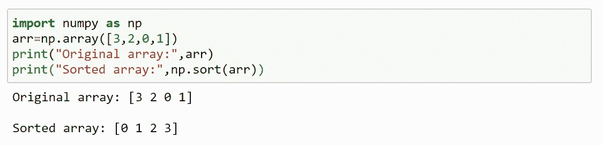
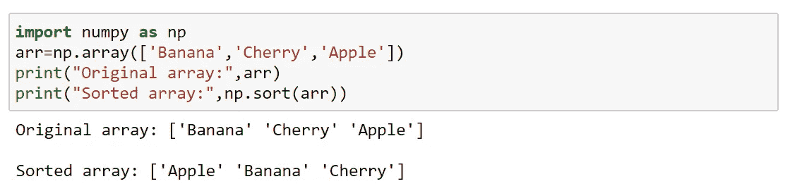
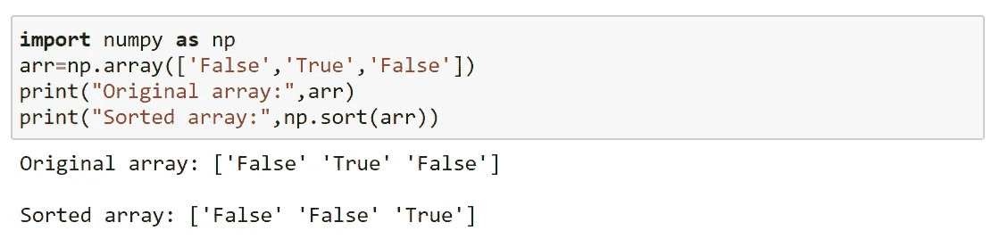
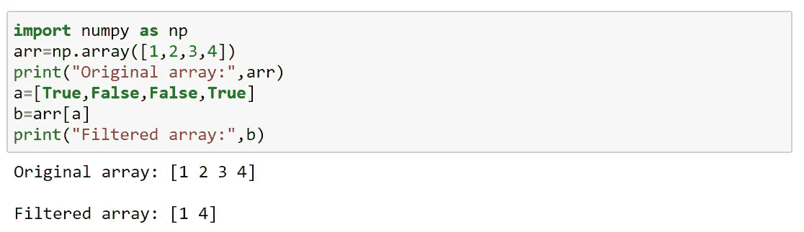
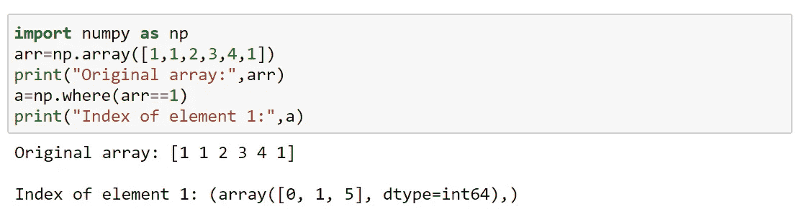
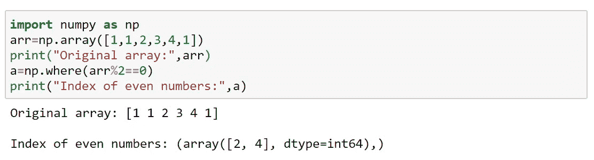
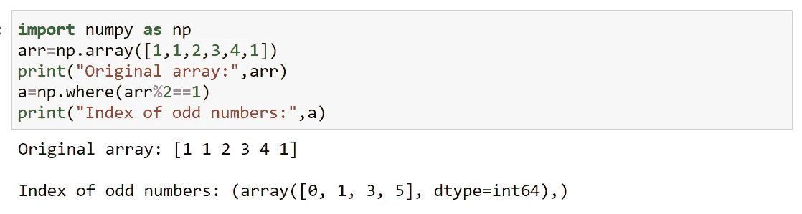
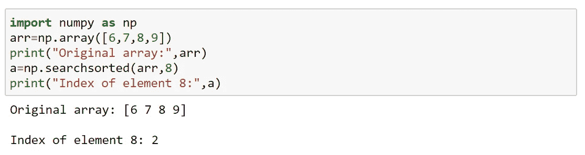
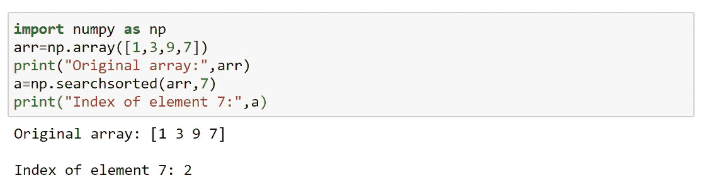
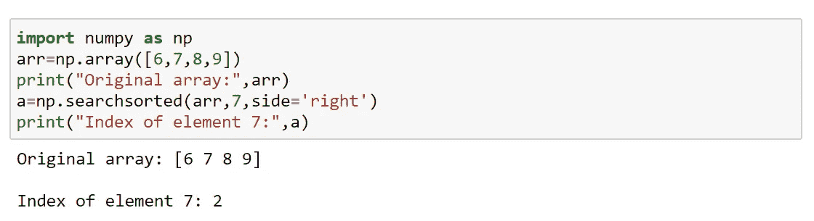

# 数字排序、过滤和搜索

> 原文：<https://medium.com/analytics-vidhya/numpy-sort-filter-and-search-53389b72d481?source=collection_archive---------14----------------------->

# 数字排序

排序意味着将元素按顺序排列。

有序序列意味着以对应于像数字或字母这样的元素的任何顺序排序；上升或下降。

Numpy 有一个名为 sort()的函数，它将对指定的数组进行排序。

此方法返回副本，而不改变原件。

我们也可以对具有字符串或任何其他数据类型的数组进行排序。

# 数字滤波器

从现有数组中取出一些元素，然后用它们创建一个新数组，这叫做过滤。

我们可以使用一个布尔索引列表(对应于数组中索引的布尔列表)来过滤一个数组

True:元素包含在数组中。

False:元素不在数组中。

# 数字搜索

Where()可用于在数组中搜索某个值，这将返回匹配的索引。

这里，元素 1 出现在索引 0，1，5 中。

返回偶数的索引

返回奇数的索引

## 搜索排序

这将在数组中执行二分搜索法，并返回索引，该方法假定它是一个已排序的数组。

下面是如何对已经排序的数组进行搜索排序；

对未排序的数组进行搜索排序；但是当它搜索并返回输出时，它假定为排序数组。

当给定数组被假定为排序数组时，它指向必须插入 7 的索引。

默认情况下，搜索排序是从左到右进行的。

但是要从右到左返回索引，我们可以给 side='right '。

