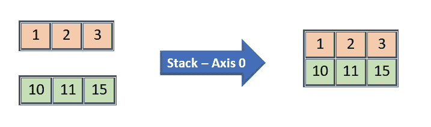
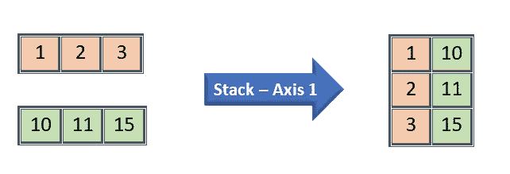
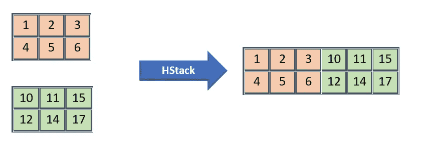
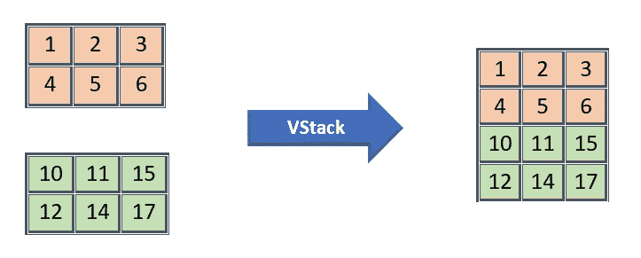

# Numpy —堆叠阵列

> 原文：<https://medium.com/analytics-vidhya/numpy-stacking-arrays-55be84cce2f4?source=collection_archive---------14----------------------->

# 连接两个 numpy 数组

*   stack 将数组与给定的轴逐个元素连接起来
*   hstack —水平延伸
*   vstack 垂直延伸

# Stack 将数组与给定的轴逐个元素连接起来

*   两个输入数组应该具有相同的维度/形状
*   堆栈中的轴参数在这里作为 dimention 而不是水平/垂直方式工作。
*   如果轴是 0，那么它将通过第一维连接
*   如果轴是 1，它将通过第二维连接
*   我们能提到的最大维数是输入数组的维数(比如 n) + 1。
*   如果给定的轴大于 n + 1，那么将抛出“维数数组越界”异常



按第一维度堆叠



按二维堆叠

```
arr1 = np.array([1,5,2,10])
arr2 = np.array([10,50,20,100])
print(arr1)
print(arr2)
```

输出:

```
[ 1  5  2 10]
[ 10  50  20 100]
```

按第一维度堆叠:

```
arr3 = np.stack((arr1, arr2), axis = 0)
```

输出:

```
array([[  1,   5,   2,  10],
       [ 10,  50,  20, 100]])
```

按第二维度堆叠:

```
arr3 = np.stack((arr1, arr2), axis = 1)
```

输出:

```
array([[  1,  10],
       [  5,  50],
       [  2,  20],
       [ 10, 100]])
```

# HStack —水平堆叠

*   此功能不适用于 axis。它通过第二阵列水平延伸第一阵列
*   当它水平扩展时，两个数组应该有相同的行数，否则将返回值错误。



HStack

1D 阵列的 HStack:

```
arr1 = np.array([1,5,2,10])
arr2 = np.array([10,50,20,100])
np.hstack((arr1, arr2))
```

输出:

```
array([  1,   5,   2,  10,  10,  50,  20, 100])
```

2D 阵列的 HStack:

```
arr1 = np.array([[1,2,3],[4,5,6]])
arr2 = np.array([[10,20,30],[40,50,60]])
np.hstack((arr1, arr2))
```

输出:

```
array([[ 1,  2,  3, 10, 20, 30],
       [ 4,  5,  6, 40, 50, 60]])
```

# VStack —垂直堆叠

*   此功能不适用于 axis。它通过第二阵列垂直延伸第一阵列



VStack

2D 阵列的 VStack:

```
arr1 = np.array([[1,2,3],[4,5,6]])
arr2 = np.array([[10,20,30],[40,50,60]])
np.vstack((arr1, arr2))
```

输出:

```
array([[ 1,  2,  3],
       [ 4,  5,  6],
       [10, 20, 30],
       [40, 50, 60]])
```

# **结论:**

在本文中，我们对 1D 和 2D 阵列进行了叠加实验。

我将添加另一个帖子，对 3D 阵列进行更多的演示，因为它有点难以理解。

如果你喜欢这篇文章，支持我，只要点击拍手图标，次数不限！！！

编程快乐！！！