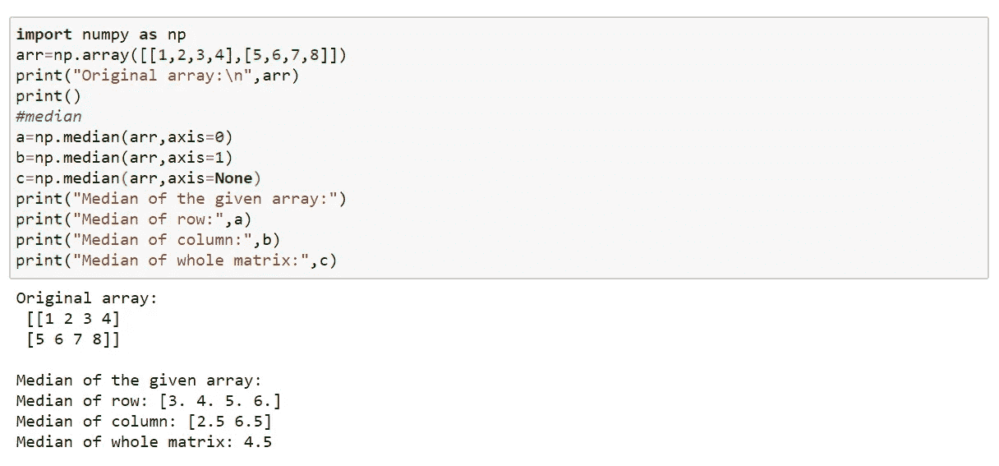

# Numpy 统计函数

> 原文：<https://medium.com/analytics-vidhya/numpy-statistical-functions-8fa6e1aadf2d?source=collection_archive---------36----------------------->

NumPy 有很多方便的统计函数，可以找到最小值、最大值、平均值、中间值和标准偏差等。从数组中的给定元素。

本文描述了这些函数。

# 统计功能

## 要查找平均值和方差:

mean:这将返回沿指定轴的算术平均值。

median:这将返回沿指定轴的中间值。

average:这将返回沿指定轴的加权平均值。

std:这将返回沿指定轴的标准偏差。

var:这将返回沿指定轴的方差。

示例 1:无坐标轴(一维数组)

示例 2:带轴

平均:

中位数:

## 要找到最小值和最大值:

amin:这将返回一个数组的最小值。

这将返回一个数组的最大值。

## 要查找百分位数:

percentile:这将返回数组的百分位数。

就这样，我们来到了这篇文章的结尾。

快乐编码…😊😊😊