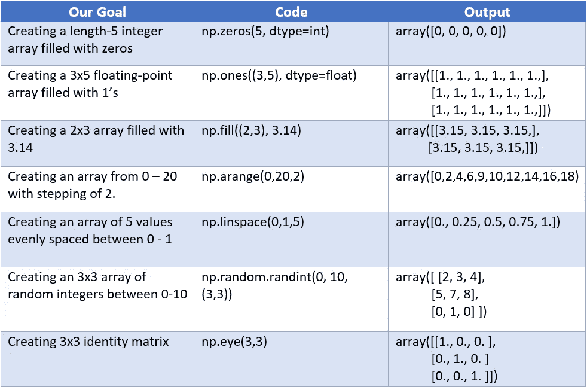
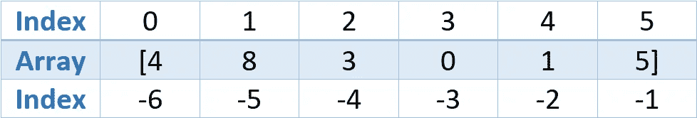

# NumPy -最基本的！

> 原文：<https://medium.com/analytics-vidhya/numpy-the-very-basics-6ce19206ee22?source=collection_archive---------4----------------------->

这篇文章是为那些对 NumPy 一无所知的人写的，这样他们就可以掌握一些入门知识。

NumPy 是 Python 中用于科学和数学计算的包。虽然 NumPy 广泛应用于数组快速运算的各种例程中，包括数学、逻辑、形状操作、排序、选择、I/O、离散傅立叶变换、基本线性代数、基本统计运算、随机模拟等等，但是我们今天将从 NumPy 的基础开始。


来源-[https://numpy.org](https://numpy.org)

> 整篇文章我将使用 Jupyter Notebook 中的代码，并假设您已经了解 Python 的基础知识并安装了 NumPy。

我们将从导入 NumPy 开始。

```
*In[1]: import numpy as np*
```

## NumPy 数组的维数


来源-[https://fgnt . github . io/python _ crash kurs _ doc/include/numpy . html](https://fgnt.github.io/python_crashkurs_doc/include/numpy.html)

## 一维数组

让我们使用 python 列表创建一个数组。(不推荐的方式)

```
*In[2]: np.array([1,2,3,4,5])
Out[2]: array([1,2,3,4,5])*
```

NumPy 的一个非常重要的属性更像是一个约束，NumPy 数组只能有一种数据类型。也就是说，不能有混合数据类型的数组。当你试图达到这个数字的时候，它会在可能的地方隐式地尝试向上转换。在代码下面，我们可以看到，即使我们有整数，它们也会被自动转换为字符串 my NumPy。

```
*In[3]: print(np.array([1,2,’Hello’,3,4])**Out[3]: ‘1’,’2’,’Hello’,’3’,’4’*
```

## 二维数组

NumPy 数组也可以是多维的。这是一个 2×5 矩阵的例子。

```
*In[4]: np.array([[1,2,3,4,5], [1,2,3,4,5]])**Out[4]: array([[1,2,3,4,5],
               [1,2,3,4,5]])*
```

## **使用内置例程创建数组**



## **NumPy 属性**

*   1.ndim -维数。
*   2.形状-每个维度的大小。
*   3.size -数组的总大小。
*   4.数组元素的数据类型。
*   5.每个数组元素的字节大小。
*   6.nbytes -数组的总大小。它等于 itemsize 乘以 size。

让我们使用随机变量创建一个形状(3，4，5)的三维数组，并检查每个属性。

```
*In[5]: a=np.random.randint(10, (3,4,5))* *print(a.ndim)* *print(a.nshape)* *print(a.size) #Multiplication of shape values* *print(a.dtype)* *print(a.itemsize)* *print(a.nbyte)**Out[5]: 3* *(3,4,5)* *60* *Int64* *8 bytes* *480 bytes*
```

## **数组索引**

如果您已经学了这么多，我相信您一定非常了解列表和索引。数组索引是相当熟悉的。让我们深入举例。

```
*In[6]: a=np.array([4,8,3,0,1,5])* *a[0]**Out[6]: 5**In[7]: a[4]**Out[7]: 1*
```

我们使用负索引从数组的末尾开始索引。

```
*In[8]: a[-1]**Out[8]: 5**In[8]: a[-2]**Out[8]: 1*
```

负索引有时可能会令人困惑。所以，下面我有一个直观的表示来给出一个清晰的思路。另一点要注意的是，当负指数是从 1 开始，而不是从 0。



**在多维数组**中，使用逗号分隔的索引来访问项目。

```
*In[9]: a=np.array([[2,3,5,8,7],* *[4,1,0,9,6],* *[6,3,4,0,6]])* *# 1st element of 1st list or element at position 0,0* *a[0 , 0]**Out[9]: 2**In[10]: a[2, -1]   #Last element of last list**Out[10]: 6*
```

## **数组切片**

当我们使用方括号来提取数组元素时，我们也可以用它来提取子数组，并结合使用冒号(:)。语法类似于 range 函数，只是我们在这里使用方括号。

> array _ variable[开始:停止:步进]
> 
> 开始的默认值为 0，停止的默认值为尺寸，步长的默认值为 1

```
*In[11]: x = np.arange(10)* *x**Out[11]: array([0, 1, 2, 3, 4, 5, 6, 7, 8, 9])* *In[12]: x[:5] #first five elements**Out[12]: array([0, 1, 2, 3, 4])* *In[13]: x[5:] # elements from index 5**Out[13]: array([5, 6, 7, 8, 9])* *In[14]: x[4:7] # subarray**Out[14]: array([4, 5, 6])* *In[15]: x[::2] # every other element**Out[15]: array([0, 2, 4, 6, 8])* *In[16]: x[1::2] # every other element, starting at index 1**Out[16]: array([1, 3, 5, 7, 9])* *In[17]: x[::-1] # all elements, reversed**Out[17]: array([9, 8, 7, 6, 5, 4, 3, 2, 1, 0])* *In[18]: x[5::-2] # reversed every other from index 5**Out[18]: array([5, 3, 1])*
```

**多维数组切片**也以同样的方式工作，唯一的区别是我们需要使用逗号(，)来分隔行和列。

```
*In[19]: a=np.array( [[2,3,5,8,7],* *[4,1,0,9,6],* *[6,3,4,0,6]] )* *# 2 rows 3 columns* *a[ :2, :3]**Out[19]: array( [[2,3,5,8,7],* *[4,1,0,9,6]] )**In[20]: a[ :3, :2] # 3 rows 2 columns**Out[20]: array( [[2,3],* *[4,1],* *[6,3]] )*
```

下一个有点棘手。我们将从行和列反转元素。将原始数组与下面的输出进行比较。

```
*In[21]: a[ ::-1, ::-1]**Out[21]: array([[6, 0, 4, 3, 6],* *[6, 9, 0, 1, 4],* *[7, 8, 5, 3, 2]] )*
```

> *数组切片与列表切片的一个不同之处在于，数组切片返回原始数组的视图，而不像在列表中它返回副本。因此，切片子数组中的任何修改也会反映在原始数组中。*

## **数组拼接和拆分**

在 NumPy 中加入或连接数组是通过使用 np.concatenate、np.vstack、np.hstack、np.dstack 来完成的，不要担心复杂的名称“stack”，这是非常简单的操作。

```
*In[22]: a= np.array([ 1,2,3,4 ])* *b=np.arrar([5,6,7,8])* *c=np.array([[9,8,7,6],* *[5,4,3,2]])* *d=np.array[([5,6],* *[4,7]])* *np.concatenate([a,b])**Out[22]: array([1,2,3,4,5,6,7,8])* *In[23]: np.vstack([a,c])**Out[23]: array([[1,2,3,4 ],* *[9,8,7,6],* *[5,4,3,2]])* *In[24]: np.hstack([c,d])**Out[24]: array([[9,8,7,6,5,6],* *[5,4,3,2,4,7]])
#np.dstack is used on three-dimensional array*
```

同样的道理也适用于**阵列分裂**。我们使用 np.split、np.vsplit 和 np.hsplit。所有这些功能都与 concatenate 完全相反。

```
*In[25]: x = [1,2,3,99,99,3,2,1]* *x1, x2, x3 = np.split(x,[3,5])* *print(x1, x2, x3)**Out[25]: [1 2 3] [99 99] [3 2 1]* *In[26]: a=np.arange(16).reshape((4,4))* *a**Out[26]: array([[ 0, 1, 2, 3],
                [ 4, 5, 6, 7],
                [ 8, 9, 10, 11],
                [12, 13, 14, 15]])* *In[27]: upper,lower = np.vsplit(a,[2])* *print(upper)* *print(lower)**Out[27]: [0 1 2 3]* *[4 5 6 7]* *In[28]: left, right= np.hsplit(a,[2])* *print(left)* *print(right)**Out[28]: [[0 1]
          [4 5]
          [8 9]
          [12 13]]
        [[2 3]
         [6 7]
         [10 11]
         [14 15]]*
```

这就是 NumPy 的基础知识。这也是给那些对 NumPy 一无所知的人的。我将发布更多先进的 NumPy 概念。

继续阅读

[](/analytics-vidhya/advanced-numpy-218584c60c63) [## 数据科学的高级数字

### 我们将讨论 NumPy 的一些高级概念，特别是处理一个

medium.com](/analytics-vidhya/advanced-numpy-218584c60c63) 

让我们连接

[](https://www.linkedin.com/in/sujan-shirol/) [## Sujan Shirol -技术作家- Python 开发者| LinkedIn

### 查看 Sujan Shirol 在世界上最大的职业社区 LinkedIn 上的个人资料。Sujan 有两个工作列在他们的…

www.linkedin.com](https://www.linkedin.com/in/sujan-shirol/)