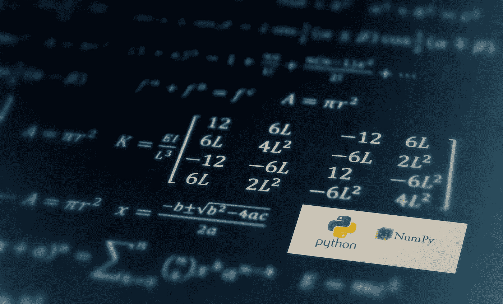

# Numpy 揭秘:使用 Numpy 的统计初学者指南

> 原文：<https://medium.com/analytics-vidhya/numpy-uncovered-a-beginners-guide-9c5fed6efc7?source=collection_archive---------20----------------------->

总结我在著名的 Python 科学图书馆 Numpy 的学习中的关键收获。

**要运行本文所示的代码，使用这个在线的**[**Python c*ompiler***](https://repl.it/repls/ElderlyEducatedBrackets#main.py)***。这将有助于你在前进的过程中理解并记住这些概念，也有助于你养成练习编码的习惯。***

> 许多公司招聘 Python…