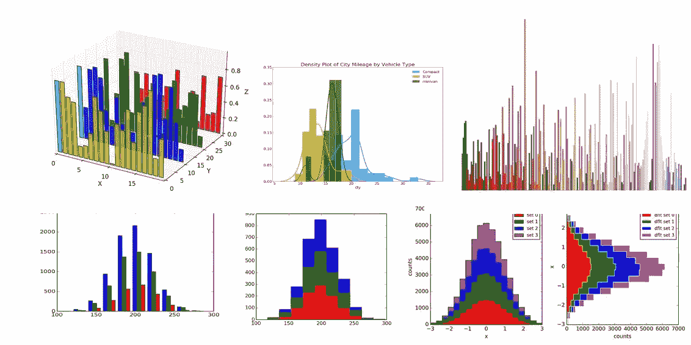

# Numpy 未覆盖:使用 Numpy 和 Matplotlib 的直方图

> 原文：<https://medium.com/analytics-vidhya/numpy-uncovered-histograms-using-numpy-and-matplotlib-a2d5a1727978?source=collection_archive---------9----------------------->

使用 Numpy 系列的统计指南第 2 部分

## 简介:

当我们第一次查看数据集时，我们希望能够快速了解它的某些方面:

*   有些值比其他值出现得更频繁吗？
*   数据集的范围是什么(即最小值和最大值)？