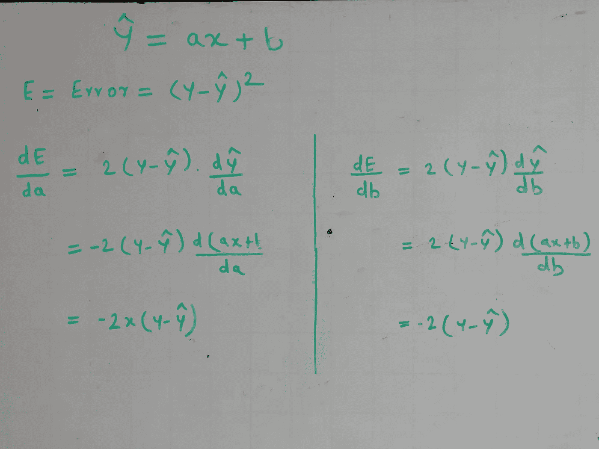

# Numpy vs PyTorch:从零开始的线性回归

> 原文：<https://medium.com/analytics-vidhya/numpy-vs-pytorch-linear-regression-from-scratch-452a121fb0e8?source=collection_archive---------15----------------------->


照片由[耶鲁安穴獭](https://unsplash.com/@jeroendenotter?utm_source=medium&utm_medium=referral)在 [Unsplash](https://unsplash.com?utm_source=medium&utm_medium=referral)

在上一篇[文章](/analytics-vidhya/introduction-to-pytorch-e5df512b1079)中，我们比较了 Numpy 数组和 PyTorch 张量。现在让我们使用 Numpy 和 PyTorch 构建简单的线性回归模型。

```
#Create dummy dataset
X = np.array([1,2,4,6,8,10,12,13,14,16,16,18,20,22,24])
Y = np.array([39,42,43,46,47,56,60,59,64,66,68,72,71,75,80])
```

正如我们所见，X 和 y 之间存在线性关系(我们将在另一篇文章中讨论更多的相关性)。这里，我们将使用线性回归来建立预测模型。

**线性回归基础:**

Y = a*X+b 是直线/线性回归模型的方程。

目标是找到 a 和 b 的值。

有多种技术可以实现这一点:

1.矩阵计算:将所有数据放入矩阵中进行优化。由于内存限制，用于小型数据集。

2.梯度下降:使用导数尽量减小实际值和预测值之间的误差/差异。

3.正则化:在最小化错误的同时，也要尽量减少不必要特征的影响。

4.简单线性回归:如果有单个输入变量和单个输出变量，用协方差和方差求 a 和 b。

以上技术的更详细的解释不在这里的范围内。我们将实现方法 2，即梯度下降，更具体地说，批量梯度下降。

重量(a，b)在整个批次/所有行结束时更新，如下所示:

新 a =旧 a-(学习率*梯度 a)

新 b =旧 b-(学习率*梯度 b)

**使用 Numpy 的线性回归:**



梯度计算

```
np.random.seed(2)
epochs=15
learning_rate = 0.001
w = np.random.randn()
b = np.random.randn()
y_pred = np.empty(len(Y))for i in range(epochs): print("-----------epoch:{}--------".format(i))
   #prediction
   y_pred = w*X +b

   #Error/loss calculation is Mean Squared Error
   error = np.mean((Y - y_pred)**2)
   print('Total Error:{}'.format(error))

   #Gradient calculation
   gradient_a = np.mean(-2*X*(Y-y_pred))
   gradient_b = np.mean(-2*(Y-y_pred))

   #Update weights
   w -= learning_rate*gradient_a
   b -= learning_rate*gradient_b
```

误差随着历元的增加而减小。时期数和学习率是需要调整的超参数。

让我们不要玩弄它，并跳转到 PyTorch 等效。

**使用 PyTorch 的线性回归:**

```
#initialise data/features and target
X_tensor = torch.from_numpy(X)
Y_tensor = torch.from_numpy(Y)#Initialise weights
'''Here unlike numpy we have to mention that these variables are trainable(need to calculate derivatives).This can be done using requires_grad'''

w_tensor = torch.randn(1,requires_grad=True,dtype=torch.float)
b_tensor = torch.randn(1,requires_grad=True,dtype=torch.float)torch.random.seed = 2
epochs=15
learning_rate = 0.001
```

首先，我们将尝试在不借助内置 PyTorch 方法的情况下构建一个模型。

```
#Model without PyTorch in-built methodsfor i in range(epochs): print("-----------epoch:{}--------".format(i)) #prediction
  y_pred = w_tensor*X_tensor +b_tensor

  #Error/loss calculation is Mean Squared Error
  error = ((Y_tensor - y_pred)**2).mean()
  print('Total Error:{}'.format(error)) '''Now no need to calculate gradients,PyTorch will do it if we     tell which function/variable needs gradient  calculation  using      backward()'''
  error.backward() '''Actual values of gradients can be seen using grad attribute'''
#print(w_tensor.grad,b_tensor.grad) '''We can not directly use gradients in normal calculation,so use  no_grad() method to get variables out of scope of computation graph   '''
  with torch.no_grad():
      w_tensor-= learning_rate*w_tensor.grad 
      b_tensor-= learning_rate*b_tensor.grad #After each step,Reinitialize gradients because PyTorch holds on   to gradients and we need to ask it to release it.
  w_tensor.grad.zero_()
  b_tensor.grad.zero_()
```

现在，让我们使用内置的 PyTorch 方法

```
#Model with PyTorch in-built methods
optimizer = torch.optim.SGD([w_tensor, b_tensor], lr=learning_rate)
loss = torch.nn.MSELoss(reduction='mean')for i in range(epochs):
   print("-----------epoch:{}--------".format(i)) #prediction
   y_pred = w_tensor*X_tensor +b_tensor 

   #Error/loss calculation is Mean Squared Error
   error = loss(Y_tensor, y_pred)
   print('Total Error:{}'.format(error)) error.backward() #Update weights using Optimizer
  optimizer.step() #After each step,Reinitialize gradients because PyTorch holds on to  gradients,reinitialize gradients using Optimizer optimizer.zero_grad()
```

到目前为止，我们已经探索了损失计算和优化。让我们也删除手动步骤。

```
#Create Network by extending parent nn.Module.'''We have to implement __init__ and forward methods '''class Network(torch.nn.Module):
    def __init__(self):
       super().__init__()
     #Intialise parameters whcih should be trained. Note that parameters need to be wrapped under nn.Parameter
      self.w_tensor = torch.nn.Parameter(torch.randn(1,requires_grad=True,dtype=torch.float))
      self.b_tensor = torch.nn.Parameter(torch.randn(1,requires_grad=True,dtype=torch.float))def forward(self,x):
#Output prediction calculation
return  w_tensor*x +b_tensor
```

让我们使用这个网络进行培训:

```
#Model with PyTorch in-built methodsmodel = Network()
optimizer = torch.optim.SGD(model.parameters(), lr=learning_rate)
loss = torch.nn.MSELoss(reduction='mean')for i in range(epochs):
     print("-----------epoch:{}--------".format(i)) #This will not do actual training but will set model in training       mode.
    model.train() #prediction
    y_pred = model(X_tensor) #Error/loss calculation is Mean Squared Error
    error = loss(Y_tensor, y_pred)
    print('Total Error:{}'.format(error)) '''Now no need to calculate gradients,PyTorch will do it if we  tell which function/variable needs gradient calculation using backward()'''
    error.backward()

   #Update weights using Optimizer
   optimizer.step() #Reinitialize gradients using Optimizer
   optimizer.zero_grad()
```

**总结:**

总之，下面是 PyTorch 模型创建的步骤:

1.创建模型类，其中 __init__()方法包含可训练参数，forward 方法包含预测计算

2.初始化优化器和损失函数

3.训练循环:

model . train()-在训练模式下设置模型

pred =模型(X) —预测

损失=损失函数(预测，实际)-损失计算

loss . backward()-梯度计算

optimizer . step()-更新权重/参数

optimizer . zero _ grad()-重置渐变

在 [git-repo](https://github.com/sarang0909/Explore-PyTorch/blob/master/PyTorch_Regression.ipynb) 可获得完整的笔记本。

现在，我们知道如何在 PyTorch 中创建简单的模型。在下一篇文章中，我们将为 PyTorch 中的情感分析创建一个稍微复杂一点的神经网络。

如果你喜欢这篇文章或有任何建议/意见，请在下面分享！

[领英](https://www.linkedin.com/in/sarang-mete-6797065a/)