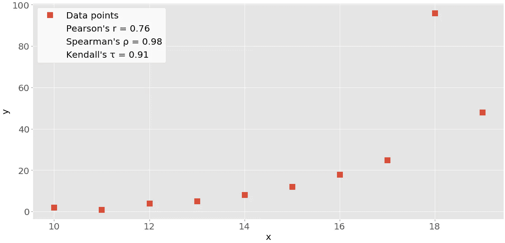
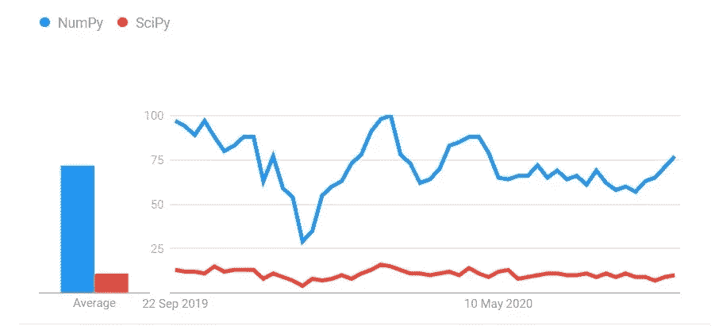

# NUMPY VS SCIPY

> 原文：<https://medium.com/analytics-vidhya/numpy-vs-scipy-3c4dee3403db?source=collection_archive---------9----------------------->

在这篇文章中，你会知道 NumPy 和 SciPy 哪个更好？


# 什么是 NumPy？

**NumPy** 是数字 Python 的缩写。 **NumPy** 是一个用 C 和 FORTRAN 编写的低级库，用于高级数学函数。它提供了一个高性能的多维数组对象，以及处理这些数组的工具，并克服了运行较慢算法的问题。然后，任何算法都可以表示为数组上的函数，从而允许算法快速运行。


# **什么是 SciPy？**

**SciPy** 是科学 Python 的缩写。SciPy 是一个使用 NumPy 实现更多数学函数的库。SciPy 使用 NumPy 数组作为基本数据结构，并附带了用于科学编程中各种常用任务的模块，包括线性代数、积分(微积分)、常微分方程求解和信号处理。

## **在 NumPy 和 SciPy 上安装**

1.  通过[Python.org](https://www.python.org/doc/)安装最新版本的 Python。或者**见** : [如何在 RHEL 或 CentOS 8 上安装 PIP](https://www.how2shout.com/how-to/how-to-install-python-3-6-and-pip-on-rhel-8-and-centos-8.html)或者[在 Windows 10 的 Python 3.7 中安装 Numpy 或 Scipy。](https://www.how2shout.com/how-to/how-to-install-numpy-in-python-3-7-in-windows-10.html)
2.  从命令提示符或 python 控制台下载最新版本的 **pip** 。
3.  下载 pip 后，只需在命令提示符下键入`pip install Numpy`和`pip install scipy`。
4.  下载完成后，只需输入 python IDE import Numpy 作为 **np** 和 import Scipy 作为 **sc** 或任何你想给的名字。
5.  现在您的 Numpy 和 Scipy 库已经被导入，您可以利用它们提供的服务。

# 数字相关计算

NumPy 有许多[统计例程](https://docs.scipy.org/doc/numpy/reference/routines.statistics.html)，包括`[np.corrcoef()](https://docs.scipy.org/doc/numpy/reference/generated/numpy.corrcoef.html)`，它们返回皮尔逊相关系数的矩阵。您可以从导入 NumPy 并定义两个 NumPy 数组开始。这些是类`[ndarray](https://docs.scipy.org/doc/numpy/reference/generated/numpy.ndarray.html)`的实例。称他们为`x`和`y`:

```
>>> import numpy as np
>>> x = np.arange(10, 20)
>>> x
array([10, 11, 12, 13, 14, 15, 16, 17, 18, 19])
>>> y = np.array([2, 1, 4, 5, 8, 12, 18, 25, 96, 48])
>>> y
array([ 2,  1,  4,  5,  8, 12, 18, 25, 96, 48])
```

这里，您使用`[np.arange()](https://realpython.com/how-to-use-numpy-arange/)`创建一个 10(含)到 20(不含)之间的整数数组`x`。然后使用`np.array()`创建包含任意整数的第二个数组`y`。

一旦有了两个相同长度的数组，就可以调用`np.corrcoef()`，将两个数组都作为参数:

```
>>> r = np.corrcoef(x, y)
>>> r
array([[1\.        , 0.75864029],
       [0.75864029, 1\.        ]])
>>> r[0, 1]
0.7586402890911867
>>> r[1, 0]
0.7586402890911869
```

`corrcoef()`返回[相关矩阵](https://www.displayr.com/what-is-a-correlation-matrix/)，这是一个包含相关系数的二维数组。这是您刚刚创建的关联矩阵的简化版本:

```
 x       yx    1.00    0.76
y    0.76    1.00
```

相关矩阵主对角线上的值(左上和右下)等于 1。左上数值对应于`x`和`x`的相关系数，而右下数值是`y`和`y`的相关系数。它们总是等于 1。

但是，你通常需要的是相关矩阵的左下和右上的值。这些值相等，都代表`x`和`y`的**皮尔逊相关系数**。在这种情况下，它大约是 0.76。

该图显示了上述示例的数据点和相关系数:



红色方块是数据点。如您所见，该图还显示了三个相关系数的值。

# 科学相关计算

SciPy 还有很多统计例程包含在`[scipy.stats](https://docs.scipy.org/doc/scipy/reference/stats.html)`中。您可以使用以下方法来计算前面看到的三个相关系数:

*   `[pearsonr()](https://docs.scipy.org/doc/scipy/reference/generated/scipy.stats.pearsonr.html)`
*   `[spearmanr()](https://docs.scipy.org/doc/scipy/reference/generated/scipy.stats.spearmanr.html)`
*   `[kendalltau()](https://docs.scipy.org/doc/scipy/reference/generated/scipy.stats.kendalltau.html)`

以下是如何在 Python 中使用这些函数:

```
>>> import numpy as np
>>> import scipy.stats
>>> x = np.arange(10, 20)
>>> y = np.array([2, 1, 4, 5, 8, 12, 18, 25, 96, 48])
>>> scipy.stats.pearsonr(x, y)    # Pearson's r
(0.7586402890911869, 0.010964341301680832)
>>> scipy.stats.spearmanr(x, y)   # Spearman's rho
SpearmanrResult(correlation=0.9757575757575757, pvalue=1.4675461874042197e-06)
>>> scipy.stats.kendalltau(x, y)  # Kendall's tau
KendalltauResult(correlation=0.911111111111111, pvalue=2.9761904761904762e-05)
```

请注意，这些函数返回包含两个值的对象:

1.  相关系数
2.  [p 值](https://en.wikipedia.org/wiki/P-value)

当你测试一个假设时，你在统计方法中使用 **p 值**。p 值是一个重要的测量值，需要深入的概率和统计知识来解释。要了解更多，你可以阅读[基础知识](https://www.statsdirect.com/help/basics/p_values.htm)或查看[一位数据科学家对 p 值的解释](https://towardsdatascience.com/p-values-explained-by-data-scientist-f40a746cfc8)。

您可以提取 p 值和相关系数及其索引，作为[元组](https://realpython.com/python-lists-tuples/)的项目:

```
>>> scipy.stats.pearsonr(x, y)[0]    # Pearson's r
0.7586402890911869
>>> scipy.stats.spearmanr(x, y)[0]   # Spearman's rho
0.9757575757575757
>>> scipy.stats.kendalltau(x, y)[0]  # Kendall's tau
0.911111111111111
```

您也可以对 Spearman 和 Kendall 系数使用点符号:

```
>>> scipy.stats.spearmanr(x, y).correlation   # Spearman's rho
0.9757575757575757
>>> scipy.stats.kendalltau(x, y).correlation  # Kendall's tau
0.911111111111111
```

点符号更长，但是可读性更强，也更容易理解。

如果想同时得到皮尔逊相关系数和 p 值，那么可以解包返回值:

```
>>> r, p = scipy.stats.pearsonr(x, y)
>>> r
0.7586402890911869
>>> p
0.010964341301680829
```

这种方法利用了 [Python 解包](https://realpython.com/lessons/tuple-assignment-packing-unpacking/)和`pearsonr()`用这两个统计数据返回一个元组的事实。

## 【NumPy 和 SciPy 的区别

1.  NumPy 具有比其他 python 库更快的处理速度。另一方面，SciPy 的计算速度较慢。
2.  NumPy 主要用于基本操作，如排序、索引和数组数据类型的基本功能。另一方面，SciPy 包含了所有的代数函数，其中一些在 NumPy 中有所体现，但并不是完全成熟的形式。
3.  NumPy 中的数组元素是同质的。NumPy 数组对象跟踪数组的数据类型、形状和维度。另一方面，SciPy 对其数组元素没有这种类型限制。SciPy 中的数组独立于异构或同构。

**一段时间内的利息**



**结论**

NumPy 和 SciPy 是处理即将到来的技术概念的两个非常重要的库。它们在概念上不同，但功能相似。作为一名数据科学家，他需要知道如何绘制各种分布图，找到数据点之间的相关性，整合、区分数据点，等等。此外，完整的统计和概率知识应该是数据科学家的基础，在这些惊人的库的帮助下，人们可以轻而易举地实现这些功能。因此，抓住这些神奇的工具，以更智能、更简单的方式探索数据科学的世界。