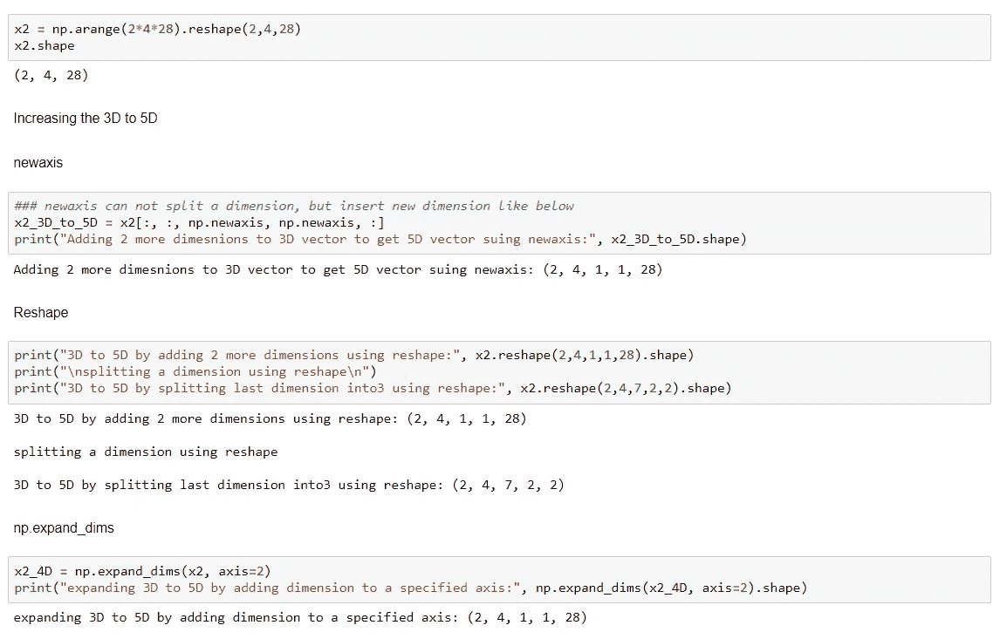
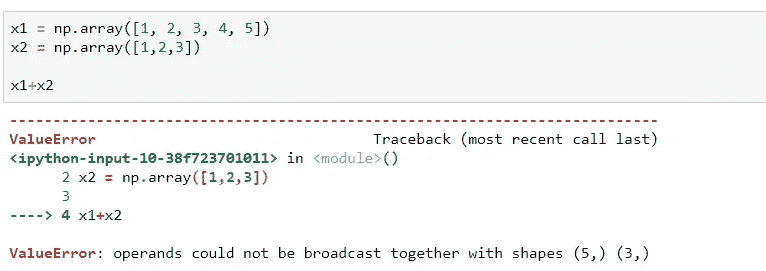
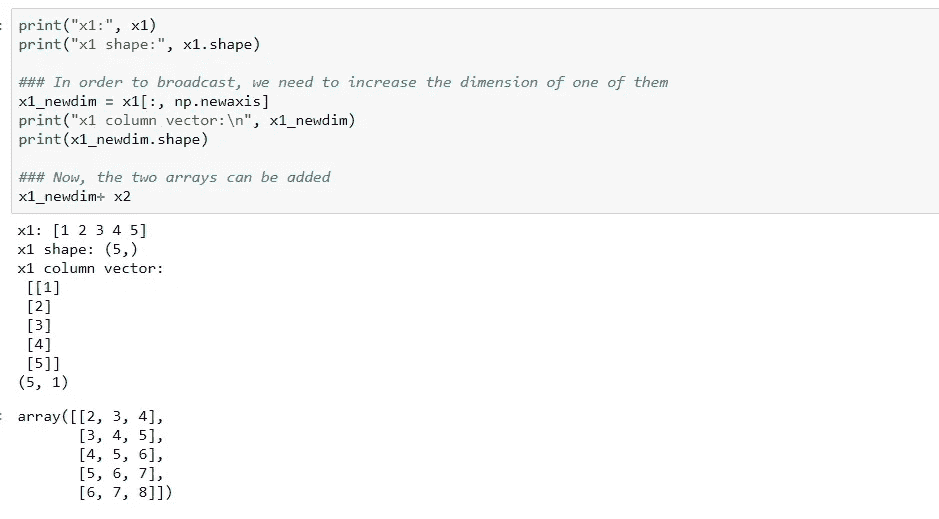

# 处理尺寸的多种方法

> 原文：<https://medium.com/analytics-vidhya/numpy-ways-to-handle-dimensions-939752c75d89?source=collection_archive---------6----------------------->

**用 python 代码说明的 np.reshape、np.newaxis 和 np.expand _ dims】**


**图片来自** [**Pixabay**](https://pixabay.com/illustrations/fractal-abstract-background-physics-1352598/)

**np.newaxis**

它用于增加现有数组的维数。它使用切片操作符来重新创建数组。

维度临时添加到数组中 np.newaxis 的位置。“None”也可以用来代替 np.newaxis

**np.reshape:**

它用于将阵列重新调整为所需的布局

**np.expand_dims:**

它通过在展开的数组形状的轴位置插入一个新轴来展开数组形状

让我们看一些主要的应用程序，上面的 NumPy 维处理操作派上了用场:

**应用 1** : **秩 1 数组到行/列向量的转换**

这里，我们创建了一个形状为(4)的 4 个元素的数组，称为 **Rank 1 数组。**

```
Array of 4 elements: [0 1 2 3]
Notice the shape, this is rank 1 array: (4,)
after transpose: (4,)
```

然而，**、**秩 1 数组**、**经常导致不明确的结果，因为它们的行为与行/列向量不一致。如上图，如果我们对 x1 进行转置，它的形状保持不变。

因此，总是建议显式指定数组的维度。这可以通过上面解释的所有 3 种技术来实现:

*   使用 np.newaxis:

```
row vector: [[0 1 2 3]]
(1, 4)

column vector:
 [[0]
 [1]
 [2]
 [3]]
(4, 1)
```

*   使用 np.reshape

```
Row vector using reshape: [[0 1 2 3]]
column vector using reshape:
 [[0]
 [1]
 [2]
 [3]]
```

*   使用 np.expand_dims

```
Row vector using expand_dims: [[0 1 2 3]]
column vector using expand_dims:
 [[0]
 [1]
 [2]
 [3]]
```

**应用二** : **增加尺寸**

让我们创建另一个形状为(2，4，28)的数组 x2，并检查如何将 x2 的维度从 3D 扩展到 5D



从上面要注意的关键是 np.reshape 也允许你分割维度。

**应用 3:广播**

根据 [NumPy 文件](https://numpy.org/doc/stable/user/basics.broadcasting.html#:~:text=The%20term%20broadcasting%20describes%20how,that%20they%20have%20compatible%20shapes.):

> *广播描述了 numpy 在算术运算时如何处理不同形状的数组。*

例如，当我们添加以下两个数组时，由于形状不匹配，它会显示“ValueError ”:



让我们看看 np.newaxis 是如何增加下面一个数组的维数的:



由于我们主要需要调整数组的维度以进行正确的广播操作，因此 np.reshape 和 np.expand_dims 增加维度的方法同样有效(如前面的示例所示)。

感谢阅读！！！

Jupyter 笔记本全代码放[这里](https://github.com/vidhi-am/numpy-dimension/blob/master/dimension%20handling-checkpoint.ipynb)。

参考资料:

*   [https://stack overflow . com/questions/46334014/NP-resh apex-1-1-vs-x-NP-new axis？noredirect=1 & lq=1](https://stackoverflow.com/questions/46334014/np-reshapex-1-1-vs-x-np-newaxis?noredirect=1&lq=1)
*   [https://stack overflow . com/questions/28385666/numpy-use-shape-or-new axis-to-add-dimensions](https://stackoverflow.com/questions/28385666/numpy-use-reshape-or-newaxis-to-add-dimensions)