# 强化学习:时间差异学习简介

> 原文：<https://medium.com/analytics-vidhya/nuts-and-bolts-of-reinforcement-learning-introduction-to-temporal-difference-td-learning-a0624eb3b985?source=collection_archive---------1----------------------->

当 DeepMind 提出一种在雅达利游戏上达到超人水平的算法时，Q-learning 成为了数据科学中一个家喻户晓的名字。这是强化学习的核心组成部分之一。每当我阅读关于 RL 的资料时，我经常会碰到 Q-learning。

但是 Q-learning 和我们的时间差异学习这个话题有什么关系呢？让我举个例子来直观地说明时间差异学习是怎么回事。

Rajesh 计划开车从德里去斋浦尔。在谷歌地图上快速查看显示，他的行程估计为 5 小时。不幸的是，由于路障，出现了意外的延迟(任何长途旅行的人都会有同感！).拉杰什的预计到达时间现在上升到了 5 小时 30 分钟。

半路上，他找到了一条支路，缩短了他的到达时间。所以总的来说，他从德里到斋浦尔的旅程需要 5 小时 10 分钟。

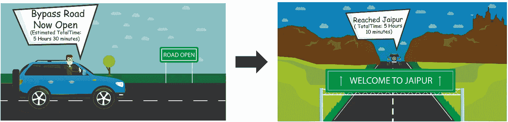

你有没有注意到 Rajesh 的到达时间是如何根据不同的剧集不断变化和更新的？简而言之，这说明了时间差异学习概念。在本文中，我将向您详细介绍这种算法及其组件，包括 Q-learning 如何融入其中。我们还将挑选一个案例研究，并用 Python 来解决它。

这是最有趣的强化学习概念之一，所以让我们享受学习的乐趣吧！

# 目录

*   时差学习简介
*   政策外学习与政策内学习
*   Q-learning:非策略时间差异学习
*   SARSA:基于策略的时间差异学习
*   案例研究:使用 Python 中的 Q-learning 进行出租车调度

# 时差学习简介

我们在引言中发展了一种对时间差异学习的直觉。现在让我们更详细地理解它。

在我的[上一篇关于蒙特卡罗学习](https://www.analyticsvidhya.com/blog/2018/11/reinforcement-learning-introduction-monte-carlo-learning-openai-gym/?utm_source=blog&utm_medium=reinforcement-learning-temporal-difference)的文章中，我们学习了当环境的模型动态事先未知时，如何使用它来解决马尔可夫决策过程(MDP)。那么我们为什么不用那个代替 TD 呢？

嗯，虽然蒙特卡罗学习为无模型学习提供了一种有效而简单的方法，但它也有一些局限性。它只能应用于偶尔发生的任务。

一个阶段性的任务持续有限的时间。例如，下一盘棋是一个阶段性的任务，你会赢或输。如果一集很长(很多情况下都是这样)，那么我们必须等待很长时间来计算价值函数。

时间差分(TD)学习是一种无模型学习算法，具有两个重要特性:

*   它不需要预先知道模型动力学
*   它也可以应用于非偶发任务

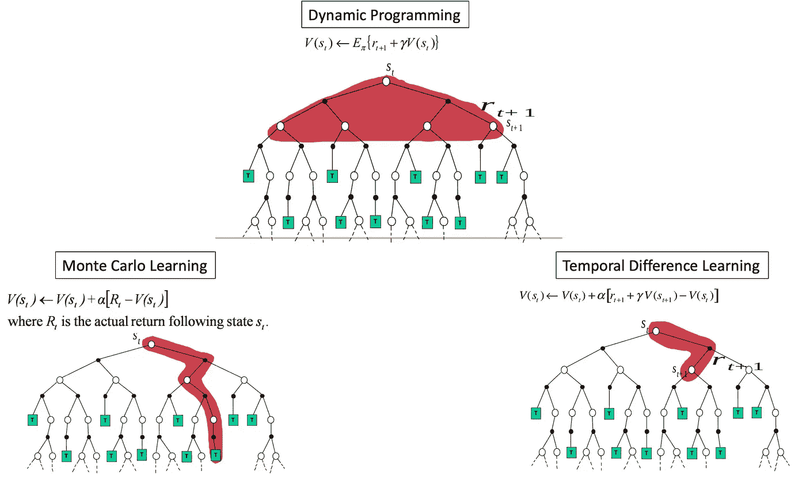

TD 学习算法是由伟大的 Richard Sutton 在 1988 年提出的。该算法同时考虑了蒙特卡罗方法和动态规划(DP)的优点:

*   像蒙特卡罗方法一样，它不需要模型动力学，而且
*   和动态规划一样，它不需要等到一集结束的时候才做出价值函数的估计

相反，时间差异学习基于先前学习的估计来逼近当前估计。这种方法也称为引导。

# 获得 TD 预测背后的直觉

我们试图在时间差异学习中预测状态值，就像我们在蒙特卡罗预测和动态规划预测中所做的那样。在蒙特卡洛预测中，我们通过简单地获取每个状态的平均回报来估计价值函数，而在动态规划和 TD 学习中，我们通过当前状态来更新先前状态的值。但是 TD 学习不像 DP 那样需要环境的模型。

我们如何做到这一点？TD 学习使用称为 TD 更新规则的东西来更新状态的值:

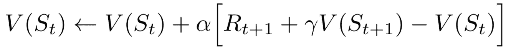

前一状态值=前一状态值+ learning_rate *(奖励+折扣 _ 因子(当前状态值)-前一状态值)

这个等式实际上是什么意思？

这是**实际报酬(r + Gamma * V(s'))** 和期望报酬 **V(s)** 之差乘以学习率α。

学习率意味着什么？

学习率，也称为步长，对收敛很有用。

因为我们取实际值和预测值之间的差值，这就像一个误差。我们可以称之为 **TD 误差**。注意，每次的 TD 误差是当时估计的误差。因为 TD 误差取决于下一个状态和下一个奖励，所以实际上直到一个时间步长之后才可用。迭代地，我们将尝试最小化这个误差。

## 以冰湖为例理解 TD 预测

让我们以冰湖为例来理解 TD 预测。接下来显示的是冰冻的湖泊环境。首先，我们将值函数初始化为 0，如 V(S)中所有状态的 0，如下面的状态-值图所示:

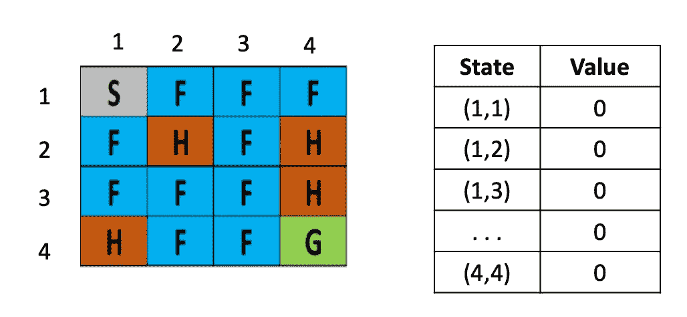

假设我们处于一个起始状态(1，1)，我们采取了一个正确的行动，并移动到下一个状态(1，2)，得到的回报(r)为-0.4。

我们如何使用这些信息来更新状态的值呢？回想一下 TD 更新公式:

让我们考虑学习率(α)为 0.1，贴现因子()为 0.5；我们知道状态(1，1)的值，如在 v(s)中，是 0，下一个状态(1，2)的值，如在 V(s’)中，也是 0。我们获得的回报(r)是-0.3。我们在 TD 规则中替换如下:

V(s) = 0 + 0.1 [ -0.4 + 0.5 (0)-0]

V(s) = — 0.04

因此，我们在值表中将状态(1，1)的值更新为-0.04，如下图所示:

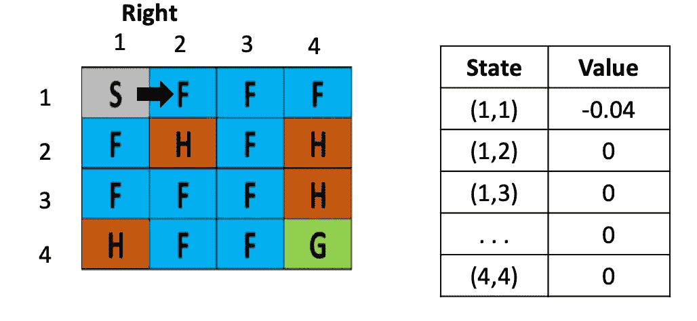

现在我们在状态 as (1，2)，我们采取一个行动权利，并移动到下一个状态(s’)(1，3)，并收到奖励(r) -0.4。我们现在如何更新 state (1，2)的值？我们将替换 TD 更新等式中的值:

V(s) = 0 + 0.1 [ -0.4 + 0.5(0)-0 ]

V(s) = -0.04

继续在值表中将 state (1，2)的值更新为-0.04:

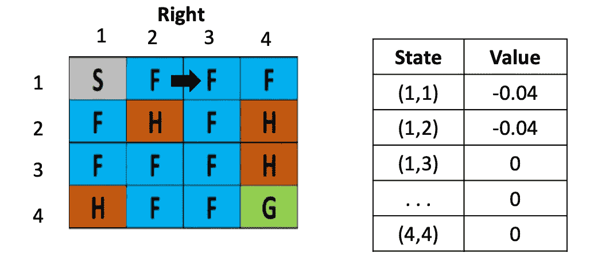

跟我到目前为止？我们现在处于状态(1，3)。让我们向左走一步。

我们再次回到状态(s’)(1，2)，我们得到奖励(r) -0.3。这里，在值表中，状态(1，3)的值是 0，下一个状态(1，2)的值是-0.03。现在，我们可以更新 state (1，3)的值，如下所示:

V(s) = 0 +0.1 [ -0.4 + 0.5 (-0.04)-0) ]

V(s) = 0.1[-0.42]

V(s) = -0.042

你知道现在该做什么。在值表中将 state (1，3)的值更新为-0.042:

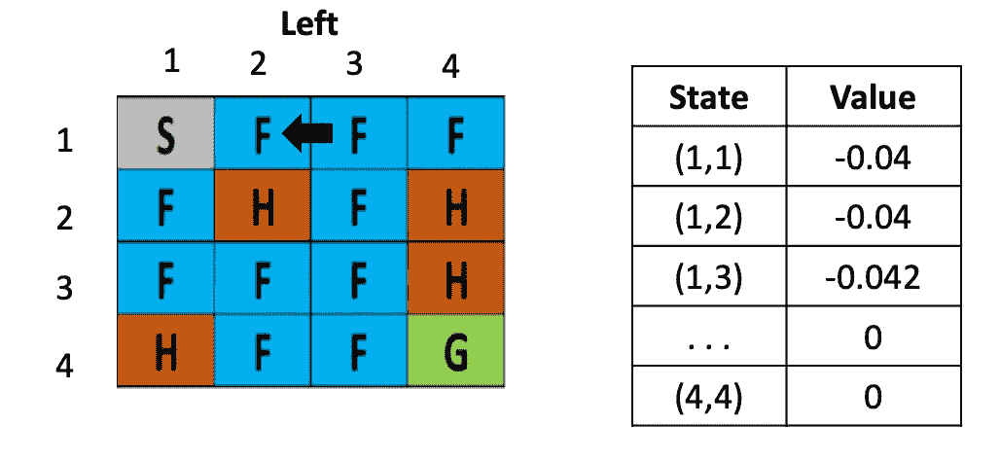

我们使用 TD 更新规则以类似的方式更新所有状态的值。总而言之，TD 预测算法中涉及的步骤是:

1.  首先，将 V(S)初始化为 0 或某个任意值
2.  然后，开始这一集。对于情节中的每一步，在状态 S 中执行动作 A，并接收奖励 R，然后移动到下一个状态(S’)
3.  使用 TD 更新规则更新先前状态的值
4.  重复步骤 2 和 3，直到我们到达终端状态

# 理解时间差异控制

在时间差预测中，我们*估计*价值函数。在 TD 控制中，我们*优化*价值函数。我们用于 TD 控制的算法有两种:

*   非策略学习算法:Q 学习
*   基于策略的学习算法:SARSA

**政策外 vs 政策内**

政策外学习和政策内学习有什么区别？答案就在他们的名字里:

*   **非策略学习:**代理根据从另一个策略采样的经验学习策略π
*   **基于策略的学习:**代理从相同策略π的经验样本中学习策略π

让我用一个例子来说明这一点。假设你作为一名数据科学家加入了一家新公司。在这种情况下，您可以将政策学习等同于工作学习。你会尝试不同的事情，并且只从自己的经历中学习。

政策外学习是指你可以完全了解其他员工的行为。在这种情况下，你要做的就是从员工的经历中学习，而不是重复员工失败的事情。

# q 学习

Q-learning 是一种非常流行和广泛使用的非策略 TD 控制算法。

在 Q 学习中，我们关注的是状态-动作值对-在状态 s 中执行动作 a 的效果。这告诉我们在特定状态下(Q(s，a))动作对代理有多好，而不是只看在那个状态下(V(s))有多好

我们将根据以下等式更新 Q 值:

为什么 Q-learning 被认为是一种非策略技术？这是因为它使用下一个状态𝑠′和贪婪动作𝑎′.的 q 值来更新其 q 值换句话说，它估计了假设遵循贪婪政策(*maxQ(*s ' a*)*)的状态-行动对的回报(总贴现未来报酬)，尽管事实上它并没有遵循贪婪政策！

上面的等式类似于 TD 预测更新规则，但有细微的区别。以下是 Q-learning 中涉及的步骤(我想让你注意到这里的区别):

1.  首先，将 Q 函数初始化为某个任意值
2.  使用 epsilon-greedy 策略()从一个状态采取一个动作，并将其移动到新的状态
3.  通过遵循更新规则来更新先前状态的 Q 值
4.  重复步骤 2 和 3，直到我们到达终端状态

现在，让我们回到冰湖的例子。假设我们处于状态(3，2)，有两个动作(左和右)。请参考下图:

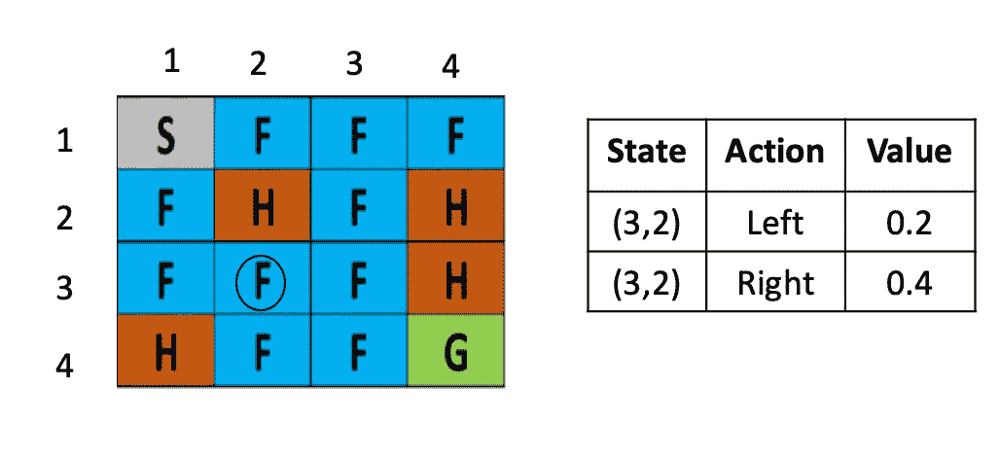

我们使用 Q-learning 中的ε-贪婪策略选择一个动作。**我们要么探索一个概率为ε的新动作，要么选择概率为 1-ε的最佳动作。**假设我们选择一个概率ε，并选择一个特定的动作(向下移动):

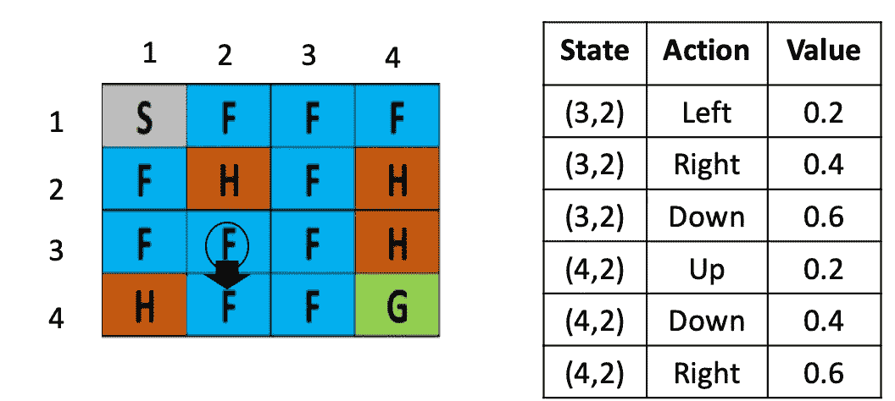

我们已经在状态(3，2)中执行了向下的动作，并且使用ε-贪婪策略到达了新的状态(4，2)。我们如何使用更新规则更新先前状态(3，2)的值？这很简单！

让我们考虑α为 0.1，贴现因子为 1，奖励为 0.4:

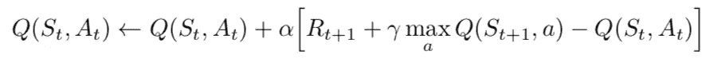

*Q( (3，2) down) = Q( (3，2) down ) + 0.1 ( 0.4 + 1 max [Q( (4，2) action) ]- Q( (3，2)，down)*

我们可以说，在 Q 表中，具有向下动作的状态(3，2)的值是 0.6。对于状态(4，2)，max Q ( (4，2)，action)是多少？

我们已经研究了三个动作(向上、向下和向右)，所以我们将只根据这些动作取最大值。这里不涉及探索——这是一个直截了当的贪婪政策。

基于前面的 Q 表，我们可以插入值:

Q( (3，2)，down) = 0.6 + 0.1 ( 0.4 + 1 * max [0.2，0.4，0.6] — 0.6)

Q( (3，2)，down) = 0.64

因此，我们将 Q 的值((3，2)，down)更新为 0.64。

现在，我们处于(4，2)状态。我们应该采取什么行动？基于ε-贪婪策略，我们可以探索概率为ε的新动作，或者选择概率为 1-ε的最佳动作。假设我们选择了后者。因此，在(4，2)中，行动权有一个最大值，这就是我们要选择的:

对，我们已经搬到了州(4，3)。到目前为止，事情进展顺利。但是等等——我们如何更新先前状态的值呢？

Q( (4，2)，right) = Q( (4，2)，right ) + 0.1 ( 0.4 + 1*max [Q( (4，3) action) ]- Q( (4，2)，right)

如果你看下面的 Q 表，我们只研究了状态(4，3)的两个动作(向上和向下)。因此，我们将仅基于这些动作来取最大值(这里我们不会执行ε-贪婪策略；我们只需选择具有最大价值的行动):

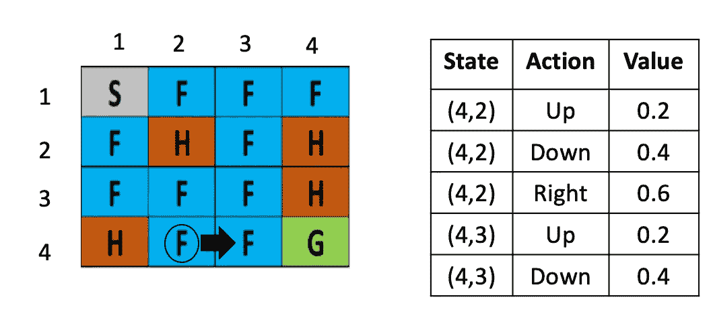

Q ( (4，2)，right) = Q((4，2)，right) + 0.1 (0.4 + 1 max [ (Q (4，3)，up)，(Q (4，3)，down) ] — Q ((4，2)，right)

Q ( (4，2)，右)= 0.6 + 0.1 (0.4 + 1 max [ 0.2，0.4] — 0.8)

= 0.6 + 0.1 (0.4 + 1(0.4) — 0.6)

= 0.62

厉害！我们将状态 Q 的值((4，2)，右)更新为 0.62。

> 这就是我们如何在 Q-learning 中获得状态-动作值。我们使用ε-贪婪策略来决定采取什么行动，并在更新 Q 值时简单地选择最大行动。

# 萨尔萨

状态-动作-奖励-状态-动作(SARSA)是一种基于策略的 TD 控制算法。类似于我们在 Q-learning 中所做的，我们**关注状态-动作值，而不是状态-值对。**在 SARSA 中，我们根据以下更新规则更新 Q 值:

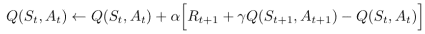

你可能已经注意到**没有最大 Q(s '，a'** )(不像 Q-learning)。这里，简单来说就是 Q(s '，a ')。当您完成以下 SARSA 步骤时，您会明白这一点:

1.  首先，将 Q 值初始化为一些任意值
2.  通过ε-greedy 策略()选择一个操作，并从一个状态转移到另一个状态
3.  通过遵循更新规则来更新前一状态中的 Q 值，其中 a’是由ε-贪婪策略选择的动作()
4.  现在我们将一步一步地理解这个算法

让我们考虑同一个冰湖的例子。假设我们处于状态(4，2)。我们根据ε-贪婪策略决定行动。假设我们使用概率 1—ε并选择最佳行动(向右移动):

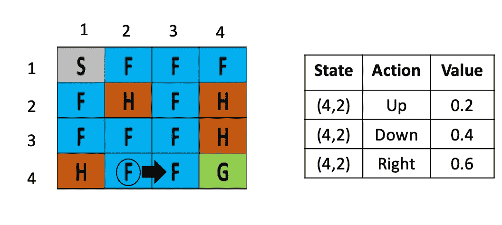

我们在州(4，3)着陆。我们如何更新先前状态(4，2)的值？我将调出上面的等式并代入数值。让我们考虑α为 0.1，回报为 0.4，贴现因子为 1:

Q( (4，2)，right) = Q( (4，2)，right) + 0.1 ( 0.4 + 1 *Q( (4，3)，action)) — Q((4，2)，right)

我们如何选择 *Q ((4，3)，action)* 的值？我们不能像在 Q-learning 中那样只拿起 *max ( Q(4，3)，action)* 。在 SARSA，我们使用ε贪婪策略。看看我下面展示的 Q 表。在状态(4，3)中，我们探讨了两个动作:

我们要么以概率ε探索，要么以概率 1-ε利用。假设我们选择了前一个选项，并探索了一个新的动作(向右移动):

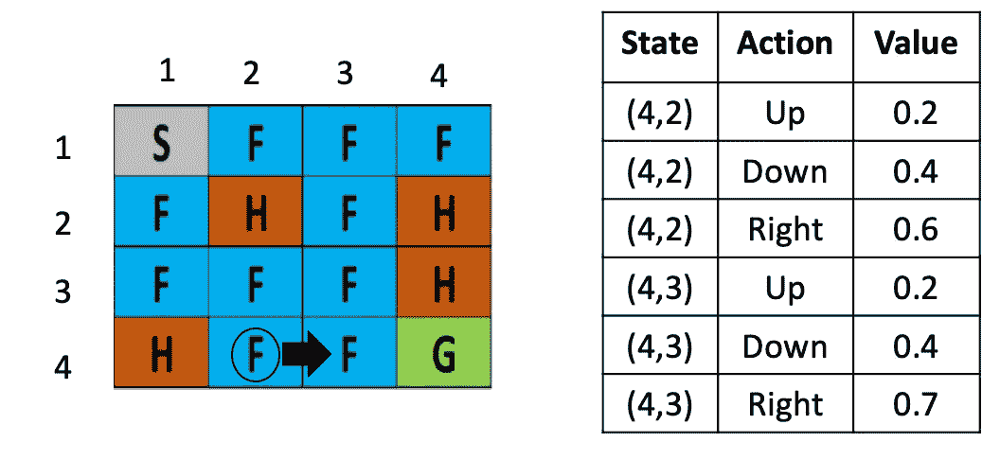

Q ( (4，2)，右)= Q((4，2)，右)+ 0.1 (0.4 + 1 (Q (4，3)，右)— Q ((4，2)，右)

Q ( (4，2)，right) = 0.6 + 0.1 (0.4 + 1(0.7) — 0.6)

Q ( (4，2)，右)= 0.65

> 这就是我们如何在 SARSA 中获得状态-动作值。我们使用ε-贪婪策略采取行动，并选择使用ε-贪婪策略更新 Q 值的行动。

现在来看看实际情况，在 [Analytics Vidhya 博客](https://www.analyticsvidhya.com/blog/2019/03/reinforcement-learning-temporal-difference-learning/)上有一个很棒的使用 Q-Learning 解决出租车调度的 python 案例研究。看看这个。

相关文章

*原载于 2019 年 3 月 28 日*[*https://www.analyticsvidhya.com*](https://www.analyticsvidhya.com/blog/2019/03/reinforcement-learning-temporal-difference-learning/)*。*