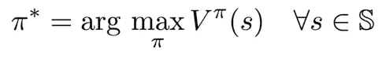

# 强化学习的基础:基于模型的动态规划

> 原文：<https://medium.com/analytics-vidhya/nuts-bolts-of-reinforcement-learning-model-based-planning-using-dynamic-programming-d71d52011b53?source=collection_archive---------1----------------------->

深度强化学习是人工智能战胜人类专业人士的两个最大胜利的原因——Alpha Go 和 OpenAI Five。在谷歌和埃隆·马斯克的倡导下，近年来对这一领域的兴趣逐渐增加，现已成为一个蓬勃发展的研究领域。


然而，在本文中，我们不会讨论典型的 RL 设置，而是探索动态编程(DP)。DP 是可以解决问题*的算法集合，其中我们有完美的环境模型(即问题设置中发生的任何变化的概率分布是已知的),并且代理只能采取离散的行动。*

DP 本质上解决的是规划问题，而不是更一般的 RL 问题。如前所述，主要的区别在于，对于 RL 问题，环境可能非常复杂，并且最初根本不知道它的细节。

但是在我们深入研究所有这些之前，让我们首先使用一个直观的例子来理解为什么应该学习动态编程。

# 为什么要学习动态编程？

除了是掌握强化学习的良好起点之外，动态规划还可以帮助找到行业中面临的规划问题的最佳解决方案，其重要假设是环境的具体情况是已知的。DP 为理解可以解决更复杂问题的 RL 算法提供了一个很好的起点。

# 桑尼摩托车租赁公司

桑尼在拉达克经营一家摩托车租赁公司。由于靠近世界上最高的公路，游客对出租摩托车有很大的需求。在镇上，他有两个地点，游客可以来租自行车。如果他在一个地方没有自行车，那么他就失去了生意。


*   自行车以每天 1200 卢比的价格出租，并在归还后的第二天出租。
*   Sunny 可以将自行车从一个位置移动到另一个位置，费用为 100 卢比
*   凭借经验，Sunny 已经计算出需求和回报率的近似概率分布。
*   每个位置返回和请求的自行车数量分别由函数 g(n)和 h(n)给出。确切地说，在两个地点租赁的自行车数量为 n 的概率由 g(n)给出，在两个地点归还的自行车数量为 n 的概率由 h(n)给出

Sunny 试图解决的问题是找出他每天应该从一个地点向另一个地点移动多少辆自行车，以便他可以最大限度地增加收入。

在这里，我们确切地知道环境(g(n)和 h(n))，这就是动态规划可以派上用场的那种问题。类似地，如果您可以对问题的环境进行适当的建模，在这里您可以采取离散的行动，那么 DP 可以帮助您找到最优的解决方案。在本文中，我们将使用 DP 来训练一个使用 Python 遍历简单环境的代理，同时触及 RL 中的关键概念，如策略、奖励、价值函数等等。

# 使用井字游戏理解 Agent 环境界面

你们大部分人小时候肯定都玩过井字游戏。如果没有，你可以从它的 [wiki 页面](https://en.wikipedia.org/wiki/Tic-tac-toe)中掌握这个简单游戏的规则。假设井字游戏是你最喜欢的游戏，但是没有人陪你玩。所以你决定设计一个能和你一起玩这个游戏的机器人。一些关键问题是:

你能定义一个基于规则的框架来设计一个高效的机器人吗？

你当然可以，但是你必须为游戏中可能出现的每一种情况编写大量的规则。然而，一个更有趣的问题是:

可以通过和你对战几次来训练机器人学习吗？这也是在没有被明确编程为高效玩井字游戏的情况下吗？

对此的一些考虑是:

*   首先，机器人需要了解它所处的情况。井字游戏有 9 个点来填充 X 或 o。游戏中每种不同的可能组合对机器人来说都是不同的情况，基于这一点，它将采取下一步行动。下图所示的每个场景都是不同的**州。**


*   一旦知道了状态，机器人必须采取一个它认为最有可能赢得游戏的**行动**(**策略**
*   这一步棋将产生一个新的场景，其中有 O 和 X 的新组合，这是一个**新状态**和一个数字**奖励**，将根据这步棋的质量给出，目标是赢得游戏(**累积奖励**

为了更清楚地了解上述奖励，让我们考虑机器人 O 和 X 之间的匹配:


考虑在井字游戏中遇到的以下情况:


例如，如果机器人 X 将 X 放在右下角，会导致以下情况:


Bot O 会很高兴(是的！它们被编程来表现情感)，因为它可以只用一个动作就赢得比赛。现在，我们需要教 X 不要再这样做了。因此，我们给予负面的奖励或惩罚，以在下一次试验中强化正确的行为。我们说，在给定的状态下，这一行动将对应于一个负的奖励，而不应该被认为是在这种情况下的最佳行动。

类似地，如果 X 阻止 O 在下一步中获胜，它将获得正奖励:

# 马尔可夫决策过程简介

现在我们已经理解了基本术语，让我们来讨论一下如何使用一个叫做马尔可夫决策过程或 MDP 的概念来将整个过程形式化。

马尔可夫决策过程(MDP)模型包含:

*   一组可能的世界状态
*   一组可能的动作
*   一个实值报酬函数 R(s，a)
*   每个状态下每个动作效果的描述测试

现在，让我们理解马尔可夫或“无记忆”性质。

处于给定状态的概率仅取决于前一状态的任何随机过程都是马尔可夫过程。

换句话说，在马尔可夫决策过程设置中，环境在时间 t+1 的响应只取决于时间 t 的状态和动作表示，而与过去发生的任何事情无关。

*   ST:t 时刻代理的状态
*   At:座席在时间 t 采取的操作
*   Rt:在时间 t 获得的奖励

上图清楚地说明了每个时间步的迭代，其中代理人收到奖励 Rt+1，并根据其在特定状态 St 的动作结束于状态 St+1。代理人的总体目标是使其长期收到的累积奖励最大化。任何时刻 t 的总报酬由下式给出:


其中 T 是该集的最后一个时间步长。在上面的等式中，我们看到所有未来的奖励都有相同的权重，这可能是不可取的。这就是额外的折现概念出现的原因。基本上，我们将γ定义为一个贴现因子，即时奖励后的每个奖励用该因子贴现如下:


对于贴现因子< 1, the rewards further in the future are getting diminished. This can be understood as a tuning parameter which can be changed based on how much one wants to consider the long term (γ close to 1) or short term (γ close to 0).

# State Value Function: How good it is to be in a given state?

Can we use the reward function defined at each time step to define how good it is, to be in a given state for a given policy? **,在策略π下表示为 v(s)的价值函数表示代理所处的状态有多好。**换句话说，在策略π下，代理人从当前状态开始会得到的平均回报是多少？


上式中的 e 代表代理人遵循策略π时每个状态下的期望报酬，而 *S* 代表所有可能状态的集合。

如前所述，策略是在每个状态下采取每个可能行动的概率的映射(π(a/s))。当策略确切地告诉你在每个状态下做什么而没有给出概率时，它也可能是确定性的。

现在，直觉告诉我们，如果每个州的价值函数最大化，就能达到“最优政策”。该最优策略由下式给出:



# 状态-行动价值函数:在特定状态下行动有多好？

上述值函数仅表征一种状态。我们也能知道一个动作在特定状态下有多好吗？一个状态-动作值函数，也称为 q 值，就是这样做的。我们将策略π下状态 *s、*中动作 *a、*的值定义为:


这是代理人在给定状态 St 的情况下，如果在时间 t 采取行动，然后遵循策略π，将获得的预期回报。

# 贝尔曼期望方程:来自后继状态的值信息被传递回当前状态

贝尔曼是一位应用数学家，他推导出了有助于解决马尔可夫决策过程的方程。

让我们回到状态值函数 v 和状态-动作值函数 q。展开值函数方程得到:


在这个等式中，我们用下一个状态的价值函数来表示给定策略π的价值函数。

选择一个动作 a，概率π(a/s)在状态 s，导致状态 s '有 prob p(s'/s，a)。这给出了奖励[r + γ*vπ(s)]，如上面方括号中给出的。

这被称为贝尔曼期望方程。来自后续状态的值信息被传输回当前状态，这可以通过称为备份图的东西来有效地表示，如下所示。


*贝尔曼期望方程对所有可能性进行平均，并根据发生的概率对每种可能性进行加权。它指出，开始状态的值必须等于预期的下一个状态的(贴现)值，加上沿途预期的回报。*

我们有 n(状态数)个线性方程，每个状态都有唯一的解。

# 贝尔曼最优方程:寻找最优策略

这里的目标是找到最优策略，当代理人遵循该策略时，将获得最大的累积回报。换句话说，找到一个政策π，使得没有其他的π可以让代理人获得更好的预期收益。我们希望找到一种策略，为每个州实现最大价值。


请注意，我们可能得不到唯一的策略，因为在任何情况下，都可能有两条或更多条路径具有相同的回报并且仍然是最优的。


**最佳值函数可以通过寻找导致 q*最大值的动作 *a* 来获得。这被称为 v*的贝尔曼最优方程。**


直观地说，贝尔曼最优方程认为，最优策略下的每个状态的值必须是代理在遵循最优策略给出的最佳行动时获得的回报。对于最优策略π*，最优值函数由下式给出:


给定一个值函数 q*，我们可以恢复一个最优策略如下:


最优策略的价值函数可以通过非线性方程组求解。我们可以使用动态规划下的迭代方法有效地解决这些问题。

# 动态规划

动态规划算法解决一类称为规划问题的问题。在这里，给定环境(MDP)的完整模型和规范，我们可以成功地找到代理要遵循的最优策略。它包含两个主要步骤:

1.  将问题分解成子问题并解决它
2.  子问题的解决方案被缓存或存储以供重用，从而找到当前问题的整体最优解决方案

要解决给定的 MDP，解决方案必须包含以下组件:

1.  找出任意政策有多好
2.  找出给定 MDP 的最优策略

# 政策评估:了解一个政策有多好？

政策评估回答了政策有多好的问题。给定一个 MDP 和一个任意的策略π，我们将计算状态值函数。在发展政策文献中，这被称为政策评估。这个想法是将前面讨论的贝尔曼期望方程更新。


为了从 vk 产生每个逐次逼近 vk+1，迭代策略评估对每个状态 s 应用相同的运算。它用从 s 的后继状态的旧值获得的新值替换 s 的旧值，以及期望的立即回报，以及在被评估的策略下可能的所有单步转换，直到它收敛到给定策略π的真实值函数。

让我们用 Gridworld 这个非常流行的例子来理解政策评估。


机器人需要穿过 4×4 维的网格才能到达目标(1 或 16)。每一步都与-1 的奖励相关联。这里有 2 个终态:1 和 16 以及 14 个非终态由[2，3，…]给出。,15].考虑一个随机策略，在每个状态下，每个行为{上、下、左、右}的概率等于 0.25。我们将从将随机策略的 v0 初始化为全 0 开始。


这个肯定用处不大。让我们计算 6 的所有状态的 v2:


同样，对于所有非终结状态，v1(s) = -1。

对于终端状态 p(s'/s，a) = 0，因此对于所有 k，vk(1) = vk(16) = 0，因此随机策略的 v1 由下式给出:


现在，对于 v2(s ),我们假设γ或折现因子为 1:


正如你所看到的，上图中用红色标记的所有状态都等同于 6，用于计算价值函数。因此，对于所有这些状态，v2(s) = -2。

对于所有剩余状态，即 2、5、12 和 15，v2 可计算如下:


如果我们重复这个步骤几次，我们得到 vπ:


# 政策改进:改进任意的政策

使用策略评估，我们已经确定了任意策略π的值函数 v。我们知道我们目前的政策有多好。现在对于一些状态 s，我们想了解采取与政策π无关的行动 *a* 会有什么影响。假设我们在*，*中选择 *a* ，之后我们遵循原来的策略π。这种行为方式的价值表现为:


如果这恰好大于值函数 vπ(s ),则意味着采取新的策略π'会更好。我们对所有状态重复这样做，以找到最佳策略。请注意，在这种情况下，代理将遵循一个贪婪的策略，因为它只向前看了一步。

让我们回到 gridworld 的例子。使用为随机策略π获得的值函数 vπ，我们可以通过遵循最高值的路径来改进π(如下图所示)。我们从一个任意的策略开始，对于每个状态，进行一步前瞻以找到导致具有最高值的状态的动作。这是对每个状态连续进行的。

如下所示，对于状态 2，留下最佳动作，这导致终端状态具有值。这是接下来所有状态中最高的(0，-18，-20)。对所有状态重复这一过程以找到新的策略。


总的来说，在使用 vπ的策略改进步骤之后，我们得到新的策略π':


看新政策，很明显比随机政策好多了。但是，我们应该使用我们之前讨论的策略评估技术来计算 vπ’,以验证这一点并更好地理解。

# 政策迭代:政策评估+政策改进

一旦使用 vπ改进了策略以产生更好的策略π’，我们就可以计算 vπ’以将其进一步改进为π”。对于给定的策略π(策略评估)，进行重复迭代以近似收敛到真实值函数。按照策略改进一节中的描述改进策略称为策略迭代。


通过这种方式，新策略肯定会比前一个策略有所改进，如果迭代次数足够多，它将返回最优策略。这听起来很神奇，但是有一个缺点——策略迭代中的每一次迭代本身都包括策略评估的另一次迭代，这可能需要多次扫描所有状态。下一节讨论的值迭代技术为此提供了一个可能的解决方案。

# 价值迭代

我们在 gridworld 示例中看到，在 k = 10 左右，我们已经能够找到最优策略。因此，我们可以更早地停止，而不是等待策略评估步骤准确地收敛到值函数 vπ。

我们还可以通过仅 1 步策略评估，然后重复更新价值函数(但这次是使用从贝尔曼最优方程中导出的更新)来获得最优策略。让我们看看这是如何作为一个简单的备份操作来完成的:


这与政策评估中的贝尔曼更新相同，不同之处在于我们在所有行动中取最大值。一旦更新足够小，我们可以将获得的价值函数作为最终值，并估计相应的最优策略。

与 DP 相关的一些要点:

1.  只有在已知环境模型的情况下，才能使用 DP。
2.  具有非常高的计算开销，即，当状态的数量增加到很大数量时，它不能很好地扩展。另一种称为异步动态编程的方法在一定程度上有助于解决这个问题。

# 动态规划在实践中:使用 Python 寻找冰冻湖泊环境的最佳政策

最重要的是，首先要有一个定义好的环境，以便测试任何一种有效解决 MDP 的策略。令人欣慰的是，OpenAI，一个非营利研究组织，提供了大量的环境来测试和玩各种强化学习算法。为了说明这里的动态编程，我们将使用它来导航冰冻的湖泊环境。

# 冰冻湖泊环境

代理控制网格世界中角色的移动。网格的一些瓦片是可行走的，其他的导致代理人掉进水里。此外，代理的移动方向是不确定的，并且仅部分取决于所选择的方向。代理人因找到一条通往目标方块的可行走路径而获得奖励。

使用如下所示的网格来描述表面:


(S:起点，安全)，(F:冰面，安全)，(H:洞，摔到你的末日)，(G:球门)

这个想法是从起点出发，只在冰冻的表面上行走，避开所有的洞，从而到达目标。安装细节和文档可通过此[链接](https://gym.openai.com/docs/)获得。

一旦安装了健身房图书馆，你就可以打开一个 jupyter 笔记本开始。

```
import gym
import numpy as np
env = gym.make('FrozenLake-v0')
```

现在，env 变量包含了关于冰冻湖泊环境的所有信息。在我们继续之前，我们需要了解什么是插曲。一个情节代表了代理人在追求达到目标的过程中所做的尝试。一旦代理人达到最终状态，一集就结束了，在这种情况下，要么是一个洞，要么是目标。

# python 中的策略迭代

策略迭代函数的参数描述

**策略:**一个大小为 n(S) x n(A)的 2D 数组，每个单元格代表一个在状态 S 采取行动 A 的概率

**环境:**初始化 OpenAI 健身房环境对象

**折扣因子:** MDP 折扣因子

**θ:**一个值函数变化的阈值。一旦对值函数的更新低于这个数

**max_iterations** :避免程序无限运行的最大迭代次数

这个函数将返回一个 nS 大小的向量，它代表每个状态的一个值函数。

让我们从策略评估步骤开始。目标是收敛到给定策略π的真实值函数。我们将定义一个返回所需值的函数。

```
def policy_evaluation(policy, environment, discount_factor=1.0, theta=1e-9, max_iterations=1e9):
        # Number of evaluation iterations
        evaluation_iterations = 1
        # Initialize a value function for each state as zero
        V = np.zeros(environment.nS)
        # Repeat until change in value is below the threshold
        for i in range(int(max_iterations)):
                # Initialize a change of value function as zero
                delta = 0
                # Iterate though each state
                for state in range(environment.nS):
                       # Initial a new value of current state
                       v = 0
                       # Try all possible actions which can be taken       from this state
                       for action, action_probability in enumerate(policy[state]):
                             # Check how good next state will be
                             for state_probability, next_state, reward, terminated in environment.P[state][action]:
                                  # Calculate the expected value
                                  v += action_probability * state_probability * (reward + discount_factor * V[next_state])

                       # Calculate the absolute change of value function
                       delta = max(delta, np.abs(V[state] - v))
                       # Update value function
                       V[state] = v
                evaluation_iterations += 1

                # Terminate if value change is insignificant
                if delta < theta:
                        print(f'Policy evaluated in {evaluation_iterations} iterations.')
                        return V
```

现在进入策略迭代算法的**策略改进**部分。我们需要一个帮助器函数来计算状态值函数。这将返回一个长度为 nA 的数组，包含每个动作的预期值

```
def one_step_lookahead(environment, state, V, discount_factor):
        action_values = np.zeros(environment.nA)
        for action in range(environment.nA):
                for probability, next_state, reward, terminated in environment.P[state][action]:
                        action_values[action] += probability * (reward + discount_factor * V[next_state])
        return action_values
```

现在，整个策略迭代将如下所述。这将返回一个元组(policy，V ),它是每个状态的最佳策略矩阵和值函数。

```
def policy_iteration(environment, discount_factor=1.0, max_iterations=1e9):
        # Start with a random policy
        #num states x num actions / num actions
        policy = np.ones([environment.nS, environment.nA]) / environment.nA
        # Initialize counter of evaluated policies
        evaluated_policies = 1
        # Repeat until convergence or critical number of iterations reached
        for i in range(int(max_iterations)):
                stable_policy = True
                # Evaluate current policy
                V = policy_evaluation(policy, environment, discount_factor=discount_factor)
                # Go through each state and try to improve actions that were taken (policy Improvement)
                for state in range(environment.nS):
                        # Choose the best action in a current state under current policy
                        current_action = np.argmax(policy[state])
                        # Look one step ahead and evaluate if current action is optimal
                        # We will try every possible action in a current state
                        action_value = one_step_lookahead(environment, state, V, discount_factor)
                        # Select a better action
                        best_action = np.argmax(action_value)
                        # If action didn't change
                        if current_action != best_action:
                                stable_policy = True
                                # Greedy policy update
                                policy[state] = np.eye(environment.nA)[best_action]
                evaluated_policies += 1
                # If the algorithm converged and policy is not changing anymore, then return final policy and value function
                if stable_policy:
                        print(f'Evaluated {evaluated_policies} policies.')
                        return policy, V
```

# python 中的值迭代

对于值迭代，参数以相同的方式定义。值迭代算法可以类似地编码为:

```
def value_iteration(environment, discount_factor=1.0, theta=1e-9, max_iterations=1e9):
        # Initialize state-value function with zeros for each environment state
        V = np.zeros(environment.nS)
        for i in range(int(max_iterationsations)):
                # Early stopping condition
                delta = 0
                # Update each state
                for state in range(environment.nS):
                        # Do a one-step lookahead to calculate state-action values
                        action_value = one_step_lookahead(environment, state, V, discount_factor)
                        # Select best action to perform based on the highest state-action value
                        best_action_value = np.max(action_value)
                        # Calculate change in value
                        delta = max(delta, np.abs(V[state] - best_action_value))
                        # Update the value function for current state
                        V[state] = best_action_value
                        # Check if we can stop
                if delta < theta:
                        print(f'Value-iteration converged at iteration#{i}.')
                        break

        # Create a deterministic policy using the optimal value function
        policy = np.zeros([environment.nS, environment.nA])
        for state in range(environment.nS):
                # One step lookahead to find the best action for this state
                action_value = one_step_lookahead(environment, state, V, discount_factor)
                # Select best action based on the highest state-action value
                best_action = np.argmax(action_value)
                # Update the policy to perform a better action at a current state
                policy[state, best_action] = 1.0
        return policy, V
```

最后，让我们比较一下这两种方法，看看哪种方法在实际环境中效果更好。为此，我们将尝试使用上述两种技术来学习冰湖环境的最佳策略。稍后，我们将根据 10000 集后的平均回报来检查哪种技术的表现更好。

```
def play_episodes(environment, n_episodes, policy):
        wins = 0
        total_reward = 0
        for episode in range(n_episodes):
                terminated = False
                state = environment.reset()
                while not terminated:
                        # Select best action to perform in a current state
                        action = np.argmax(policy[state])
                        # Perform an action an observe how environment acted in response
                        next_state, reward, terminated, info = environment.step(action)
                        # Summarize total reward
                        total_reward += reward
                        # Update current state
                        state = next_state
                        # Calculate number of wins over episodes
                        if terminated and reward == 1.0:
                                wins += 1
        average_reward = total_reward / n_episodes
        return wins, total_reward, average_reward

# Number of episodes to play
n_episodes = 10000
# Functions to find best policy
solvers = [('Policy Iteration', policy_iteration),
           ('Value Iteration', value_iteration)]
for iteration_name, iteration_func in solvers:
        # Load a Frozen Lake environment
        environment = gym.make('FrozenLake-v0')
        # Search for an optimal policy using policy iteration
        policy, V = iteration_func(environment.env)
        # Apply best policy to the real environment
        wins, total_reward, average_reward = play_episodes(environment, n_episodes, policy)
        print(f'{iteration_name} :: number of wins over {n_episodes} episodes = {wins}')
        print(f'{iteration_name} :: average reward over {n_episodes} episodes = {average_reward} \n\n')
```


我们观察到，当价值迭代运行 10，000 集时，它具有更好的平均回报和更高的获胜次数。

# 结束注释

在本文中，我们熟悉了使用动态编程的基于模型的规划，它给出了环境的所有规范，可以找到最佳策略。我想特别提到萨顿和巴尔托写的关于 RL 的杰出著作，它是这种技术的圣经，并鼓励人们参考它。更重要的是，你已经向掌握强化学习迈出了第一步。请继续关注这个令人兴奋的领域中涵盖不同算法的更多文章。

你也可以在分析 Vidhya 的 Android 应用上阅读这篇文章

*原载于 2018 年 9 月 17 日*[*【www.analyticsvidhya.com*](https://www.analyticsvidhya.com/blog/2018/09/reinforcement-learning-model-based-planning-dynamic-programming/)*。*